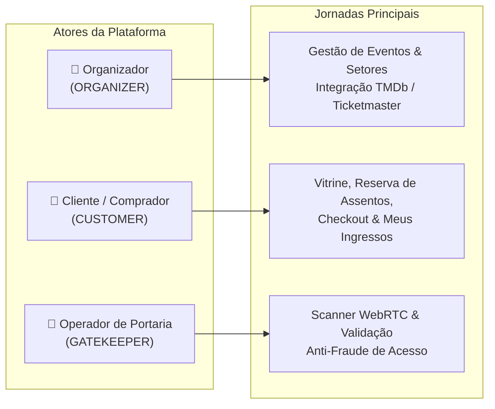

# Visão Geral da Plataforma de Eventos e Ingressos

A **Plataforma de Eventos e Ingressos** é uma solução web fullstack de alta performance e experiência premium, projetada para atender ao desafio técnico **Elite Dev**.

A plataforma resolve o ciclo de vida completo de eventos: desde a busca de atrações em catálogos globais e configuração de setores/assentos até a venda concorrente sem *double-booking*, emissão de ingressos com QR Code criptografado e controle de acesso veloz na portaria com câmera WebRTC.

---

## 1. Proposta de Valor e Atores do Sistema

O sistema é centrado em três atores fundamentais com jornadas e permissões estritamente delimitadas via **Controle de Acesso Baseado em Papéis (RBAC)**:

### 1.1 Organizador (`ORGANIZER`)
- Explora atrações em alta via APIs externas (**TMDb** para filmes e **Ticketmaster** para shows) ou cadastra atrações manuais.
- Cria eventos definindo datas, horários, local, categoria, imagens e tipo de capacidade:
  - **Pista / Setores Gerais**: capacidade total livre e preço unitário.
  - **Mapa de Assentos Numerados**: configuração de fileiras e poltronas com preços por setor.
- Acompanha status de vendas e métricas de comparecimento.

### 1.2 Cliente (`CUSTOMER`)
- Navega pela vitrine de eventos com busca por título e cidade.
- Acessa detalhes da atração e seleciona ingressos de pista ou assentos específicos em um mapa interativo.
- Realiza checkout com tempo de reserva protegido contra concorrência (*anti-double booking*).
- Simula pagamento (com opções explícitas de aprovação e recusa para testes).
- Acessa a área **"Meus Ingressos"** com QR Codes assinados digitalmente e compartilha ingressos individuais via links públicos seguros.

### 1.3 Operador de Portaria (`GATEKEEPER`)
- Opera uma interface mobile-first de alta resposta física no local do evento.
- Valida ingressos através de:
  - **Leitura contínua por câmera (WebRTC)**.
  - **Digitação manual do código alfanumérico**.
- Recebe feedback visual e sonoro instantâneo em 4 estados determinísticos:
  1. `VÁLIDO` (Verde - Liberação de Entrada)
  2. `JÁ UTILIZADO` (Laranja - Alerta de Reentrada / Fraude)
  3. `EVENTO ERRADO` (Vermelho - Ingresso de outra data/evento)
  4. `INVÁLIDO / FORJADO` (Vermelho Escuro - QR adulterado / código inexistente)

---

## 2. Pilares de Engenharia e Princípios de Design

1. **Anti-AI Slop & Design com Propósito**:
   - Interface limpa, sóbria e refinada, sem excesso de gradientes, cards aninhados desnecessários ou clichês visuais.
   - Alta ergonomia para o operador de portaria (grandes alvos de toque, contraste sob luz solar) e fluxo de checkout sem fricção.
2. **Integridade Transacional & Concorrência ACID**:
   - Bloqueio temporário de assentos durante a seleção para impedir venda duplicada do mesmo lugar.
   - Transações atômicas de banco de dados na emissão e no check-in.
3. **Segurança Anti-Fraude**:
   - QR Codes não utilizam IDs expostos; utilizam **assinatura criptográfica HMAC-SHA256** combinando código, evento e timestamp.
   - Sessões protegidas por cookies `httpOnly`, prevenindo ataques XSS.
4. **Pronto para Avaliação Imediata**:
   - Pipeline de *seed* automatizado que popula banco de dados com credenciais prontas para os 3 papéis e eventos pré-configurados.
   - *Role Switcher* em desenvolvimento para alternância instantânea de perfis sem perda de contexto.
5. **Escala Serverless & Resiliência de Pool (Vercel + Supabase)**:
   - Estratégia de dupla conexão (*Dual URL*): `DATABASE_URL` conectada via pooler **Supavisor (Porta 6543 / Modo Transação)** com `?pgbouncer=true&connection_limit=1` para evitar esgotamento de conexões na Vercel, e `DIRECT_URL` (Porta 5432) para execução segura de migrações DDL e travas de schema.

---

## 3. Navegação e Documentação Complementar

- 📖 **Dicionário de Domínio (DDD)**: [`docs/00-overview/DOMAIN-DICTIONARY.md`](./DOMAIN-DICTIONARY.md)
- 🗺️ **Roadmap & Fases**: [`docs/00-overview/ROADMAP.md`](./ROADMAP.md)
- 📋 **Casos de Uso Detalhados**: [`docs/01-use-cases/`](../01-use-cases/)
- 🏛️ **Arquitetura & ADRs**: [`docs/02-architecture/`](../02-architecture/)
- 🎨 **Design System & UI/UX**: [`docs/03-design/`](../03-design/)
- 🔌 **Contratos de API & OpenAPI**: [`docs/04-api-and-integrations/`](../04-api-and-integrations/)
- 🚀 **DevOps & Ambiente Local**: [`docs/05-devops-and-operations/`](../05-devops-and-operations/)
- 🧪 **Qualidade, Testes & DoD**: [`docs/06-quality-and-testing/`](../06-quality-and-testing/)
