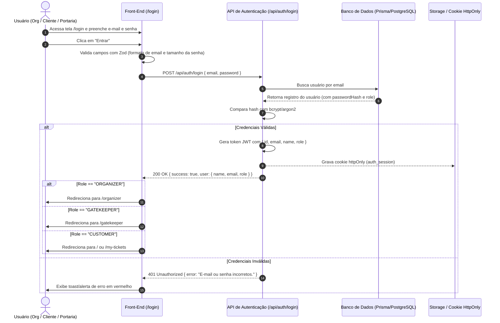
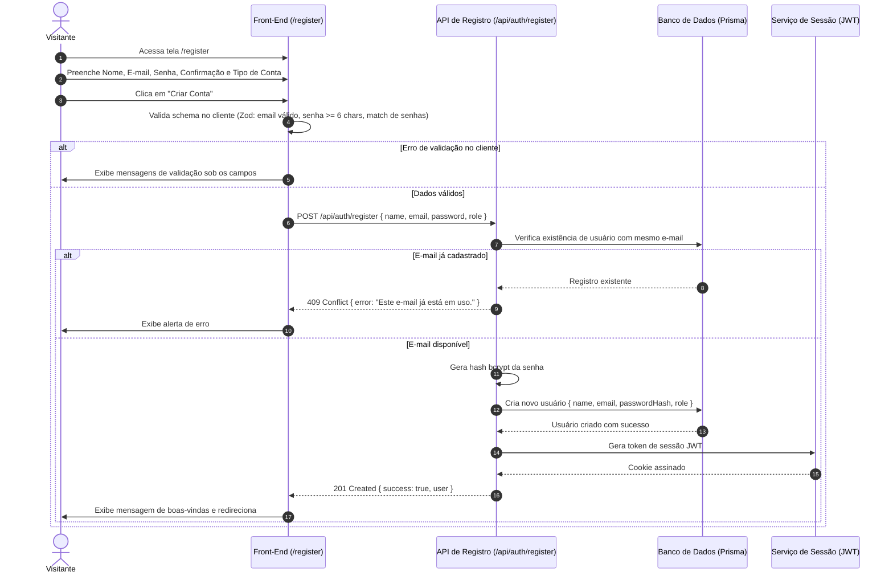
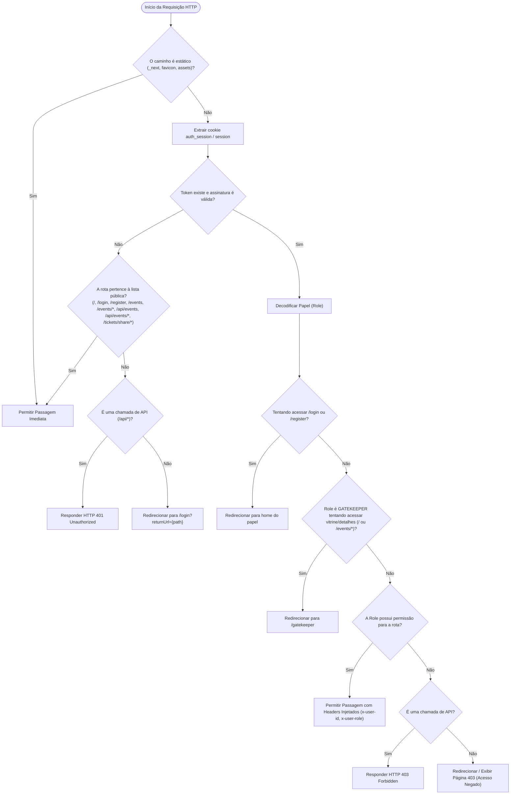
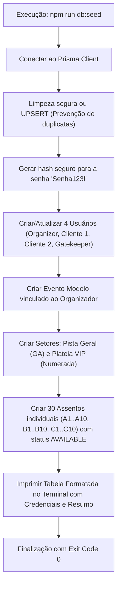

# Módulo 1: Autenticação, Acesso e RBAC (UC01 a UC05)

Este documento consolida os casos de uso detalhados do módulo.

> [!IMPORTANT]
> **Status do Módulo**: 🔴 OBRIGATÓRIO (Requisito Mínimo do Desafio)


---
# Caso de Uso: UC01 - Autenticação e Login de Usuários
## Plataforma de Eventos e Ingressos (Fase 2 - Core)

---

## 1. Identificação e Descrição
- **Identificador**: `UC01`
- **Classificação**: 🔴 OBRIGATÓRIO (Requisito Mínimo do Desafio)
- **Nome**: Autenticação e Login de Usuários com Perfis RBAC
- **Objetivo**: Permitir que usuários cadastrados (Organizador, Cliente e Portaria) se autentiquem com suas credenciais de forma segura, recebendo um cookie de sessão JWT assinado e sendo redirecionados contextualmente para a área correspondente ao seu papel.

---

## 2. Atores
- **Organizador (`ORGANIZER`)**: Usuário responsável pela publicação e gestão de eventos.
- **Cliente (`CUSTOMER`)**: Comprador de ingressos e participante de eventos.
- **Portaria (`GATEKEEPER`)**: Operador responsável pela validação de ingressos no local.

---

## 3. Pré-condições e Pós-condições
- **Pré-condição**:
  - O usuário deve estar cadastrado no banco de dados com e-mail e hash de senha válidos.
  - O usuário não deve possuir sessão ativa ou estar navegando como visitante anônimo.
- **Pós-condição**:
  - Um cookie `httpOnly` contendo o JWT de sessão é gerado e fixado no navegador.
  - O usuário é redirecionado para a rota padrão do seu papel ou para a rota previamente solicitada (`returnUrl`).
  - O estado da barra de navegação superior é atualizado com as permissões do papel.

---

## 4. Diagrama de Sequência



---

## 5. Fluxo Principal de Execução

1. O usuário acessa a rota `/login`.
2. A tela exibe o formulário de login contendo:
   - Campo de e-mail (com foco automático).
   - Campo de senha (com botão de alternar visibilidade ocultar/exibir).
   - Botão de envio "Entrar".
   - Links auxiliares: "Criar uma conta" e atalhos rápidos com as credenciais de teste para agilizar a avaliação.
3. O usuário insere suas credenciais e submete o formulário.
4. O cliente valida os campos em tempo de digitação via schema Zod.
5. O cliente envia uma requisição `POST /api/auth/login` com o payload JSON.
6. O servidor localiza o usuário pelo e-mail e valida o hash da senha.
7. O servidor gera o token JWT assinado digitalmente e o anexa ao cabeçalho `Set-Cookie` com a flag `httpOnly`.
8. O servidor responde com HTTP 200 e os dados de perfil do usuário.
9. O front-end exibe uma notificação Toast de boas-vindas e redireciona o usuário para o destino correto.

---

## 6. Fluxos Alternativos e Exceções

### Fluxo Alternativo 1: Redirecionamento com Parâmetro `returnUrl`
- **Cenário**: O usuário tentou acessar uma rota protegida (ex: `/checkout`) e foi redirecionado para `/login?returnUrl=/checkout`.
- **Comportamento**: Após o login bem-sucedido, o sistema verifica se o usuário possui a permissão requerida pela URL de retorno. Em caso afirmativo, redireciona o usuário diretamente para `/checkout` em vez da rota padrão.

### Fluxo Alternativo 2: Retomada de Compra Pendente pós-login / pós-cadastro
- **Cenário**: O visitante deslogado escolheu ingressos e clicou para comprar. Ao ser redirecionado para `/login` ou `/register`, a seleção de ingressos é armazenada no `sessionStorage`.
- **Comportamento**: Imediatamente após a autenticação bem-sucedida como `CUSTOMER`, o sistema processa automaticamente a reserva e redireciona o comprador direto para a tela de pagamento `/checkout?reservationId=...`. Caso ocorra indisponibilidade de assentos, notifica o usuário e redireciona para a página do evento.

### Fluxo de Exceção 1: Credenciais Inválidas (401)
- **Condição**: O e-mail não existe no banco ou a senha digitada não coincide com o hash.
- **Comportamento**: O servidor retorna `401 Unauthorized`. O formulário destaca os campos com borda vermelha e exibe a mensagem: *"E-mail ou senha incorretos. Verifique suas credenciais."*. A senha é limpa e o foco permanece no campo de e-mail.

### Fluxo de Exceção 2: Campos Vazios ou Formato Inválido (400)
- **Condição**: O usuário submete sem preencher o e-mail ou insere um formato inválido (ex: `usuario@invalido`).
- **Comportamento**: O Zod bloqueia o envio antes da chamada de rede e exibe o erro contextual abaixo do campo: *"Insira um e-mail válido."*.

---

## 7. Regras de Negócio (RN)

- **RN01 - Criptografia de Senha**: Nenhuma senha em texto puro é armazenada. O hash deve ser gerado utilizando `bcrypt` (mínimo de 10 rounds) ou `argon2`.
- **RN02 - Segurança de Cookies**: O token JWT de autenticação nunca deve ser exposto no `localStorage` ou acessível via `document.cookie` em JavaScript client-side; deve trafegar estritamente via cookie `httpOnly`, `SameSite=Lax`, e `Secure` em produção.
- **RN03 - Redirecionamento Baseado em Papel**:
  - Usuários com papel `ORGANIZER` devem ser redirecionados por padrão para `/organizer`.
  - Usuários com papel `GATEKEEPER` devem ser redirecionados imediatamente para `/gatekeeper`.
  - Usuários com papel `CUSTOMER` devem ser redirecionados para a vitrine `/` ou `/my-tickets`.
- **RN04 - Duração da Sessão**: A sessão tem validade padrão de 7 dias, expirando automaticamente após esse período se não renovada.
- **RN05 - Bloqueio de Login/Cadastro para Usuários Autenticados**: Usuários com sessão ativa não podem acessar as rotas `/login` e `/register`. O sistema deve interceptar a requisição e redirecionar o usuário para a página correspondente ao seu perfil (`ORGANIZER` -> `/organizer`, `GATEKEEPER` -> `/gatekeeper`, `CUSTOMER` -> `/`).

---

## 8. Contratos de API

### Requisição: `POST /api/auth/login`
```json
{
  "email": "organizador@verzel.com.br",
  "password": "Senha123!"
}
```

### Resposta de Sucesso: `HTTP 200 OK`
```json
{
  "success": true,
  "user": {
    "id": "cuid_org_1",
    "name": "Organizador Oficial Verzel",
    "email": "organizador@verzel.com.br",
    "role": "ORGANIZER"
  },
  "redirectUrl": "/organizer"
}
```

### Resposta de Erro: `HTTP 401 Unauthorized`
```json
{
  "success": false,
  "error": "E-mail ou senha inválidos."
}
```

---

## 9. Critérios de Aceite (BDD / Gherkin)

```gherkin
Funcionalidade: Autenticação de Usuários
  Como um usuário cadastrado (Organizador, Cliente ou Portaria)
  Eu quero realizar login com meu e-mail e senha
  Para acessar as funcionalidades exclusivas do meu perfil

  Cenário: Login bem-sucedido como Organizador
    Dado que existe um usuário cadastrado com e-mail "organizador@verzel.com.br", senha "Senha123!" e papel "ORGANIZER"
    Quando eu preencho o campo de e-mail com "organizador@verzel.com.br"
    E preencho o campo de senha com "Senha123!"
    E clico no botão "Entrar"
    Então o sistema deve autenticar a sessão gerando o cookie "auth_session"
    E deve exibir uma mensagem de sucesso "Bem-vindo de volta, Organizador Oficial Verzel!"
    E deve me redirecionar para a rota "/organizer"

  Cenário: Login bem-sucedido como Portaria (Gatekeeper)
    Dado que existe um usuário cadastrado com e-mail "portaria@verzel.com.br", senha "Senha123!" e papel "GATEKEEPER"
    Quando eu preencho as credenciais da portaria e clico em "Entrar"
    Então o sistema deve autenticar a sessão
    E deve me redirecionar diretamente para a tela operacional "/gatekeeper"

  Cenário: Tentativa de login com senha incorreta
    Dado que o usuário "cliente1@verzel.com.br" está cadastrado
    Quando eu preencho o e-mail "cliente1@verzel.com.br" e a senha "SenhaErrada"
    E clico no botão "Entrar"
    Então o sistema deve retornar status HTTP 401
    E deve exibir a mensagem de erro "E-mail ou senha inválidos."
    E nenhum cookie de sessão deve ser gerado
```


---

# Caso de Uso: UC02 - Cadastro e Registro de Novos Usuários
## Plataforma de Eventos e Ingressos (Fase 2 - Core)

---

## 1. Identificação e Descrição
- **Identificador**: `UC02`
- **Classificação**: 🔴 OBRIGATÓRIO (Requisito Mínimo do Desafio)
- **Nome**: Cadastro e Registro de Novos Usuários (Cliente e Organizador)
- **Objetivo**: Permitir que novos visitantes criem uma conta na plataforma, escolhendo seu papel inicial (Cliente ou Organizador), validando a unicidade do e-mail e persistindo as credenciais com segurança.

---

## 2. Atores
- **Visitante / Novo Usuário**: Qualquer pessoa não autenticada que deseja utilizar a plataforma.

---

## 3. Pré-condições e Pós-condições
- **Pré-condição**:
  - O visitante navega na página de registro (`/register`).
  - O e-mail informado ainda não deve estar cadastrado na base de dados.
- **Pós-condição**:
  - Um novo registro é inserido na tabela `users` do Prisma.
  - A senha é gravada exclusivamente em formato de hash criptográfico (`bcrypt`).
  - O usuário é automaticamente autenticado e redirecionado contextualmente.

---

## 4. Diagrama de Sequência



---

## 5. Fluxo Principal de Execução

1. O visitante acessa a rota `/register`.
2. A tela exibe o formulário de cadastro com os seguintes campos:
   - **Nome Completo** (texto obrigatório, mín. 3 caracteres).
   - **E-mail** (formato válido de e-mail).
   - **Tipo de Perfil**: Opção de seleção clara entre:
     - `Quero comprar ingressos (Cliente)` -> `role: "CUSTOMER"` (padrão).
     - `Quero publicar eventos (Organizador)` -> `role: "ORGANIZER"`.
   - **Senha** (mínimo de 6 caracteres).
   - **Confirmação de Senha** (deve coincidir exatamente com a senha).
   - Botão de submissão "Criar Conta".
   - Link de atalho: "Já tem uma conta? Faça login".
3. O visitante preenche as informações e clica em "Criar Conta".
4. O Zod valida os campos no cliente.
5. A requisição `POST /api/auth/register` é disparada.
6. O servidor verifica se o e-mail já existe no banco de dados.
7. O servidor gera o hash da senha via `bcrypt`.
8. O novo usuário é persistido no banco de dados.
9. A sessão é iniciada gerando o cookie `httpOnly` correspondente.
10. O usuário é redirecionado para a tela inicial do seu perfil selecionado.

---

## 6. Fluxos Alternativos e Exceções

### Fluxo de Exceção 1: E-mail já cadastrado (409 Conflict)
- **Condição**: O e-mail informado já existe na tabela `users`.
- **Comportamento**: O servidor retorna `409 Conflict`. A interface exibe um toast informando *"Este e-mail já está registrado em nossa plataforma. Deseja fazer login?"*, com um link direto para a página de login.

### Fluxo de Exceção 2: Divergência entre Senha e Confirmação de Senha
- **Condição**: O usuário digita valores diferentes nos campos "Senha" e "Confirmar Senha".
- **Comportamento**: O Zod impede o envio da requisição e exibe o erro contextual: *"As senhas informadas não conferem."*.

### Fluxo de Exceção 3: Tentativa de Registro com Papel Restrito (`GATEKEEPER`)
- **Regra de Segurança**: Usuários de portaria não podem ser criados publicamente na interface de registro; são contas administrativas criadas via seed ou painel do sistema.
- **Comportamento**: Se um atacante enviar `role: "GATEKEEPER"` no payload da API, o schema do servidor substitui silenciosamente ou rejeita o payload com `400 Bad Request`.

---

## 7. Regras de Negócio (RN)

- **RN01 - Unicidade de E-mail**: Não podem existir duas contas com o mesmo endereço de e-mail no sistema (insensível a maiúsculas/minúsculas).
- **RN02 - Restrição de Papéis Públicos**: O cadastro público permite apenas a criação de papéis `CUSTOMER` ou `ORGANIZER`.
- **RN03 - Força Mínima de Senha**: A senha deve possuir no mínimo 6 caracteres.

---

## 8. Contratos de API

### Requisição: `POST /api/auth/register`
```json
{
  "name": "Maria Silva",
  "email": "maria.silva@exemplo.com",
  "password": "MinhaSenhaForte2026!",
  "role": "CUSTOMER"
}
```

### Resposta de Sucesso: `HTTP 201 Created`
```json
{
  "success": true,
  "user": {
    "id": "cuid_customer_99",
    "name": "Maria Silva",
    "email": "maria.silva@exemplo.com",
    "role": "CUSTOMER"
  },
  "redirectUrl": "/"
}
```

### Resposta de Erro: `HTTP 409 Conflict`
```json
{
  "success": false,
  "error": "Já existe uma conta vinculada a este endereço de e-mail."
}
```

---

## 9. Critérios de Aceite (BDD / Gherkin)

```gherkin
Funcionalidade: Cadastro de Novos Usuários
  Como um visitante da plataforma
  Eu quero criar uma conta informando meus dados e meu perfil
  Para comprar ingressos ou gerenciar eventos

  Cenário: Cadastro com sucesso como Cliente
    Dado que estou na página "/register"
    Quando eu preencho o nome com "Lucas Pereira"
    E preencho o e-mail com "lucas.pereira@teste.com"
    E seleciono o perfil "Cliente"
    E preencho a senha com "SenhaSegura123"
    E confirmo a senha com "SenhaSegura123"
    E clico em "Criar Conta"
    Então o sistema deve criar o usuário no banco de dados com a role "CUSTOMER"
    E deve iniciar a sessão automaticamente
    E deve me redirecionar para a página principal "/"

  Cenário: Tentativa de cadastro com e-mail duplicado
    Dado que já existe um usuário com o e-mail "cliente1@verzel.com.br"
    Quando eu tento me registrar com o mesmo e-mail "cliente1@verzel.com.br"
    Então o sistema deve retornar erro com status HTTP 409
    E deve exibir a mensagem "Já existe uma conta vinculada a este endereço de e-mail."
```


---

# Caso de Uso: UC03 - Controle de Acesso e Proteção de Rotas (RBAC)
## Plataforma de Eventos e Ingressos (Fase 2 - Core)

---

## 1. Identificação e Descrição
- **Identificador**: `UC03`
- **Classificação**: 🔴 OBRIGATÓRIO (Requisito Mínimo do Desafio)
- **Nome**: Controle de Acesso e Proteção de Rotas Baseado em Papéis (RBAC)
- **Objetivo**: Garantir que as rotas da interface e os endpoints de API sejam estritamente protegidos, permitindo o acesso apenas a usuários autenticados com o papel (`Role`) correspondente, impedindo privilégios indevidos e garantindo isolamento entre Organizador, Cliente e Portaria.

---

## 2. Atores
- **Visitante Anônimo**: Usuário sem sessão ativa.
- **Cliente (`CUSTOMER`)**: Comprador com acesso à vitrine, checkout e seus próprios ingressos.
- **Organizador (`ORGANIZER`)**: Usuário com permissão para criar e gerenciar eventos.
- **Portaria (`GATEKEEPER`)**: Usuário operacional com permissão exclusiva para a tela de leitura de ingressos.
- **Middleware / Guardião de Segurança**: Camada de interceptação em nível de servidor.

---

## 3. Pré-condições e Pós-condições
- **Pré-condição**:
  - O usuário tenta acessar uma URL no navegador ou envia uma requisição HTTP para um endpoint de API.
- **Pós-condição**:
  - Se o usuário possuir o papel adequado, a requisição é processada com status `200 OK`.
  - Se não autenticado, é redirecionado para `/login?returnUrl=...` (ou recebe `401 Unauthorized` se for API).
  - Se autenticado com papel insuficiente, é redirecionado para uma tela amigável de Acesso Proibido (`403 Forbidden`) ou recebe `403` na API.

---

## 4. Matriz de Autorização Completa

| Rota / Endpoint | Atores Permitidos | Comportamento se Anônimo | Comportamento se Papel Inválido |
| :--- | :--- | :--- | :--- |
| `/` (Vitrine de Eventos) | `CUSTOMER`, `ORGANIZER` (Público) | Acesso Permitido | Bloqueia Portaria (Redireciona `/gatekeeper`) |
| `/events` (Catálogo e Busca) | `CUSTOMER`, `ORGANIZER` (Público) | Acesso Permitido (Busca e Filtros livres) | Bloqueia Portaria (Redireciona `/gatekeeper`) |
| `/events/:id` (Detalhes) | `CUSTOMER`, `ORGANIZER` (Público) | Acesso Permitido | Bloqueia Portaria (Redireciona `/gatekeeper`) |
| `/tickets/share/:token` | Todos (Público) | Acesso Permitido | Acesso Permitido |
| `GET /api/events` (Consulta/Busca) | Todos (Público) | Acesso Permitido | Acesso Permitido |
| `GET /api/events/:id/seats` | Todos (Público) | Acesso Permitido | Acesso Permitido |
| `/login` / `/register` | Anônimo apenas | Acesso Permitido | Redireciona para Dashboard da Role |
| `/my-tickets` | `CUSTOMER`, `ORGANIZER` | Redireciona `/login` | Bloqueia Portaria (Redireciona `/gatekeeper`) |
| `/checkout` | `CUSTOMER`, `ORGANIZER` | Redireciona `/login` | Bloqueia Portaria (Redireciona `/gatekeeper`) |
| `/organizer/*` | `ORGANIZER` apenas | Redireciona `/login` | Renderiza Tela `403 Forbidden` |
| `/gatekeeper/*` | `GATEKEEPER` apenas | Redireciona `/login` | Renderiza Tela `403 Forbidden` |
| `POST /api/events` | `ORGANIZER` apenas | Retorna `401 Unauthorized` | Retorna `403 Forbidden` |
| `PUT /api/events/:id` | `ORGANIZER` (Dono) apenas | Retorna `401 Unauthorized` | Retorna `403 Forbidden` |
| `POST /api/gate/validate` | `GATEKEEPER` apenas | Retorna `401 Unauthorized` | Retorna `403 Forbidden` |

---

## 5. Diagrama de Fluxo de Decisão do Middleware



---

## 6. Fluxos de Exceção

### Fluxo de Exceção 1: Cliente tentando acessar área do Organizador
1. O usuário logado como `CUSTOMER` digita na barra de endereço `/organizer/events/create`.
2. O Middleware intercepta a requisição e detecta que a rota exige `ORGANIZER`.
3. A aplicação renderiza a página de erro `403 - Acesso Não Autorizado`, informando:
   - *"Você não tem permissão para acessar o painel do organizador."*
   - Botão para *"Voltar para a página inicial"* ou *"Alternar de conta"*.

### Fluxo de Exceção 2: Organizador tentando acessar a tela de Portaria
1. O usuário logado como `ORGANIZER` acessa `/gatekeeper`.
2. O Middleware detecta que a rota exige `GATEKEEPER`.
3. A aplicação renderiza a tela `403 - Acesso Restrito à Portaria`.

### Fluxo de Exceção 3: Portaria tentando acessar Vitrine ou Detalhes de Eventos
1. O usuário logado como `GATEKEEPER` tenta acessar a página inicial `/`, catálogo `/events` ou `/events/:id`.
2. O Middleware intercepta a requisição e identifica o perfil operacional da Portaria.
3. O sistema redireciona o operador automaticamente de volta para a tela de controle `/gatekeeper`.

### Fluxo de Exceção 4: Token JWT Expirado ou Chave Adulterada
1. O usuário envia uma requisição com um cookie de sessão cujo segredo foi alterado ou cujo tempo de vida expirou.
2. A biblioteca de criptografia rejeita o token com erro `JWTExpired` ou `JWSSignatureVerificationFailed`.
3. O middleware invalida o cookie expirado e redireciona o usuário para `/login` com a mensagem: *"Sua sessão expirou. Por favor, faça login novamente."*.

---

## 7. Regras de Negócio (RN)

- **RN01 - Bloqueio na Borda (Edge Middleware)**: A validação de permissões deve ocorrer antes mesmo da renderização das páginas ou execução dos controllers, poupando recursos de banco e servidor.
- **RN02 - Headers de Contexto**: O Middleware, após validar o JWT com sucesso, injeta os cabeçalhos `x-user-id`, `x-user-email` e `x-user-role` na requisição downstream para consumo rápido pelos Server Components e endpoints.
- **RN03 - Isolamento Estrito da Portaria**: O papel `GATEKEEPER` é estritamente operacional e não possui acesso a fluxos de compra, vitrine de eventos ou criação de eventos. Tentativas de acessar `/`, `/events`, `/events/*`, `/checkout` ou `/my-tickets` redirecionam imediatamente para `/gatekeeper`.

---

## 8. Critérios de Aceite (BDD / Gherkin)

```gherkin
Funcionalidade: Controle de Acesso e Proteção de Rotas (RBAC)
  Como o sistema de segurança da plataforma
  Eu quero validar o perfil de cada requisição
  Para impedir que usuários acessem áreas não autorizadas

  Cenário: Cliente tentando acessar área restrita do Organizador
    Dado que estou autenticado com a conta de Cliente "cliente1@verzel.com.br"
    Quando eu tento navegar para a URL "/organizer"
    Então o sistema deve bloquear a renderização da página do organizador
    E deve exibir a página de status 403 com a mensagem "Acesso Não Autorizado"
    E deve apresentar um botão para retornar à vitrine inicial

  Cenário: Usuário não autenticado tentando acessar "Meus Ingressos"
    Dado que não estou autenticado em nenhuma conta
    Quando eu tento navegar para a URL "/my-tickets"
    Então o sistema deve interceptar a requisição
    E deve me redirecionar para a URL "/login?returnUrl=%2Fmy-tickets"

  Cenário: Portaria acessando com sucesso a tela de validação
    Dado que estou autenticado com a conta de Portaria "portaria@verzel.com.br"
    Quando eu navego para a URL "/gatekeeper"
    Então o sistema deve autorizar o acesso com status 200
    E deve renderizar o painel do leitor de ingressos
```


---

# Caso de Uso: UC04 - Pipeline de Carga de Dados de Teste (Seed Automatizado)
## Plataforma de Eventos e Ingressos (Fase 2 - Core)

---

## 1. Identificação e Descrição
- **Identificador**: `UC04`
- **Classificação**: 🔴 OBRIGATÓRIO (Requisito Mínimo do Desafio)
- **Nome**: Pipeline de Carga e Inicialização de Dados de Teste (Seed Pipeline)
- **Objetivo**: Fornecer um script automatizado e idempotente que popula o banco de dados com todos os dados essenciais exigidos pelo desafio (1 Organizador, 2 Clientes, 1 Portaria e ao menos 1 Evento completo publicado com pista e assentos numerados), permitindo que os avaliadores naveguem por todos os fluxos sem necessidade de configuração manual.

---

## 2. Atores
- **Avaliador do Desafio / Engenheiro de Testes**: Executa a aplicação pela primeira vez para auditar as funcionalidades.
- **Desenvolvedor**: Roda os testes e inicializa o ambiente de desenvolvimento local.
- **Script de Seed (`prisma/seed.ts`)**: Agente automatizado que executa as inserções e vínculos relacionais no banco.

---

## 3. Pré-condições e Pós-condições
- **Pré-condição**:
  - O banco de dados foi inicializado e as migrações do Prisma foram executadas (`npx prisma migrate dev` ou `npx prisma db push`).
  - As variáveis de ambiente de banco (`DATABASE_URL` e `DIRECT_URL`) estão devidamente configuradas no `.env`.
- **Pós-condição**:
  - Os 4 usuários obrigatórios estão presentes no banco de dados com senhas criptografadas.
  - Ao menos 1 evento modelo completo está publicado com setores de Pista e Assentos Numerados.
  - O terminal exibe um resumo amigável com a tabela de credenciais prontas para teste.

---

## 4. Especificação dos Dados Semeados

### 4.1 Usuários de Teste Obrigatórios

| Papel (`Role`) | Nome | E-mail | Senha Padrão | Finalidade no Teste |
| :--- | :--- | :--- | :--- | :--- |
| **`ORGANIZER`** | Organizador Oficial Verzel | `organizador@verzel.com.br` | `Senha123!` | Publicação e gestão de novos eventos |
| **`CUSTOMER`** (1) | Lucas Cliente Primário | `cliente1@verzel.com.br` | `Senha123!` | Compra de ingressos e teste de concorrência |
| **`CUSTOMER`** (2) | Camila Cliente Secundária | `cliente2@verzel.com.br` | `Senha123!` | Segundo cliente para validação de conflito de assentos |
| **`GATEKEEPER`** | Roberto Validador Portaria | `portaria@verzel.com.br` | `Senha123!` | Operação da tela de check-in na portaria |

### 4.2 Evento Modelo Obrigatório

```json
{
  "title": "Festival Indie Rock Verzel 2026",
  "description": "Uma noite épica com as melhores bandas do cenário independente nacional e internacional. Estrutura completa de som, praça de alimentação e mapa de assentos exclusivo.",
  "category": "SHOW",
  "bannerUrl": "https://images.unsplash.com/photo-1470225620780-dba8ba36b745?w=1200&q=80",
  "locationName": "Espaço Hall Cultural Verzel",
  "city": "São Paulo, SP",
  "eventDate": "2026-11-20T20:00:00Z",
  "status": "PUBLISHED",
  "sectors": [
    {
      "name": "Pista Geral",
      "type": "GENERAL_ADMISSION",
      "price": 120.00,
      "totalCapacity": 200,
      "availableCapacity": 200
    },
    {
      "name": "Plateia VIP Numerada",
      "type": "NUMBERED_SEATS",
      "price": 250.00,
      "totalCapacity": 30,
      "availableCapacity": 30,
      "seats": [
        "Fileira A: A1 a A10 (10 assentos)",
        "Fileira B: B1 a B10 (10 assentos)",
        "Fileira C: C1 a C10 (10 assentos)"
      ]
    }
  ]
}
```

---

## 5. Diagrama de Fluxo de Execução do Seed



---

## 6. Regras de Negócio e Idempotência (RN)

- **RN01 - Idempotência Estrita**: Executar o comando `npm run db:seed` múltiplas vezes não deve causar duplicação de usuários ou quebra de restrições únicas (`unique constraints`). O script utiliza `upsert` com base no `email` do usuário e identificadores dos setores.
- **RN02 - Capacidade Real dos Setores**: No setor numerado, a capacidade total (`totalCapacity`) deve corresponder exatamente à soma dos assentos cadastrados na tabela `seats`.
- **RN03 - Assentos com Status Inicial Disponível**: Todos os assentos criados no seed inicial devem ter o status `AVAILABLE`, permitindo que o avaliador teste a reserva imediatamente.

---

## 7. Critérios de Aceite (BDD / Gherkin)

```gherkin
Funcionalidade: Carga Automatizada de Dados de Teste
  Como um avaliador do projeto
  Eu quero executar o comando de seed
  Para ter um banco de dados pronto para testar todos os fluxos sem cadastro prévio

  Cenário: Execução bem-sucedida do script de seed
    Dado que o banco de dados está sincronizado com o schema do Prisma
    Quando eu executo o comando "npm run db:seed" no terminal
    Então o script deve cadastrar com sucesso os 4 usuários de teste com suas respectivas roles
    E deve criar o evento "Festival Indie Rock Verzel 2026"
    E deve criar o setor "Pista Geral" com capacidade para 200 pessoas
    E deve criar o setor "Plateia VIP Numerada" com 30 assentos distribuídos nas fileiras A, B e C
    E deve exibir no terminal as credenciais e status de conclusão com código 0

  Cenário: Execução repetida sem erro (Idempotência)
    Dado que o seed já foi executado uma vez
    Quando eu executo o comando "npm run db:seed" novamente
    Então o script deve atualizar os registros existentes sem gerar erros de unicidade
    E a integridade do banco deve ser mantida intacta
```


---

# Caso de Uso: UC05 - Encerramento de Sessão (Logout) e Invalidação de Cookie
## Plataforma de Eventos e Ingressos (Fase 2 - Core)

---

## 1. Identificação e Descrição
- **Identificador**: `UC05`
- **Classificação**: 🔴 OBRIGATÓRIO (Requisito Mínimo do Desafio)
- **Nome**: Encerramento de Sessão (Logout), Invalidação de Cookie HttpOnly e Limpeza de Estado Local
- **Objetivo**: Permitir que qualquer usuário autenticado (Organizador, Cliente ou Portaria) encerre sua sessão ativa de forma segura, invalidando o cookie `httpOnly` (`auth_session`), limpando caches locais do cliente e sendo redirecionado para a página inicial ou de login.

---

## 2. Atores
- **Usuário Autenticado**: Qualquer usuário logado com papel `ORGANIZER`, `CUSTOMER` ou `GATEKEEPER`.
- **Servidor de Aplicação / Auth API**: Responsável por revogar o cookie de sessão via cabeçalho `Set-Cookie`.

---

## 3. Pré-condições e Pós-condições
- **Pré-condição**:
  - O usuário possui uma sessão ativa com cookie `auth_session` válido.
- **Pós-condição**:
  - O cookie `auth_session` é expirado no navegador (`Max-Age=0`).
  - Qualquer cache ou contexto de usuário no front-end é redefinido para estado anônimo.
  - O usuário é redirecionado para a página inicial `/` ou tela de login `/login`.

---

## 4. Diagrama de Sequência

```mermaid
sequenceDiagram
    autonumber
    actor User as Usuário Logado
    participant UI as Header / Dropdown de Perfil
    participant AuthAPI as API de Auth (/api/auth/logout)
    participant Cookie as Navegador / Storage

    User->>UI: Clica no botão "Sair" / "Encerrar Sessão"
    UI->>AuthAPI: POST /api/auth/logout
    AuthAPI->>AuthAPI: Prepara cabeçalho de expiração de cookie
    AuthAPI-->>Cookie: Set-Cookie: auth_session=; Path=/; Max-Age=0; HttpOnly
    AuthAPI-->>UI: 200 OK { success: true, message: "Sessão encerrada com sucesso." }
    UI->>UI: Limpa estado do AuthContext / Query Client
    UI->>User: Exibe toast informativo e redireciona para "/"
```

---

## 5. Fluxo Principal de Execução

1. O usuário logado clica no avatar/menu de perfil na barra de navegação superior ou no botão "Sair".
2. Um modal rápido ou confirmação em dropdown é acionado (ou logout imediato).
3. O front-end dispara uma requisição `POST /api/auth/logout`.
4. O servidor recebe a requisição e responde com HTTP 200, incluindo o cabeçalho `Set-Cookie` com `Max-Age=0` e `Expires` no passado.
5. O navegador descarta o cookie de autenticação `auth_session`.
6. O estado global de autenticação no front-end é redefinido para usuário deslogado (`user: null`).
7. O usuário é redirecionado para a rota raiz `/` com feedback visual ("Você saiu da sua conta.").

---

## 6. Fluxos Alternativos e Exceções

### Fluxo Alternativo 1: Logout disparado por expiração de token
- **Cenário**: O usuário realiza uma ação com um token JWT expirado ou inválido.
- **Comportamento**: O middleware ou API retorna `401 Unauthorized` com flag `SESSION_EXPIRED`. O front-end limpa o estado local e redireciona para `/login?expired=true`.

### Fluxo de Exceção 1: Falha na requisição de rede
- **Condição**: Perda de conexão no momento do clique em "Sair".
- **Comportamento**: O cliente limpa o estado de memória local do React e força o redirecionamento para `/login`, garantindo que o usuário não permaneça em telas restritas no front-end.

---

## 7. Regras de Negócio (RN)

- **RN01 - Invalidação Estrita no Navegador**: O cookie `auth_session` deve ser sobrescrito com string vazia, `Max-Age=0`, `Path=/`, `HttpOnly` e `SameSite=Lax`.
- **RN02 - Redirecionamento Seguro**: Rotas autenticadas (`/organizer`, `/my-tickets`, `/gatekeeper`) devem ser inacessíveis imediatamente após o logout; qualquer tentativa posterior de acesso deve redirecionar para `/login`.
- **RN03 - Não Exposição de Dados**: Ao deslogar, qualquer dado temporário mantido em `sessionStorage` ou React State deve ser completamente resetado.

---

## 8. Contratos de API

### Requisição: `POST /api/auth/logout`
```http
POST /api/auth/logout HTTP/1.1
Content-Type: application/json
```

### Resposta de Sucesso: `HTTP 200 OK`
```http
HTTP/1.1 200 OK
Set-Cookie: auth_session=; Path=/; Expires=Thu, 01 Jan 1970 00:00:00 GMT; Max-Age=0; HttpOnly; SameSite=Lax
Content-Type: application/json

{
  "success": true,
  "message": "Sessão encerrada com sucesso."
}
```

---

## 9. Critérios de Aceite (BDD / Gherkin)

```gherkin
Funcionalidade: Encerramento de Sessão (Logout)
  Como um usuário autenticado na plataforma
  Eu quero realizar logout da minha conta
  Para garantir que terceiros não acessem meu painel no mesmo dispositivo

  Cenário: Logout com sucesso a partir do menu do usuário
    Dado que estou autenticado com a conta "organizador@verzel.com.br"
    Quando eu clico na opção "Sair" na barra de navegação
    Então o sistema deve invalidar o cookie "auth_session"
    E deve resetar as permissões de acesso
    E deve me redirecionar para a página inicial "/"
    E a barra de navegação deve exibir os botões "Entrar" e "Criar Conta"

  Cenário: Tentativa de acessar rota restrita após logout
    Dado que realizei logout com sucesso
    Quando eu tento navegar diretamente para "/organizer"
    Então o sistema deve bloquear o acesso
    E deve me redirecionar para "/login"
```

---

# Caso de Uso: UC01b - Gestão e Geração de Contas Temporárias de Portaria pelo Organizador
## Plataforma de Eventos e Ingressos (Fase 2 - Core)

---

## 1. Identificação e Descrição
- **Identificador**: `UC01b`
- **Classificação**: 🔴 OBRIGATÓRIO (Requisito Mínimo do Desafio)
- **Nome**: Geração e Vinculação de Contas Temporárias de Portaria pelo Organizador
- **Objetivo**: Permitir que o organizador de um evento gere contas de acesso temporárias com o papel `GATEKEEPER`, vinculadas especificamente àquele evento físico, com geração automática de e-mail e senha em 1 clique e botão de cópia rápida para repasse imediato aos operadores de catraca no dia da realização.

---

## 2. Regras de Negócio (RN)
- **RN01 - Posse do Evento**: Apenas o organizador titular do evento pode gerar, visualizar ou remover contas de portaria vinculadas.
- **RN02 - Vínculo com Papel Gatekeeper**: As contas geradas possuem `role = GATEKEEPER` e são associadas na tabela `event_gatekeepers`.
- **RN03 - Visualização Única de Senha**: A senha gerada é exibida em texto claro na tela imediatamente após a criação para possibilitar a cópia instantânea pelo organizador.


