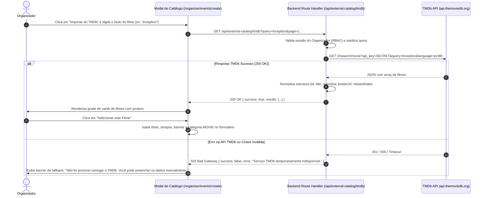
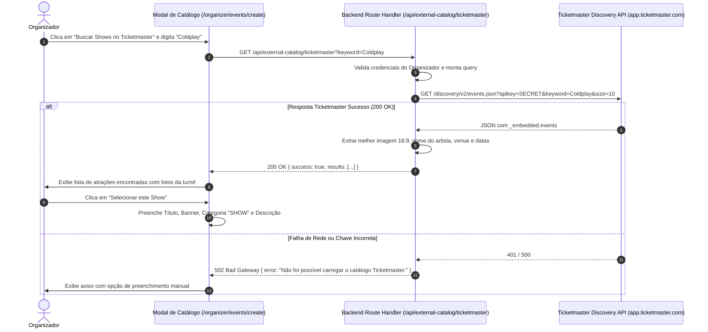
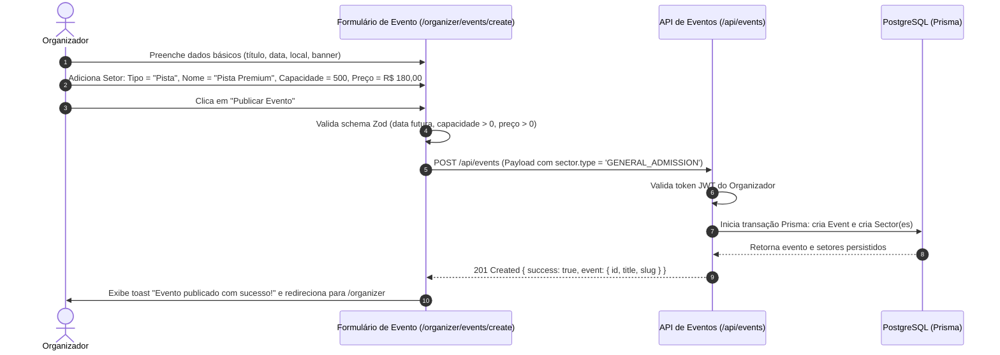
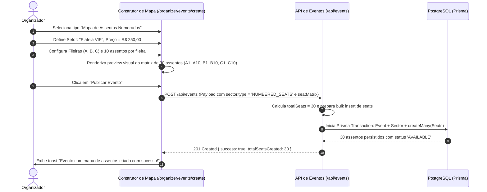
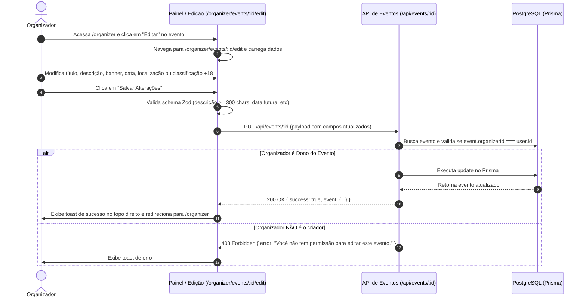

# Módulo 2: Gestão de Eventos, TMDb e Ticketmaster (UC06 a UC10)

Este documento consolida os casos de uso detalhados do módulo.

> [!IMPORTANT]
> **Status do Módulo**: 🔴 OBRIGATÓRIO (Requisito Mínimo do Desafio)


---
# Caso de Uso: UC06 - Integração e Busca de Filmes no Catálogo Externo (TMDb)
## Plataforma de Eventos e Ingressos (Fase 2 - Core)

---

## 1. Identificação e Descrição
- **Identificador**: `UC06`
- **Classificação**: 🔴 OBRIGATÓRIO (Requisito Mínimo do Desafio)
- **Nome**: Integração e Busca de Filmes no Catálogo Externo TMDb (The Movie Database)
- **Objetivo**: Permitir que o Organizador pesquise filmes na API do TMDb diretamente na interface de criação de eventos, obtendo títulos, sinopses, posters/banners e datas de lançamento para preenchimento automatizado do formulário.

---

## 2. Atores
- **Organizador (`ORGANIZER`)**: Busca filmes para criar sessões ou exibições de cinema.
- **Serviço de Integração TMDb (Backend)**: Faz a intermediação segura das chamadas HTTP com a API externa.
- **The Movie Database (TMDb API v3)**: Serviço externo que fornece o catálogo de filmes.

---

## 3. Pré-condições e Pós-condições
- **Pré-condição**:
  - O usuário deve estar autenticado com o papel `ORGANIZER`.
  - A variável de ambiente `TMDB_API_KEY` deve estar configurada no servidor (ou mock ativo se em modo offline).
- **Pós-condição**:
  - Os dados do filme selecionado (título, descrição, categoria `MOVIE`, poster URL) são preenchidos automaticamente nos campos correspondentes do formulário de criação de evento.

---

## 4. Diagrama de Sequência



---

## 5. Fluxo Principal de Execução

1. O organizador acessa a tela de criação de evento em `/organizer/events/create`.
2. Clica na aba ou botão **"Buscar Filmes no TMDb"**.
3. Um modal ou painel lateral de pesquisa é aberto contendo um campo de busca com *debounce* de 400ms.
4. O organizador digita o nome do filme (ex: *"Duna: Parte 2"*).
5. O front-end dispara `GET /api/external-catalog/tmdb?query=Duna`.
6. O backend injeta a chave de API segura no cabeçalho e consulta o endpoint oficial `https://api.themoviedb.org/3/search/movie`.
7. O backend normaliza a resposta:
   - Converte `poster_path` e `backdrop_path` para URLs absolutas de imagem (`https://image.tmdb.org/t/p/w780/...`).
   - Mapeia a sinopse em português (`overview`).
8. O modal exibe os resultados com cartaz, ano de lançamento e breve sinopse.
9. O organizador clica sobre o card do filme desejado.
10. O modal fecha e os campos do formulário principal são preenchidos automaticamente:
    - **Título**: preenchido com o título do filme.
    - **Categoria**: fixada como `MOVIE`.
    - **Descrição**: preenchida com a sinopse oficial.
    - **URL do Banner/Poster**: preenchida com a URL de alta resolução da capa.
11. O organizador prossegue para definir data, local e setores de assentos.

---

## 6. Fluxos Alternativos e Exceções

### Fluxo Alternativo 1: Busca Sem Resultados
- **Condição**: O termo buscado não retorna nenhum registro no TMDb.
- **Comportamento**: A interface exibe ilustração/mensagem amigável: *"Nenhum filme encontrado para 'xyz'. Tente outro termo ou preencha manualmente."*.

### Fluxo de Exceção 1: Chave de API Não Configurada ou Limite Atingido (Fallback Mock Automático)
- **Condição**: `TMDB_API_KEY` ausente ou retorno HTTP 429/5xx da API externa.
- **Comportamento**: O backend ativa automaticamente o catálogo de filmes embutido (mock fallback) com dados reais normalizados de filmes populares (ex: *Duna: Parte 2*, *A Origem*, *Oppenheimer*, *Interestelar*), retornando status 200 com flag `provider: "TMDB_MOCK"`. O organizador consegue selecionar filmes normalmente para testar o fluxo completo de criação de eventos sem necessidade de chave de API.

---

## 7. Regras de Negócio (RN)

- **RN01 - Sigilo da Chave de API**: A chave do TMDb deve residir estritamente no arquivo `.env` do servidor e nunca ser exposta no código React client-side.
- **RN02 - Idioma Padrão**: As buscas no TMDb devem priorizar `language=pt-BR`, com fallback para o título original caso a sinopse em português não esteja disponível.
- **RN03 - Normalização de Imagens**: O backend deve construir a URL final usando a CDN oficial do TMDb com largura padrão (`w780` ou `original`).
- **RN04 - Resiliência por Catálogo Mock**: Na ausência da chave ou falha de conectividade, o sistema deve fornecer dados de mock realistas para não bloquear a experiência de avaliação do projeto.

---

## 8. Contratos de API

### Requisição: `GET /api/external-catalog/tmdb?query=Inception&page=1`

### Resposta de Sucesso: `HTTP 200 OK`
```json
{
  "success": true,
  "provider": "TMDB",
  "page": 1,
  "totalResults": 1,
  "results": [
    {
      "externalId": "tmdb_27205",
      "title": "A Origem",
      "originalTitle": "Inception",
      "overview": "Dom Cobb é um ladrão com a rara habilidade de roubar segredos do inconsciente...",
      "releaseDate": "2010-07-15",
      "posterUrl": "https://image.tmdb.org/t/p/w780/9gk7adHYeDvHkCSEqAvQNLV5Uge.jpg",
      "backdropUrl": "https://image.tmdb.org/t/p/original/s3TBrRGB1iav7gFOCNx3H31MoES.jpg",
      "category": "MOVIE"
    }
  ]
}
```

### Resposta de Erro: `HTTP 502 Bad Gateway`
```json
{
  "success": false,
  "error": "Falha na comunicação com o serviço externo TMDb. Tente novamente mais tarde."
}
```

---

## 9. Critérios de Aceite (BDD / Gherkin)

```gherkin
Funcionalidade: Busca de Filmes no Catálogo Externo TMDb
  Como um Organizador criando um evento de cinema
  Eu quero pesquisar filmes na base do TMDb
  Para autopreencher os detalhes do evento com agilidade e qualidade

  Cenário: Busca de filme com resultados válidos
    Dado que estou autenticado como "ORGANIZER" na tela de criação de eventos
    Quando eu abro a busca TMDb e pesquiso por "Inception"
    Então o sistema deve consultar a API do TMDb através do backend
    E deve renderizar os cards com poster, título "A Origem" e ano de lançamento
    Quando eu clico no card de "A Origem"
    Então o formulário de evento deve ser preenchido com o título, sinopse, banner e categoria "MOVIE"

  Cenário: Falha temporária da API externa
    Dado que a API do TMDb está indisponível
    Quando eu tento realizar uma busca no modal
    Então o sistema deve exibir a mensagem de aviso "Serviço TMDb temporariamente indisponível."
    E deve permitir que eu feche o modal e preencha todos os dados manualmente
```


---

# Caso de Uso: UC07 - Integração e Busca de Shows/Eventos na Ticketmaster Discovery API
## Plataforma de Eventos e Ingressos (Fase 2 - Core)

---

## 1. Identificação e Descrição
- **Identificador**: `UC07`
- **Classificação**: 🔴 OBRIGATÓRIO (Requisito Mínimo do Desafio)
- **Nome**: Integração e Busca de Shows e Atrações na Ticketmaster Discovery API
- **Objetivo**: Permitir que o Organizador pesquise shows musicais, concertos e festivais na Ticketmaster Discovery API diretamente na criação do evento, obtendo dados da atração, imagens em alta resolução, local estimado e gênero para preenchimento ágil do formulário.

---

## 2. Atores
- **Organizador (`ORGANIZER`)**: Pesquisa atrações musicais e turnês internacionais ou nacionais.
- **Serviço de Integração Ticketmaster (Backend)**: Executa as chamadas HTTP autenticadas com a API Key.
- **Ticketmaster Discovery API v2**: Provedor externo global de eventos e atrações musicais/esportivas.

---

## 3. Pré-condições e Pós-condições
- **Pré-condição**:
  - O usuário deve possuir a role `ORGANIZER`.
  - A chave `TICKETMASTER_API_KEY` deve estar configurada nas variáveis de ambiente.
- **Pós-condição**:
  - Título do show, descrição/gênero, banner de palco/turnê e categoria `SHOW` ou `FESTIVAL` são carregados no formulário de criação de evento.

---

## 4. Diagrama de Sequência



---

## 5. Fluxo Principal de Execução

1. O organizador acessa o formulário de criação de eventos (`/organizer/events/create`).
2. Clica na opção **"Buscar Shows no Ticketmaster"**.
3. Um modal de pesquisa se abre com seletor de país/cidade opcional e campo de texto de atração.
4. O organizador digita o nome de uma banda ou turnê (ex: *"Imagine Dragons"*).
5. O front-end dispara `GET /api/external-catalog/ticketmaster?keyword=Imagine+Dragons`.
6. O backend efetua a requisição para a Ticketmaster Discovery API v2.
7. O backend seleciona as imagens com melhor resolução (formato `16_9` e largura `> 1000px`), extrai o gênero musical (`classifications[0].genre.name`) e o local.
8. A grade de resultados exibe a capa da turnê, nome do artista e gênero.
9. O organizador seleciona a atração desejada.
10. O modal é encerrado e os dados são preenchidos no formulário:
    - **Título**: Ex: *"Imagine Dragons - Loom World Tour"*.
    - **Categoria**: Definida como `SHOW` ou `FESTIVAL`.
    - **Banner**: URL de alta resolução da imagem da turnê.
    - **Descrição**: Detalhes da turnê e gênero musical.
11. O organizador complementa com o local físico da sua cidade, data e configuração dos setores de ingressos.

---

## 6. Fluxos Alternativos e Exceções

### Fluxo Alternativo 1: Seleção de Imagem Alternativa
- **Cenário**: O evento retornado possui múltiplas opções de imagem (poster vertical 3:2 ou banner horizontal 16:9).
- **Comportamento**: A interface permite que o organizador visualize e alterne entre a imagem de banner horizontal (para o cabeçalho hero) e o poster vertical.

### Fluxo de Exceção 1: Chave de API Não Configurada ou Limite Atingido (Fallback Mock Automático)
- **Condição**: `TICKETMASTER_API_KEY` ausente ou indisponibilidade da API externa.
- **Comportamento**: O backend ativa automaticamente o catálogo de shows embutido (mock fallback) com dados reais normalizados de grandes turnês (ex: *Coldplay - Music of the Spheres*, *Imagine Dragons - Loom World Tour*, *Iron Maiden - The Future Past Tour*), retornando status 200 com flag `provider: "TICKETMASTER_MOCK"`. O organizador seleciona os shows com fotos em alta definição sem bloqueios no fluxo de teste.

---

## 7. Regras de Negócio (RN)

- **RN01 - Sigilo da Chave**: A chave da Ticketmaster reside estritamente nas variáveis de ambiente do backend.
- **RN02 - Otimização de Imagens**: O backend deve priorizar imagens em proporção `16_9` com largura superior a 1000px para garantir a melhor apresentação visual nos banners.
- **RN03 - Resiliência por Catálogo Mock**: Na ausência da chave ou erro externo, o backend responde com dados mock estruturados para permitir a avaliação de ponta a ponta.

- **RN01 - Isolamento de Credenciais**: O token de acesso `TICKETMASTER_API_KEY` deve ser mantido em segredo absoluto pelo backend e nunca exposto em bundles de client-side.
- **RN02 - Seleção de Imagem de Alta Fidelidade**: O backend deve priorizar imagens com aspect ratio `16_9` e largura mínima de `1024px` para garantir a qualidade visual da vitrine hero.
- **RN03 - Categoria Padrão**: Toda atração oriunda da Ticketmaster deve mapear para as categorias internas `SHOW` ou `FESTIVAL`.

---

## 8. Contratos de API

### Requisição: `GET /api/external-catalog/ticketmaster?keyword=Coldplay`

### Resposta de Sucesso: `HTTP 200 OK`
```json
{
  "success": true,
  "provider": "TICKETMASTER",
  "results": [
    {
      "externalId": "tm_k7vGFKdnZa1",
      "title": "Coldplay - Music of the Spheres Tour",
      "genre": "Rock / Pop Alternativo",
      "bannerUrl": "https://s1.ticketm.net/dam/a/123/coldplay_wide_16_9.jpg",
      "category": "SHOW",
      "suggestedLocation": "Estádio do Morumbi, São Paulo"
    }
  ]
}
```

---

## 9. Critérios de Aceite (BDD / Gherkin)

```gherkin
Funcionalidade: Busca de Shows no Catálogo Ticketmaster
  Como um Organizador criando um evento musical
  Eu quero buscar atrações na Ticketmaster Discovery API
  Para importar os dados e cartazes oficiais do show diretamente para a plataforma

  Cenário: Busca com correspondência exata
    Dado que estou autenticado como Organizador
    Quando eu busco por "Coldplay" na aba Ticketmaster
    Então o sistema deve listar as opções de shows encontradas com suas fotos de alta qualidade
    Quando eu clico no resultado "Coldplay - Music of the Spheres Tour"
    Então os campos de título, categoria "SHOW", descrição e URL de banner devem ser preenchidos no formulário principal
```


---

# Caso de Uso: UC08 - Criação de Evento com Setor de Pista (Lotação Geral)
## Plataforma de Eventos e Ingressos (Fase 2 - Core)

---

## 1. Identificação e Descrição
- **Identificador**: `UC08`
- **Classificação**: 🔴 OBRIGATÓRIO (Requisito Mínimo do Desafio)
- **Nome**: Criação de Evento com Setores de Pista / Lotação Geral (General Admission)
- **Objetivo**: Permitir que o Organizador cadastre um novo evento configurando setores de capacidade livre (sem assento fixo), definindo nome do setor (ex: "Pista Comum", "Pista Premium"), quantidade total de ingressos e valor unitário.

---

## 2. Atores
- **Organizador (`ORGANIZER`)**: Responsável pela definição das cotas e preços da pista.
- **Banco de Dados (PostgreSQL / Prisma)**: Persiste o registro de evento e setor `GENERAL_ADMISSION`.

---

## 3. Pré-condições e Pós-condições
- **Pré-condição**:
  - O usuário autenticado possui o papel `ORGANIZER`.
  - Os dados básicos do evento (título, descrição, data futura, local e banner) estão preenchidos.
- **Pós-condição**:
  - O evento é salvo na tabela `events` associado ao ID do organizador.
  - Um ou mais setores do tipo `GENERAL_ADMISSION` são criados com `totalCapacity` e `availableCapacity` iguais ao valor informado.

---

## 4. Diagrama de Sequência



---

## 5. Fluxo Principal de Execução

1. O organizador acessa a tela de novo evento (`/organizer/events/create`).
2. Preenche os dados gerais:
   - Título do evento.
   - Categoria (`SHOW`, `FESTIVAL`, `THEATER`, `MOVIE`).
   - Classificação Indicativa: Opção de marcar o evento como `+18` (`isAdult: true/false`).
   - Sinopse / Descrição detalhada (mínimo de 300 caracteres, com contador em tempo real).
   - Data e horário de início (deve ser data futura).
   - Nome do local, Cidade (input de texto) e UF (seletor dos 27 estados brasileiros, unificados no payload como `"Cidade, UF"`).
   - URL da imagem de banner.
3. Na seção **"Configuração de Setores"**, clica em **"Adicionar Setor de Pista"**.
4. Define os parâmetros do setor:
   - **Nome do Setor**: Ex: *"Pista Comum"*.
   - **Capacidade Máxima**: Ex: `1000` pessoas.
   - **Preço do Ingresso**: Ex: `R$ 120,00`.
5. Opcionalmente adiciona outro setor de pista (ex: *"Camarote Open Bar"*, `200` pessoas, `R$ 350,00`).
6. Clica em **"Publicar Evento"**.
7. O front-end valida que a descrição possui no mínimo 300 caracteres, cidade/UF estão preenchidos, capacidade total é maior que zero e data é futura.
8. O backend recebe a requisição, autentica o usuário via JWT e cria o registro em transação única no banco de dados com `isAdult` e `city`.
9. O evento é registrado com status `PUBLISHED` e fica visível imediatamente na vitrine pública.
10. O organizador é redirecionado para seu painel de gestão (`/organizer`).

---

## 6. Fluxos Alternativos e Exceções

### Fluxo Alternativo 1: Salvar como Rascunho (`DRAFT`)
- **Cenário**: O organizador não quer disponibilizar os ingressos na vitrine imediatamente.
- **Comportamento**: Clica em "Salvar Rascunho". O evento é gravado com status `DRAFT` e não aparece na vitrine pública até ser explicitamente publicado.

### Fluxo de Exceção 1: Data do Evento no Passado
- **Condição**: A data/hora selecionada é anterior ao momento atual.
- **Comportamento**: A validação Zod bloqueia o envio e destaca o campo: *"A data do evento deve ser futura."*.

### Fluxo de Exceção 2: Descrição com Menos de 300 Caracteres
- **Condição**: A descrição informada possui menos de 300 caracteres.
- **Comportamento**: A validação Zod bloqueia o envio e destaca o campo: *"A descrição do evento deve conter no mínimo 300 caracteres."*.

---

## 7. Regras de Negócio (RN)

- **RN01 - Consistência de Capacidade**: Para setores `GENERAL_ADMISSION`, `availableCapacity` deve ser inicializada com o mesmo valor de `totalCapacity`.
- **RN02 - Validação Financeira**: O preço unitário (`price`) não pode ser negativo ou zero.
- **RN03 - Vinculação com Organizador**: Todo evento deve ser associado obrigatoriamente ao `organizerId` extraído da sessão autenticada.
- **RN04 - Detalhamento Mínimo da Descrição**: A descrição do evento deve ter no mínimo 300 caracteres para garantir qualidade da informação ao comprador.
- **RN05 - Formatação Padronizada de Localização**: O campo `city` no backend deve ser armazenado no formato padronizado `"Cidade, UF"`.
- **RN06 - Classificação +18**: O evento pode conter a flag booleana `isAdult`, exibindo badges apropriados na vitrine e detalhes do evento.
- **RN07 - Período do Evento (Início e Fim)**: O evento deve ter uma data e hora de início (`eventDate`) e pode opcionalmente definir uma data e hora de término (`endDate`), que deve ser estritamente posterior ao início.
- **RN08 - Horário Obrigatório de Início para Entrar (`entryStartTime`)**: O evento deve possuir obrigatoriamente um horário de abertura dos portões / entrada (`entryStartTime NOT NULL`). Deve ser no mínimo 30 minutos e no máximo 6 horas antes de `eventDate`. O valor padrão sugerido na interface é de 30 minutos antes do início.

---

## 8. Contratos de API

### Requisição: `POST /api/events`
```json
{
  "title": "Festival Indie Rock 2026",
  "description": "Edição comemorativa com as melhores bandas do cenário alternativo nacional e internacional. O festival contará com três palcos simultâneos, praça de alimentação com opções gastronômicas variadas, bares temáticos, área de descanso e estrutura completa de som e iluminação de última geração para proporcionar uma experiência inesquecível.",
  "category": "FESTIVAL",
  "isAdult": false,
  "eventDate": "2026-11-20T20:00:00.000Z",
  "endDate": "2026-11-20T23:30:00.000Z",
  "entryStartTime": "2026-11-20T19:30:00.000Z",
  "locationName": "Espaço Hall Cultural",
  "city": "São Paulo, SP",
  "bannerUrl": "https://images.unsplash.com/photo-1470225620780-dba8ba36b745",
  "status": "PUBLISHED",
  "sectors": [
    {
      "name": "Pista Geral",
      "type": "GENERAL_ADMISSION",
      "price": 120.00,
      "totalCapacity": 500
    },
    {
      "name": "Pista Premium",
      "type": "GENERAL_ADMISSION",
      "price": 240.00,
      "totalCapacity": 150
    }
  ]
}
```

### Resposta de Sucesso: `HTTP 201 Created`
```json
{
  "success": true,
  "event": {
    "id": "evt_clx987654321",
    "title": "Festival Indie Rock 2026",
    "status": "PUBLISHED",
    "totalCapacity": 650,
    "createdAt": "2026-08-14T03:30:00.000Z"
  }
}
```

---

## 9. Critérios de Aceite (BDD / Gherkin)

```gherkin
Funcionalidade: Criação de Evento com Setores de Pista
  Como um Organizador
  Eu quero criar um evento definindo capacidade de pista e preço
  Para disponibilizar ingressos sem assento numerado para compra

  Cenário: Cadastro bem-sucedido de evento com dois setores de pista
    Dado que estou logado como Organizador na rota "/organizer/events/create"
    Quando eu preencho os dados gerais com título "Festival Indie Rock 2026"
    E configuro o setor "Pista Geral" com capacidade 500 e preço R$ 120,00
    E configuro o setor "Pista Premium" com capacidade 150 e preço R$ 240,00
    E clico em "Publicar Evento"
    Então o sistema deve criar o evento com status "PUBLISHED"
    E deve criar os dois setores associados com suas capacidades disponíveis
    E deve me redirecionar para a listagem "/organizer"
```


---

# Caso de Uso: UC09 - Criação de Evento com Mapa de Assentos Numerados
## Plataforma de Eventos e Ingressos (Fase 2 - Core)

---

## 1. Identificação e Descrição
- **Identificador**: `UC09`
- **Classificação**: 🔴 OBRIGATÓRIO (Requisito Mínimo do Desafio)
- **Nome**: Criação de Evento com Mapa de Assentos Numerados (Grid de Fileiras e Poltronas)
- **Objetivo**: Permitir que o Organizador crie eventos com mapa de assentos numerados (cinema, teatro ou arenas com poltronas marcadas), configurando setores com fileiras (ex: A, B, C, D) e quantidade de assentos por fileira, gerando automaticamente a matriz de assentos individuais no banco de dados.

---

## 2. Atores
- **Organizador (`ORGANIZER`)**: Define a topologia do mapa de assentos e os preços por setor numerado.
- **Banco de Dados (PostgreSQL / Prisma)**: Registra o evento, o setor numerado e todos os registros individuais de assentos vinculados.

---

## 3. Pré-condições e Pós-condições
- **Pré-condição**:
  - O usuário autenticado possui o papel `ORGANIZER`.
  - As informações básicas do evento estão preenchidas.
- **Pós-condição**:
  - O setor `NUMBERED_SEATS` é criado com a capacidade total calculada pela multiplicação de fileiras x assentos.
  - Cada assento é gerado individualmente na tabela `seats` com sua etiqueta (ex: `A1`, `A2`, `B1`...), status inicial `AVAILABLE` e vínculo ao setor.

---

## 4. Diagrama de Sequência



---

## 5. Fluxo Principal de Execução

1. O organizador acessa a criação de eventos e preenche as informações gerais (título, descrição, data futura, local, banner).
2. Na seção de setores, seleciona **"Adicionar Setor com Mapa de Assentos"**.
3. Preenche os dados do setor:
   - **Nome do Setor**: Ex: *"Plateia Nobre"* ou *"Sala 1 IMAX"*.
   - **Preço Unitário**: Ex: `R$ 180,00`.
   - **Letras das Fileiras**: Ex: `A, B, C, D`.
   - **Quantidade de Assentos por Fileira**: Ex: `12` poltronas.
4. O front-end renderiza instantaneamente o **Preview Visual da Sala**:
   - Um grid interativo representando as fileiras e poltronas com suas identificações (`A1` a `A12`, `B1` a `B12`...).
   - Indicador de capacidade calculada: *"Total de 48 assentos numerados"*.
5. O organizador pode adicionar setores numerados adicionais (ex: *"Balcão Superior"*, fileiras `E, F`, 10 por fileira, `R$ 90,00`).
6. O organizador clica em **"Publicar Evento"**.
7. O backend valida a estrutura da matriz e inicia uma transação no banco:
   - Cria o registro do Evento.
   - Cria o Setor com `totalCapacity = 48` e `availableCapacity = 48`.
   - Executa `createMany` na tabela `seats`, gerando as 48 poltronas com status `AVAILABLE`.
8. O banco confirma a transação e o evento fica publicado e pronto para escolha de lugares.

---

## 6. Fluxos Alternativos e Exceções

### Fluxo Alternativo 1: Evento Híbrido (Pista + Assentos Numerados)
- **Cenário**: O organizador quer oferecer tanto assentos marcados na Plateia quanto espaço livre na Pista.
- **Comportamento**: A interface permite adicionar múltiplos setores de tipos diferentes no mesmo evento (1 setor `NUMBERED_SEATS` + 1 setor `GENERAL_ADMISSION`).

### Fluxo de Exceção 1: Configuração Vazia de Fileiras
- **Condição**: O organizador seleciona setor numerado mas não informa nenhuma fileira ou coloca zero assentos por fileira.
- **Comportamento**: O Zod bloqueia o envio com a mensagem: *"Adicione ao menos uma fileira com no mínimo um assento."*.

---

## 7. Regras de Negócio (RN)

- **RN01 - Unicidade de Assento por Setor**: Cada etiqueta de assento (ex: `A1`, `B5`) deve ser única dentro do mesmo setor.
- **RN02 - Cálculo Automático de Capacidade**: A `totalCapacity` do setor numerado deve ser estritamente igual ao número total de assentos gerados no grid.
- **RN03 - Status Inicial dos Assentos**: Todo assento recém-criado deve ser inserido com status `AVAILABLE` (`SeatStatus.AVAILABLE`).

---

## 8. Contratos de API

### Requisição: `POST /api/events`
```json
{
  "title": "Apresentação Teatral: O Fantasma da Ópera",
  "description": "Superprodução musical clássica com orquestra sinfônica ao vivo, cenários monumentais e figurinos de época deslumbrantes. Uma das histórias de amor e mistério mais aclamadas de todos os tempos, agora apresentada em uma montagem brasileira inesquecível com elenco de prestígio internacional e acústica impecável no Theatro Municipal.",
  "category": "THEATER",
  "isAdult": false,
  "eventDate": "2026-12-10T19:30:00.000Z",
  "locationName": "Teatro Municipal Verzel",
  "city": "Rio de Janeiro, RJ",
  "bannerUrl": "https://images.unsplash.com/photo-1507676184212-d03ab07a01bf",
  "status": "PUBLISHED",
  "sectors": [
    {
      "name": "Plateia VIP Numerada",
      "type": "NUMBERED_SEATS",
      "price": 250.00,
      "rows": ["A", "B", "C"],
      "seatsPerRow": 10
    }
  ]
}
```

### Resposta de Sucesso: `HTTP 201 Created`
```json
{
  "success": true,
  "event": {
    "id": "evt_clx987111222",
    "title": "Apresentação Teatral: O Fantasma da Ópera",
    "status": "PUBLISHED",
    "sectors": [
      {
        "id": "sec_vip_01",
        "name": "Plateia VIP Numerada",
        "type": "NUMBERED_SEATS",
        "totalSeats": 30,
        "availableSeats": 30
      }
    ]
  }
}
```

---

## 9. Critérios de Aceite (BDD / Gherkin)

```gherkin
Funcionalidade: Criação de Evento com Assentos Numerados
  Como um Organizador
  Eu quero configurar fileiras e poltronas para um evento
  Para que os clientes possam escolher seus lugares específicos no mapa

  Cenário: Geração automática de 30 assentos numerados
    Dado que estou autenticado como Organizador na tela de cadastro de eventos
    Quando eu adiciono um setor "Plateia VIP Numerada" com preço R$ 250,00
    E configuro as fileiras "A, B, C" com 10 assentos por fileira
    E clico em "Publicar Evento"
    Então o sistema deve criar o evento e o setor com capacidade total de 30 lugares
    E deve criar 30 registros de assento no banco (A1 a A10, B1 a B10, C1 a C10)
    E todos os 30 assentos devem ter status "AVAILABLE"
```


---

# Caso de Uso: UC10 - Gestão, Edição e Controle de Status de Eventos
## Plataforma de Eventos e Ingressos (Fase 2 - Core)

---

## 1. Identificação e Descrição
- **Identificador**: `UC10`
- **Classificação**: 🔴 OBRIGATÓRIO (Requisito Mínimo do Desafio)
- **Nome**: Gestão, Edição e Controle de Ciclo de Vida de Eventos pelo Organizador
- **Objetivo**: Permitir que o Organizador visualize a listagem completa dos eventos sob sua gestão, edite informações cadastrais (título, descrição, banner, data) e controle as transições de status (`DRAFT` -> `PUBLISHED` -> `CLOSED` / `CANCELLED`).

---

## 2. Atores
- **Organizador (`ORGANIZER`)**: Proprietário do evento que administra suas publicações.
- **Banco de Dados (PostgreSQL / Prisma)**: Registra as alterações e garante isolamento multitenant entre organizadores.

---

## 3. Pré-condições e Pós-condições
- **Pré-condição**:
  - O usuário autenticado possui o papel `ORGANIZER`.
- **Pós-condição**:
  - Os dados do evento são atualizados no banco de dados.
  - A visibilidade pública do evento é atualizada de acordo com o novo status.

---

## 4. Diagrama de Sequência



---

## 5. Fluxo Principal de Execução

1. O organizador autenticado acessa o painel `/organizer`.
2. A aplicação consulta `GET /api/organizer/events` e exibe uma tabela responsiva com os eventos do usuário:
   - Capa, título e categoria.
   - Data do evento.
   - Status atual (`DRAFT` = Cinza, `PUBLISHED` = Verde, `CLOSED` = Laranja, `CANCELLED` = Vermelho).
   - Ingressos vendidos vs. capacidade total.
   - Ações: "Editar", "Alterar Status", "Ver Analytics" e "Acessar Vitrine".
3. O organizador clica em **"Editar"** para abrir a tela de edição `/organizer/events/[id]/edit`.
4. A tela carrega todos os dados cadastrais do evento:
   - Título, Categoria, Descrição com contador de 300 caracteres, URL de Imagem de Capa com preview, Data/Hora, Nome do Local, Cidade e UF, Classificação Indicativa +18.
5. O organizador altera os dados desejados e clica em **"Salvar Alterações"**.
6. O front-end valida os dados via `updateEventSchema` e envia `PUT /api/events/[id]`.
7. O backend valida a sessão JWT e confirma que `event.organizerId === user.id`.
8. O registro do evento é atualizado no banco de dados e a resposta 200 OK é retornada.
9. O usuário recebe notificação Toast destacada no topo direito e é redirecionado de volta para `/organizer`.

---

## 6. Fluxos Alternativos e Exceções

### Fluxo de Exceção 1: Tentativa de Editar Evento de Outro Organizador
- **Condição**: O organizador A tenta acessar a rota ou enviar requisição `PUT` para o evento pertencente ao organizador B.
- **Comportamento**: O backend retorna `403 Forbidden` com `{ error: "Você não tem permissão para editar este evento." }`.

### Fluxo de Exceção 2: Validação de Dados Inválidos
- **Condição**: O organizador submete o formulário de edição com descrição inferior a 300 caracteres ou data inválida.
- **Comportamento**: O Zod bloqueia a submissão e exibe o feedback de erro nos campos correspondentes.

---

## 7. Regras de Negócio (RN)

- **RN01 - Isolamento por Organizador**: O organizador só pode listar, visualizar e alterar eventos criados por sua própria conta (`WHERE organizerId = currentUserId`).
- **RN02 - Imutabilidade de Setores com Vendas**: A estrutura de setores e assentos com ingressos emitidos permanece protegida para evitar corrupção de ingressos já comercializados.
- **RN03 - Evento Encerrado**: Eventos com status `CLOSED` continuam visíveis em "Meus Ingressos" para quem comprou e na portaria para validação, mas são desabilitados para novas compras na vitrine.
- **RN04 - Integridade dos Metadados**: Ao editar um evento, a descrição deve manter a exigência de no mínimo 300 caracteres e a cidade no formato `"Cidade, UF"`.

---

## 8. Contratos de API

### Requisição: `PUT /api/events/:id`
```json
{
  "title": "Festival Indie Rock Verzel 2026 - Edição Especial",
  "description": "Edição comemorativa expandida com as melhores bandas do cenário alternativo nacional e internacional. O festival contará com palcos simultâneos, praça de alimentação completa, bares temáticos e estrutura de som de última geração para proporcionar uma experiência inesquecível.",
  "category": "FESTIVAL",
  "bannerUrl": "https://images.unsplash.com/photo-1470225620780-dba8ba36b745",
  "locationName": "Espaço Hall Cultural Verzel",
  "city": "São Paulo, SP",
  "eventDate": "2026-11-21T21:00:00.000Z",
  "isAdult": false
}
```

### Resposta de Sucesso: `HTTP 200 OK`
```json
{
  "success": true,
  "event": {
    "id": "evt_clx987111222",
    "title": "Festival Indie Rock Verzel 2026 - Edição Especial",
    "status": "PUBLISHED",
    "updatedAt": "2026-08-19T14:30:00.000Z"
  }
}
```

### Requisição: `PATCH /api/events/:id/status`
```json
{
  "status": "CLOSED"
}
```

### Resposta de Sucesso: `HTTP 200 OK`
```json
{
  "success": true,
  "event": {
    "id": "evt_clx987111222",
    "status": "CLOSED",
    "updatedAt": "2026-08-14T03:40:00.000Z"
  }
}
```

---

## 9. Critérios de Aceite (BDD / Gherkin)

```gherkin
Funcionalidade: Edição e Gestão de Eventos pelo Organizador
  Como um Organizador autenticado
  Eu quero editar as informações dos eventos que eu criei
  Para manter os dados atualizados para os compradores

  Cenário: Edição com sucesso de evento próprio
    Dado que sou o criador do evento com id "evt_123"
    Quando eu acesso a página "/organizer/events/evt_123/edit"
    E altero o título para "Festival Indie Rock 2026 - Edição Especial"
    E clico em "Salvar Alterações"
    Então o sistema deve atualizar os dados do evento com status HTTP 200
    E deve exibir uma notificação Toast de sucesso no topo direito
    E deve me redirecionar para a listagem "/organizer"

  Cenário: Tentativa de editar evento criado por outro organizador
    Dado que estou autenticado com a conta de um Organizador A
    Quando tento enviar uma requisição PUT para o evento do Organizador B
    Então o sistema deve rejeitar a requisição com status HTTP 403 Forbidden
    E deve exibir a mensagem "Você não tem permissão para editar este evento."
```


---

