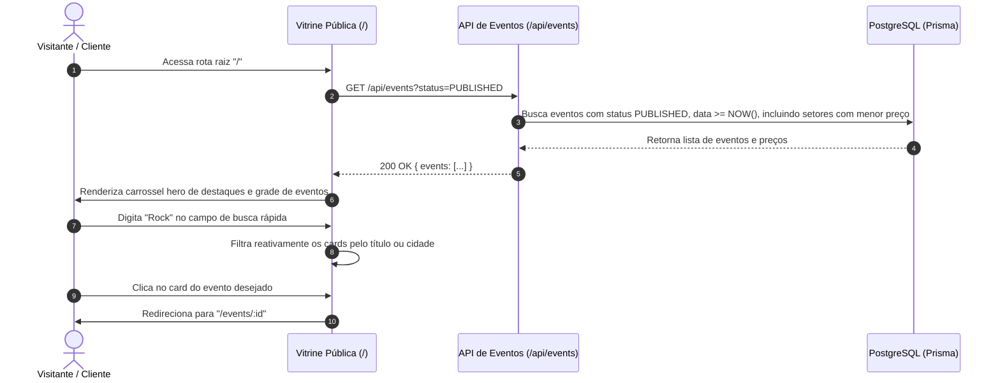
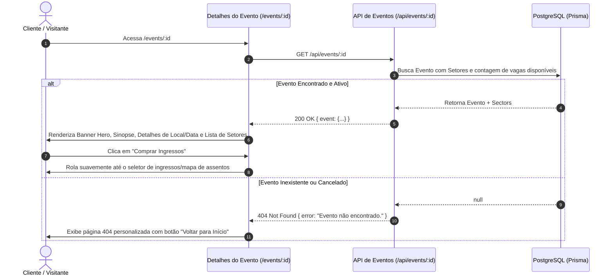
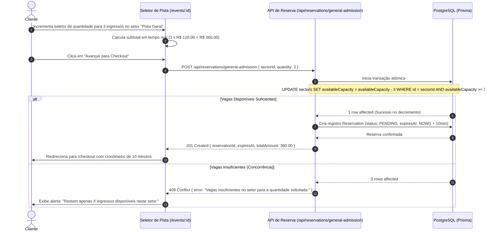
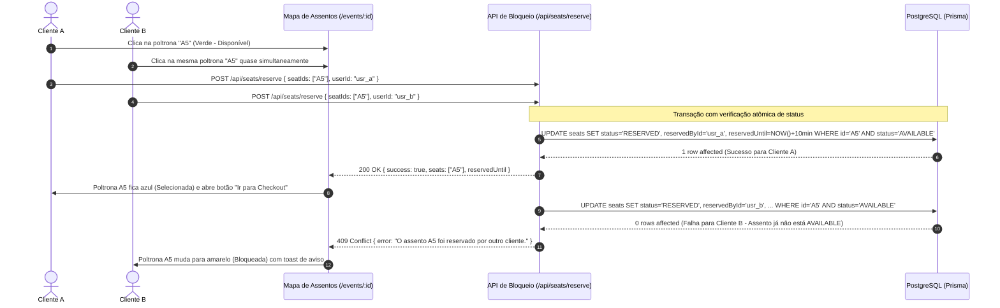
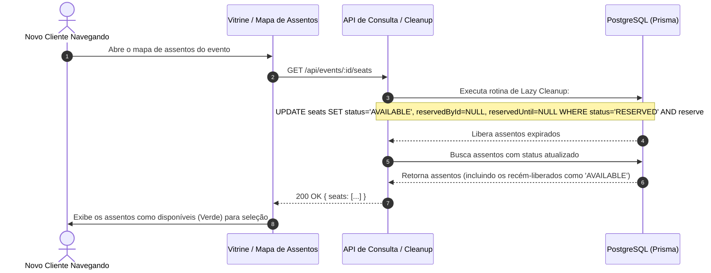
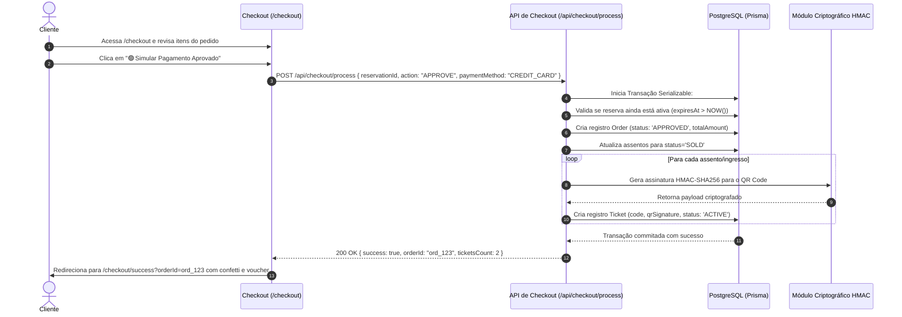
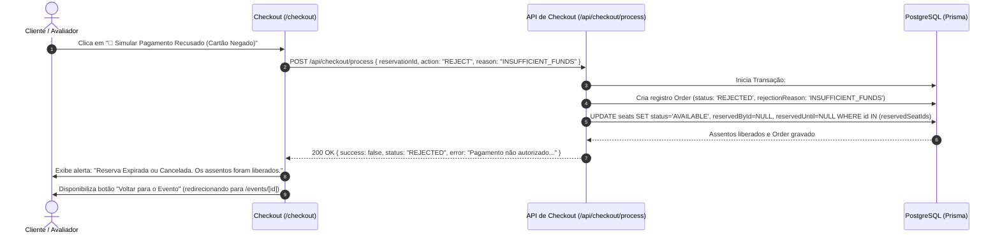
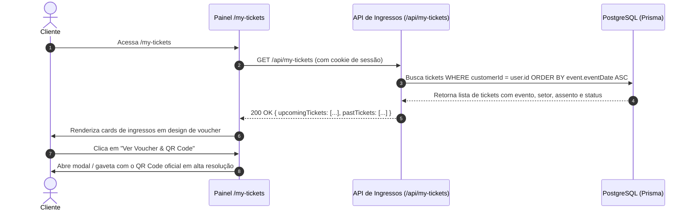
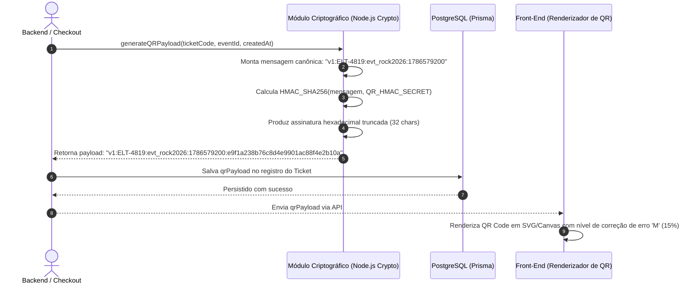
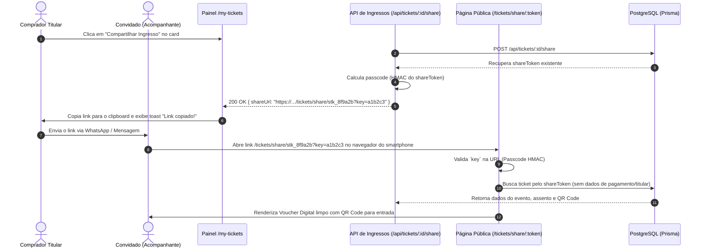

# Módulo 3: Venda, Reserva Anti-Double Booking, Checkout e Vouchers (UC11 a UC20)

Este documento consolida os casos de uso detalhados do módulo.

> [!IMPORTANT]
> **Status do Módulo**: 🔴 OBRIGATÓRIO (Requisito Mínimo do Desafio)


---
# Caso de Uso: UC11 - Vitrine Pública e Navegação de Eventos
## Plataforma de Eventos e Ingressos (Fase 2 - Core)

---

## 1. Identificação e Descrição
- **Identificador**: `UC11`
- **Classificação**: 🔴 OBRIGATÓRIO (Requisito Mínimo do Desafio)
- **Nome**: Vitrine Pública, Navegação e Busca Rápida de Eventos
- **Objetivo**: Permitir que qualquer visitante ou cliente descubra eventos publicados na página inicial (`/`), navegando por categorias em destaque, visualizando informações essenciais (cartaz, título, data, local e preço inicial) e realizando busca rápida textual com resultados reativos.

---

## 2. Atores
- **Visitante / Cliente (`CUSTOMER`)**: Navega na plataforma para encontrar atrações de interesse.
- **Sistema / Vitrine Pública**: Apresenta os eventos com paginação, cartazes otimizados e ordenação temporal.

---

## 3. Pré-condições e Pós-condições
- **Pré-condição**:
  - Existem eventos cadastrados com status `PUBLISHED` e data futura no banco de dados.
- **Pós-condição**:
  - A grade de eventos é renderizada com preços mínimos calculados por setor ("A partir de R$ XX,XX").
  - O usuário pode clicar em qualquer card para acessar a página de detalhes.

---

## 4. Diagrama de Sequência



---

## 5. Fluxo Principal de Execução

1. O visitante acessa a página principal `/`.
2. A aplicação executa uma consulta aos eventos publicados:
   - Carrega eventos futuros com status `PUBLISHED`.
   - Calcula o menor preço entre os setores ativos para cada evento (`minPrice`).
3. A página inicial exibe:
   - **Hero Banner**: Destaque com headline interativa utilizando animação de digitação (*typewriter effect*), alternando ciclicamente entre 9 frases, onde a palavra/termo-chave dinâmico é destacado com uma cor temática exclusiva para cada categoria:
     1. *"Seu próximo <span style="color:#0057ff">show</span> começa aqui."* (Azul Action Blue `#0057ff`)
     2. *"Seu próximo <span style="color:#731be5">filme</span> começa aqui."* (Roxo Vibrant Purple `#731be5`)
     3. *"Sua próxima <span style="color:#e11d48">festa</span> começa aqui."* (Rosa/Rose `#e11d48`)
     4. *"Sua próxima <span style="color:#f59e0b">peça de teatro</span> começa aqui."* (Âmbar/Teatro `#f59e0b`)
     5. *"Sua próxima <span style="color:#059669">palestra</span> começa aqui."* (Verde Esmeralda `#059669`)
     6. *"Seu próximo <span style="color:#0891b2">workshop</span> começa aqui."* (Ciano `#0891b2`)
     7. *"Seu próximo <span style="color:#4f46e5">networking</span> começa aqui."* (Índigo `#4f46e5`)
     8. *"Sua próxima <span style="color:#dc2626">história</span> começa aqui."* (Vermelho `#dc2626`)
     9. *"Sua próxima <span style="color:#0d9488">experiência</span> começa aqui."* (Teal/Turquesa `#0d9488`)
     A animação digita a frase progressivamente simulando uma pessoa digitando, mantém o texto por 3 segundos (3000ms), apaga suavemente e avança para a próxima frase. O container do título possui altura fixa calibrada responsivamente para acomodar 1 ou 2 linhas sem qualquer variação de altura ou pulo na página. Logo abaixo da barra de pesquisa, exibe os **Filtros Rápidos de Categoria** (Pílulas interativas).
   - **Navegação de Categorias**: Ao clicar em uma pílula de categoria específica (ex: "Shows"), o visitante é redirecionado para a página do catálogo (`/events`) exibindo apenas aqueles eventos. Ao clicar em "Todos", retorna para a vitrine inicial padrão (`/`).
   - **Barra de Busca Rápida**: Campo de texto com busca instantânea por título, artista ou cidade. Redireciona buscas do contexto principal para a página de catálogo.
   - **Grade de Destaques (2 Fileiras)**: Grade responsiva exibindo até 7 eventos. No 8º slot, é exibido um card de chamada de ação dinâmico "Ver todos os eventos", redirecionando o cliente para a página de catálogo `/events`.
   - **Carrosséis por Categoria (Show, Cinema, Teatro, Festivais)**: Uma seção dedicada e rolável horizontalmente contendo até 8 eventos daquela categoria específica, finalizando com um card interativo de "Ver todos os eventos [Tipo]".
4. O visitante pode clicar no card "Ver Todos" e ser redirecionado para a página de catálogo completo em `/events`, que apresenta todos os eventos combinados com paginação (ou grade livre) e filtros ativos no cabeçalho (`CategoryPills`).
5. A aplicação navega fluidamente para a página de detalhes do evento selecionado (`/events/:id`) quando um card de evento individual é clicado.

---

## 6. Fluxos Alternativos e Exceções

### Fluxo Alternativo 1: Nenhum Evento Cadastrado
- **Cenário**: O banco de dados ainda não possui eventos publicados.
- **Comportamento**: A vitrine exibe uma tela de estado vazio (*empty state*) elegante, com ilustração e mensagem convidativa: *"Nenhum evento em cartaz no momento. Fique atento às próximas novidades!"*.

### Fluxo Alternativo 2: Filtragem por Pílula de Categoria
- **Cenário**: O cliente clica na pílula "Filmes".
- **Comportamento**: Apenas eventos com categoria `MOVIE` permanecem visíveis na grade.

---

## 7. Regras de Negócio (RN)

- **RN01 - Ocultação de Eventos Não Publicados**: Eventos em status `DRAFT` ou `CANCELLED` nunca devem ser listados na vitrine pública.
- **RN02 - Cálculo do Preço Mínimo**: O valor exibido no card ("A partir de R$ XX") deve corresponder ao menor preço unitário ativo entre todos os setores daquele evento.
- **RN03 - Ordenação Padrão**: Os eventos devem ser ordenados cronologicamente pela data de realização mais próxima (`eventDate ASC`).
- **RN04 - Busca e Filtros Públicos sem Autenticação**: A vitrine (`/`), a página de catálogo completo (`/events`), a busca por termo (`q`) e as pílulas de filtro de categoria (`CategoryPills`) devem ser 100% acessíveis publicamente sem necessidade de login.
- **RN05 - Interatividade Visual (Hover & Feedback)**: Os botões de filtro de categoria possuem estados visuais claros de hover (`hover:bg-surface-hover`, `hover:border-primary/40`, `hover:text-primary`), transição suave de cores e feedback ao clique.

---

## 8. Contratos de API

### Requisição: `GET /api/events?category=SHOW&query=Indie`

### Resposta de Sucesso: `HTTP 200 OK`
```json
{
  "success": true,
  "total": 1,
  "events": [
    {
      "id": "evt_rock2026",
      "title": "Festival Indie Rock Verzel 2026",
      "category": "SHOW",
      "eventDate": "2026-11-20T20:00:00.000Z",
      "locationName": "Espaço Hall Cultural",
      "city": "São Paulo, SP",
      "bannerUrl": "https://images.unsplash.com/photo-1470225620780-dba8ba36b745",
      "minPrice": 120.00,
      "status": "PUBLISHED"
    }
  ]
}
```

---

## 9. Critérios de Aceite (BDD / Gherkin)

```gherkin
Funcionalidade: Vitrine Pública de Eventos
  Como um visitante da plataforma sem login
  Eu quero pesquisar e filtrar eventos por categoria
  Para escolher um evento e visualizar seus detalhes sem precisar autenticar

  Cenário: Visualização de cards e filtros na página inicial sem login
    Dado que não estou autenticado na plataforma
    Quando eu acesso a URL raiz "/" ou "/events"
    Então eu devo ver a lista de eventos com título, data, local e preço "A partir de R$ XX"
    E devo poder passar o cursor sobre as pílulas de categoria vendo o efeito de hover
    E ao clicar em uma categoria (ex: "Shows"), devo visualizar os eventos filtrados sem redirecionamento para login

  Cenário: Busca textual por evento sem login
    Dado que estou na página inicial "/" como visitante anônimo
    Quando eu digito "Indie" no campo de busca rápida
    Então a aplicação deve realizar a busca e exibir os eventos correspondentes sem exigir autenticação
```


---

# Caso de Uso: UC12 - Visualização Detalhada do Evento
## Plataforma de Eventos e Ingressos (Fase 2 - Core)

---

## 1. Identificação e Descrição
- **Identificador**: `UC12`
- **Classificação**: 🔴 OBRIGATÓRIO (Requisito Mínimo do Desafio)
- **Nome**: Visualização Detalhada do Evento (`/events/:id`)
- **Objetivo**: Apresentar ao cliente todas as informações completas de um evento específico (banner cinematográfico em alta resolução, sinopse, local com endereço, data e horário, lista de setores disponíveis com preços e botão de chamada para ação de compra).

---

## 2. Atores
- **Cliente / Visitante**: Consulta os detalhes completos antes de decidir pela compra.
- **Sistema / Página de Detalhes**: Renderiza o layout imersivo com os dados consolidados do evento e setores.

---

## 3. Pré-condições e Pós-condições
- **Pré-condição**:
  - O evento com o ID solicitado existe no banco de dados.
- **Pós-condição**:
  - A página exibe a sinopse, especificações do local, setores disponíveis e habilita o botão "Selecionar Ingressos / Escolher Assentos".

---

## 4. Diagrama de Sequência



---

## 5. Fluxo Principal de Execução

1. O cliente clica em um evento na vitrine ou acessa diretamente `/events/:id`.
2. A página renderiza:
   - **Hero Imersivo**: Imagem de fundo estilizada com gradiente e layout responsivo, título imponente, badge de categoria e organizador.
   - **Cartão de Informações Rápidas**:
     - 📅 Data e horário com contagem regressiva formatada.
     - 📍 Local físico e cidade com botões de navegação para aplicativos externos (Google Maps, Waze, Apple Maps).
     - 🎟️ Faixa de preços ("A partir de R$ XX") e formas de pagamento simuladas.
   - **Corpo Principal**:
     - Sinopse completa e descrição do evento.
     - **Mapa Interativo Integrado (Google Maps Embed)**:
       - Renderizado via iframe seguro (`maps.google.com/maps?q=...&output=embed`) sem necessidade de chave de API externa.
       - Permite visualização espacial do local com zoom e modo satélite/rua.
     - Tabela e seletor interativo de setores disponíveis (`Pista Livre` ou `Mapa de Assentos Numerados`), com cálculo em tempo real de vagas e subtotais.
   - **Painel Flutuante / Sticky de Compra**:
     - Botão em destaque: **"Comprar Ingressos"** ou **"Ver Assentos Disponíveis"**.
3. O cliente clica em "Comprar Ingressos", iniciando a escolha entre seleção de quantidade (Pista) ou abertura do mapa interativo de assentos.

---

## 6. Fluxos Alternativos e Exceções

### Fluxo Alternativo 1: Evento com Ingressos Esgotados
- **Cenário**: Todos os setores estão com `availableCapacity = 0`.
- **Comportamento**: O botão de compra é desabilitado exibindo o status *"Ingressos Esgotados"* em cinza, impedindo avanço para o checkout.

### Fluxo Alternativo 2: Abertura de Rota em Aplicativo de Navegação
- **Cenário**: O cliente clica no botão "Abrir no Waze" ou "Abrir no Google Maps".
- **Comportamento**: Uma nova aba é aberta diretamente com as coordenadas/endereço do local (`https://waze.com/ul?q=...` ou `https://www.google.com/maps/dir/?api=1&destination=...`).

### Fluxo de Exceção 1: ID Inválido ou Evento Inexistente (404)
- **Condição**: O ID na URL não existe no banco de dados.
- **Comportamento**: A aplicação renderiza a página de erro `404 - Evento Não Encontrado` com botão de retorno à vitrine.

---

## 7. Regras de Negócio (RN)

- **RN01 - Exibição de Setores**: Apenas setores com capacidade maior que zero devem ser listados na área de seleção.
- **RN02 - Formatação de Moeda**: Todos os valores monetários devem ser formatados no padrão brasileiro (`R$ 1.250,00`).
- **RN03 - Mapa Embed Resiliente**: O componente de mapa deve codificar em URI o nome do local e cidade (`encodeURIComponent`), garantindo renderização instantânea mesmo para locais sem coordenadas GPS salvas.

---

## 8. Contratos de API

### Requisição: `GET /api/events/evt_rock2026`

### Resposta de Sucesso: `HTTP 200 OK`
```json
{
  "success": true,
  "event": {
    "id": "evt_rock2026",
    "title": "Festival Indie Rock Verzel 2026",
    "description": "Uma noite épica com as melhores bandas...",
    "category": "SHOW",
    "eventDate": "2026-11-20T20:00:00.000Z",
    "locationName": "Espaço Hall Cultural",
    "city": "São Paulo, SP",
    "bannerUrl": "https://images.unsplash.com/photo-1470225620780-dba8ba36b745",
    "status": "PUBLISHED",
    "sectors": [
      {
        "id": "sec_pista_01",
        "name": "Pista Geral",
        "type": "GENERAL_ADMISSION",
        "price": 120.00,
        "totalCapacity": 200,
        "availableCapacity": 185
      },
      {
        "id": "sec_vip_01",
        "name": "Plateia VIP Numerada",
        "type": "NUMBERED_SEATS",
        "price": 250.00,
        "totalCapacity": 30,
        "availableCapacity": 24
      }
    ]
  }
}
```

---

## 9. Critérios de Aceite (BDD / Gherkin)

```gherkin
Funcionalidade: Visualização Detalhada do Evento
  Como um Cliente
  Eu quero ver os detalhes completos de um evento
  Para conhecer os setores e preços antes de reservar

  Cenário: Visualização com sucesso dos detalhes do evento
    Dado que existe o evento publicado "Festival Indie Rock Verzel 2026"
    Quando eu acesso a URL "/events/evt_rock2026"
    Então eu devo ver o título, a sinopse completa, a data "20/11/2026" e o local
    E devo ver a lista de setores com os preços "R$ 120,00" e "R$ 250,00"
    E o botão "Comprar Ingressos" deve estar habilitado
```


---

# Caso de Uso: UC13 - Reserva e Seleção de Quantidade em Setores de Pista
## Plataforma de Eventos e Ingressos (Fase 2 - Core)

---

## 1. Identificação e Descrição
- **Identificador**: `UC13`
- **Classificação**: 🔴 OBRIGATÓRIO (Requisito Mínimo do Desafio)
- **Nome**: Seleção de Quantidade e Reserva Atômica em Setores de Pista (General Admission)
- **Objetivo**: Permitir que o cliente escolha a quantidade de ingressos desejada para um setor de pista/lotação geral (ex: 1 a 6 ingressos), calculando o valor total em tempo real e realizando o bloqueio atômico temporário das vagas no banco de dados para evitar superlotação.

---

## 2. Atores
- **Cliente (`CUSTOMER`)**: Seleciona o número de ingressos de pista e inicia o checkout.
- **Backend / Engine de Reserva**: Realiza o bloqueio atômico decrementando a capacidade disponível durante o TTL de 10 minutos.

---

## 3. Pré-condições e Pós-condições
- **Pré-condição**:
  - O setor selecionado é do tipo `GENERAL_ADMISSION` e possui `availableCapacity >= quantidade solicitada`.
- **Pós-condição**:
  - Uma reserva temporária é gerada com status `PENDING` associada ao usuário ou sessão.
  - A `availableCapacity` do setor é decrementada temporariamente no banco de dados.
  - O cliente é direcionado para a tela de `/checkout`.

---

## 4. Diagrama de Sequência



---

## 5. Fluxo Principal de Execução

1. Na página do evento, o cliente localiza a seção do setor de Pista.
2. O componente exibe:
   - Nome do setor (ex: *"Pista Comum"*).
   - Preço unitário (ex: `R$ 120,00`).
   - Contador de quantidade com botões `[-]` e `[+]` (mínimo 1, máximo 6 por compra).
   - Mostrador dinâmico do valor total.
3. O cliente ajusta a quantidade (ex: `2` ingressos) e clica em **"Ir para Pagamento"**.
4. O backend recebe a requisição e executa um comando atômico no banco:
   `UPDATE "Sector" SET "availableCapacity" = "availableCapacity" - 2 WHERE "id" = :sectorId AND "availableCapacity" >= 2`.
5. Se a atualização afetar 1 linha, o backend cria o registro `Reservation` com status `PENDING` e `expiresAt = NOW() + 10 minutos`.
6. O cliente é redirecionado para a página `/checkout`, onde o tempo de reserva passa a ser exibido em contagem regressiva.

---

## 6. Fluxos Alternativos e Exceções

### Fluxo de Exceção 1: Quantidade Solicitada Maior que o Estoque Atual
- **Condição**: Outro comprador finalizou a compra milissegundos antes e restam menos vagas do que o solicitado.
- **Comportamento**: O backend rejeita a transação (`409 Conflict`), retorna a capacidade restante real e a UI atualiza o limite máximo do botão `[+]`.

### Fluxo de Exceção 2: Tentativa de Compra por Conta de Organizador
- **Condição**: Um usuário autenticado com o papel `ORGANIZER` tenta reservar ingressos de pista.
- **Comportamento**: O sistema não permite a compra. A interface exibe um modal informativo solicitando login com uma conta de cliente (com ação para alternar de conta). No backend, a API retorna `403 Forbidden` (`code: "ORGANIZER_CANNOT_BUY"`).

---

## 7. Regras de Negócio (RN)

- **RN01 - Limite Máximo por Compra**: Cada transação de pista é limitada a no máximo **6 ingressos** para coibir cambismo.
- **RN02 - Atomicidade de Decremento**: O decremento da capacidade deve obrigatoriamente verificar `availableCapacity >= quantity` na cláusula `WHERE` da query SQL, impedindo que a capacidade fique negativa.
- **RN03 - Tempo de Retenção (TTL)**: A reserva de pista retém a quantidade por exatamente **10 minutos**.
- **RN04 - Exclusividade de Compra para Clientes**: Organizadores (`ORGANIZER`) e operadores de portaria (`GATEKEEPER`) não têm permissão para comprar ingressos. O fluxo de compra é restrito exclusivamente ao perfil `CUSTOMER`.

---

## 8. Contratos de API

### Requisição: `POST /api/reservations/general-admission`
```json
{
  "sectorId": "sec_pista_01",
  "quantity": 2
}
```

### Resposta de Sucesso: `HTTP 201 Created`
```json
{
  "success": true,
  "reservation": {
    "id": "res_ga_123456",
    "sectorId": "sec_pista_01",
    "quantity": 2,
    "unitPrice": 120.00,
    "totalPrice": 240.00,
    "expiresAt": "2026-08-14T03:50:00.000Z"
  }
}
```

---

## 9. Critérios de Aceite (BDD / Gherkin)

```gherkin
Funcionalidade: Reserva de Pista por Quantidade
  Como um Cliente
  Eu quero selecionar a quantidade de ingressos de pista
  Para garantir minhas vagas temporariamente antes do pagamento

  Cenário: Reserva de 2 ingressos de pista com capacidade suficiente
    Dado que o setor "Pista Geral" possui 50 vagas disponíveis
    Quando eu seleciono a quantidade 2 e clico em "Ir para Pagamento"
    Então o sistema deve reservar atomicamente 2 vagas
    E a capacidade disponível do setor deve passar para 48
    E eu devo ser redirecionado para a tela de checkout com a reserva ativa
```


---

# Caso de Uso: UC14 - Seleção no Mapa de Assentos com Bloqueio Atômico Anti-Double Booking
## Plataforma de Eventos e Ingressos (Fase 2 - Core)

---

## 1. Identificação e Descrição
- **Identificador**: `UC14`
- **Classificação**: 🔴 OBRIGATÓRIO (Requisito Mínimo do Desafio)
- **Nome**: Seleção Interativa no Mapa de Assentos com Bloqueio Atômico Anti-Double Booking
- **Objetivo**: Fornecer um mapa interativo e responsivo de poltronas (inspirado em *ingresso.com*), permitindo que o cliente clique nos assentos desejados e execute um bloqueio atômico com tempo limite (10 min) no PostgreSQL, garantindo de forma matemática que dois clientes nunca consigam reservar a mesma poltrona física simultaneamente.

---

## 2. Atores
- **Cliente (`CUSTOMER`)**: Visualiza a sala, clica nas poltronas e realiza a reserva.
- **Engine Anti-Double Booking (Banco de Dados)**: Controla concorrência via `UPDATE ... WHERE status = 'AVAILABLE'` com locks em nível de linha no PostgreSQL.

---

## 3. Pré-condições e Pós-condições
- **Pré-condição**:
  - O setor selecionado possui assentos numerados cadastrados.
  - O cliente está autenticado.
- **Pós-condição**:
  - Os assentos selecionados mudam de `AVAILABLE` para `RESERVED` com `reservedById = user.id` e `reservedUntil = NOW() + 10min`.
  - O cliente é direcionado para a tela de `/checkout`.

---

## 4. Diagrama de Sequência



---

## 5. Fluxo Principal de Execução

1. O cliente clica em "Escolher Assentos" na página do evento.
2. O mapa de assentos é renderizado:
   - Indicador de "Tela / Palco" no topo para orientação espacial.
   - Grade organizada por fileiras (A, B, C...) e números de poltrona (1, 2, 3...).
   - **Legenda de Estados**:
     - 🟢 `Livre` (Fundo sutil, borda clara, clicável).
     - 🔵 `Selecionado` (Fundo azul vibrante, assento escolhido pelo usuário atual).
     - 🟡 `Em Reserva` (Fundo amarelo/âmbar, bloqueado temporariamente por outro usuário).
     - ⚫ `Ocupado / Vendido` (Fundo cinza escuro, opacidade reduzida, não clicável).
3. O cliente clica na poltrona `A1` e na poltrona `A2`.
4. O rodapé do mapa exibe o resumo imediato: *"2 assentos selecionados (A1, A2) - Total: R$ 500,00"*.
5. O cliente clica em **"Avançar para Pagamento"**.
6. O front-end dispara a requisição `POST /api/seats/reserve` contendo o array de IDs dos assentos.
7. O backend executa uma transação atômica no PostgreSQL. Se todos os assentos estiverem com status `AVAILABLE`, a transação atualiza os assentos para `RESERVED`, fixa o `reservedUntil` para daqui a 10 minutos e associa ao ID do cliente.
8. A resposta de sucesso é retornada e o usuário é redirecionado para `/checkout`.

---

## 6. Fluxos Alternativos e Exceções

### Fluxo de Exceção 1: Conflito de Concorrência (Race Condition / 409 Conflict)
- **Condição**: Outro usuário reservou um dos assentos escolhidos frações de segundo antes.
- **Comportamento**: A transação no banco não afeta todas as linhas solicitadas e sofre rollback imediato. O backend retorna `409 Conflict` especificando quais assentos tornaram-se indisponíveis. A interface colore imediatamente esses assentos como indisponíveis e solicita que o cliente escolha outra poltrona.

---

## 7. Regras de Negócio (RN)

- **RN01 - Garantia Anti-Double Booking**: Toda alteração de estado para `RESERVED` deve ser condicional (`WHERE status = 'AVAILABLE'`). Se a contagem de linhas afetadas for menor que a quantidade solicitada, a transação inteira é cancelada.
- **RN02 - Limite de Assentos**: O cliente pode selecionar no máximo **6 assentos** por pedido.
- **RN03 - Janela de Retenção**: A reserva expira em **10 minutos** contados a partir do timestamp do banco de dados.

---

## 8. Contratos de API

### Requisição: `POST /api/seats/reserve`
```json
{
  "seatIds": ["seat_a1_uuid", "seat_a2_uuid"]
}
```

### Resposta de Sucesso: `HTTP 200 OK`
```json
{
  "success": true,
  "reservedSeats": ["A1", "A2"],
  "totalPrice": 500.00,
  "reservedUntil": "2026-08-14T03:52:00.000Z"
}
```

### Resposta de Conflito: `HTTP 409 Conflict`
```json
{
  "success": false,
  "error": "O assento A1 não está mais disponível.",
  "unavailableSeatIds": ["seat_a1_uuid"]
}
```

---

## 9. Critérios de Aceite (BDD / Gherkin)

```gherkin
Funcionalidade: Bloqueio Atômico de Assentos Numerados
  Como um Cliente
  Eu quero selecionar poltronas específicas no mapa
  Para garantir meus lugares sem o risco de compra duplicada por outro usuário

  Cenário: Reserva de assentos disponíveis com sucesso
    Dado que os assentos "A1" e "A2" estão com status "AVAILABLE"
    Quando eu seleciono "A1" e "A2" no mapa e clico em "Avançar para Pagamento"
    Então o sistema deve atualizar o status dos dois assentos para "RESERVED"
    E deve associar o bloqueio ao meu ID de usuário por 10 minutos
    E deve me redirecionar para a tela de checkout

  Cenário: Conflito de assento simultâneo
    Dado que o Cliente A e o Cliente B tentam reservar o mesmo assento "A1" simultaneamente
    Quando a requisição do Cliente A é processada primeiro
    Então o Cliente A deve receber status 200 e ter o assento reservado
    E o Cliente B deve receber status 409 com aviso de assento indisponível
    E o assento "A1" nunca deve ser concedido aos dois clientes
```


---

# Caso de Uso: UC15 - Expiração de Tempo Limite (TTL) e Liberação de Assentos
## Plataforma de Eventos e Ingressos (Fase 2 - Core)

---

## 1. Identificação e Descrição
- **Identificador**: `UC15`
- **Classificação**: 🔴 OBRIGATÓRIO (Requisito Mínimo do Desafio)
- **Nome**: Expiração Automática de Reservas por Tempo Limite (TTL) e Liberação de Estoque
- **Objetivo**: Garantir que assentos numerados ou cotas de pista que tenham sido reservados mas não foram pagos dentro da janela de tolerância de 10 minutos sejam automaticamente liberados e retornem para a vitrine pública, evitando retenção indefinida por abandono de carrinho.

---

## 2. Atores
- **Sistema / Rotina de Limpeza (Lazy Cleanup / Worker)**: Identifica e expira reservas ultrapassadas.
- **Visitantes e Clientes Concorrentes**: Passam a ter acesso imediato às vagas que foram liberadas.

---

## 3. Pré-condições e Pós-condições
- **Pré-condição**:
  - Existem assentos com status `RESERVED` cujo `reservedUntil < NOW()` ou reservas de pista `PENDING` com `expiresAt < NOW()`.
- **Pós-condição**:
  - Os assentos numerados retornam para status `AVAILABLE` com `reservedById = NULL` e `reservedUntil = NULL`.
  - A capacidade disponível de setores de pista (`availableCapacity`) é incrementada correspondente à quantidade expirada.

---

## 4. Diagrama de Sequência



---

## 5. Fluxo Principal de Execução

1. O cliente A reserva a poltrona `B3` às `14:00`, recebendo prazo de pagamento até às `14:10`.
2. O cliente A fecha o navegador ou abandona a tela de checkout sem finalizar a compra.
3. Às `14:11`, o cliente B abre o mapa de assentos do mesmo evento.
4. Antes de entregar a lista de assentos para o cliente B, o backend executa a rotina de verificação e limpeza (*lazy expiration*):
   - Localiza todos os assentos com `status = 'RESERVED'` e `reservedUntil < NOW()`.
   - Executa `UPDATE seats SET status = 'AVAILABLE', "reservedById" = NULL, "reservedUntil" = NULL WHERE status = 'RESERVED' AND "reservedUntil" < NOW()`.
   - Para reservas de pista expiradas, atualiza `status = 'EXPIRED'` e incrementa a `availableCapacity` do setor correspondente.
5. O cliente B visualiza a poltrona `B3` com status verde `AVAILABLE` e pode selecioná-la normalmente.

---

## 6. Fluxos Alternativos e Exceções

### Fluxo de Exceção 1: Cliente Tentando Pagar Após o Vencimento do TTL
- **Cenário**: O cliente A ficou 15 minutos na tela de checkout e clica em "Pagar" após o cronômetro zerar.
- **Comportamento**: A API de checkout rejeita o pagamento com `410 Gone` (*"Sua reserva de 10 minutos expirou. Por favor, selecione os assentos novamente."*), exibindo o estado de reserva expirada com botão de retorno direto para a página do evento (`/events/[id]`) para reiniciar a seleção.

---

## 7. Regras de Negócio (RN)

- **RN01 - Dupla Camada de Expiração**: A liberação deve ocorrer de forma reativa (em cada requisição de leitura do mapa - *lazy expiration*) e preventivamente antes de qualquer tentativa de checkout.
- **RN02 - Cronômetro Sincronizado**: O front-end do checkout deve calcular a contagem regressiva baseado na diferença entre o timestamp do servidor (`expiresAt`) e o relógio local.

---

## 8. Contratos de API

### Requisição Interna / Trigger: `POST /api/cron/release-expired-reservations`

### Resposta de Sucesso: `HTTP 200 OK`
```json
{
  "success": true,
  "releasedSeatsCount": 4,
  "releasedPistaReservationsCount": 1,
  "timestamp": "2026-08-14T03:55:00.000Z"
}
```

---

## 9. Critérios de Aceite (BDD / Gherkin)

```gherkin
Funcionalidade: Liberação Automática de Reservas Expiradas
  Como o sistema de controle de estoque de ingressos
  Eu quero liberar assentos não pagos após 10 minutos
  Para que outros clientes possam adquiri-los

  Cenário: Liberação automática de assento após expiração do prazo
    Dado que a poltrona "B3" foi reservada às 14:00 com expiração às 14:10
    Quando o relógio atinge 14:11 e um novo cliente consulta o mapa
    Então o sistema deve atualizar o status da poltrona "B3" de volta para "AVAILABLE"
    E a poltrona "B3" deve aparecer livre para compra
```


---

# Caso de Uso: UC16 - Checkout e Simulação de Pagamento Aprovado
## Plataforma de Eventos e Ingressos (Fase 2 - Core)

---

## 1. Identificação e Descrição
- **Identificador**: `UC16`
- **Classificação**: 🔴 OBRIGATÓRIO (Requisito Mínimo do Desafio)
- **Nome**: Checkout e Simulação de Pagamento com Sucesso (Aprovação e Emissão)
- **Objetivo**: Permitir que o cliente revise os detalhes do seu pedido na tela de checkout (`/checkout`), visualize o resumo dos assentos e valores, e acione o botão deliberado **"Simular Pagamento Aprovado"**, gerando o pedido definitivo (`Order`), convertendo os assentos para `SOLD` e emitindo os ingressos digitais com seus respectivos QR Codes criptografados.

---

## 2. Atores
- **Cliente (`CUSTOMER`)**: Revisa o pedido e confirma o pagamento simulado.
- **Gateway de Pagamento Simulado**: Processa a aprovação da transação financeira fictícia.
- **Engine de Emissão de Ingressos**: Cria os registros de `Ticket` e assina os QR Codes via HMAC.

---

## 3. Pré-condições e Pós-condições
- **Pré-condição**:
  - O cliente possui uma reserva ativa válida (dentro do prazo de 10 minutos).
  - O cliente está autenticado na plataforma.
- **Pós-condição**:
  - O pedido é gravado com status `APPROVED`.
  - Os assentos mudam para `SOLD` com `isOccupied = true`.
  - São criados os registros de `Ticket` individuais vinculados ao cliente.
  - O cliente é redirecionado para a página de sucesso com links para download e visualização dos ingressos.

---

## 4. Diagrama de Sequência



---

## 5. Fluxo Principal de Execução

1. O cliente é direcionado para a tela `/checkout` contendo:
   - Resumo da compra: Nome do evento, data/hora, local, setor e etiquetas dos assentos (ex: *"Plateia VIP - Poltronas A1, A2"*).
   - Discriminação de valores: Subtotal, taxas de serviço (se aplicável) e valor total a pagar.
   - Cronômetro regressivo destacado indicando os minutos/segundos restantes para expiração.
   - Painel de Simulação de Pagamento com dados fictícios de cartão e botões de teste.
2. O cliente clica no botão verde **"Simular Pagamento Aprovado"**.
3. O front-end exibe estado de carregamento (*loading spinner*) no botão para evitar cliques duplicados.
4. O front-end envia `POST /api/checkout/process` com `action: "APPROVE"`.
5. O backend executa em transação atômica:
   - Verifica se os assentos ainda estão associados ao usuário e dentro do TTL.
   - Registra o `Order` com status `APPROVED`.
   - Altera os assentos para status `SOLD`.
   - Gera um código legível único para cada ingresso (ex: `ELT-7821`).
   - Calcula a assinatura criptográfica HMAC do QR Code.
   - Persiste os registros de `Ticket` com status inicial `ACTIVE`.
6. A resposta retorna HTTP 200 com os dados do pedido aprovado.
7. A aplicação redireciona para a página `/checkout/success`, exibindo animação de confirmação e atalho direto para a área "Meus Ingressos".

---

## 6. Fluxos Alternativos e Exceções

### Fluxo de Exceção 1: Reserva Expirada Durante a Finalização
- **Condição**: O cliente clicou no momento exato em que os 10 minutos se esgotaram.
- **Comportamento**: A transação é abortada com `410 Gone`. Os assentos são liberados e o usuário recebe a mensagem explicativa com botão para voltar diretamente para a página do evento (`/events/[id]`) e reiniciar a seleção dos ingressos.

---

## 7. Regras de Negócio (RN)

- **RN01 - Transacionalidade Rígida**: O pagamento, a criação do pedido, a mudança de status dos assentos para `SOLD` e a emissão dos ingressos devem ocorrer dentro de uma única transação de banco de dados (`prisma.$transaction`).
- **RN02 - Unicidade do Código do Ingresso**: Cada ingresso emitido deve receber um identificador alfanumérico curto único no sistema (ex: `ELT-XXXX`).
- **RN03 - Assinatura do QR Code**: Todo ingresso emitido deve ter seu QR Code assinado no momento da criação.

---

## 8. Contratos de API

### Requisição: `POST /api/checkout/process`
```json
{
  "reservationId": "res_a1a2_uuid",
  "action": "APPROVE",
  "paymentMethod": "SIMULATED_CREDIT_CARD"
}
```

### Resposta de Sucesso: `HTTP 200 OK`
```json
{
  "success": true,
  "orderId": "ord_8829104",
  "status": "APPROVED",
  "totalPaid": 500.00,
  "tickets": [
    {
      "id": "tkt_1",
      "ticketCode": "ELT-4819",
      "seatNumber": "A1",
      "sectorName": "Plateia VIP Numerada",
      "status": "ACTIVE"
    },
    {
      "id": "tkt_2",
      "ticketCode": "ELT-4820",
      "seatNumber": "A2",
      "sectorName": "Plateia VIP Numerada",
      "status": "ACTIVE"
    }
  ]
}
```

---

## 9. Critérios de Aceite (BDD / Gherkin)

```gherkin
Funcionalidade: Pagamento Simulado Aprovado
  Como um Cliente
  Eu quero simular a aprovação do meu pagamento
  Para receber meus ingressos e ter minha compra confirmada

  Cenário: Simulação de compra aprovada com sucesso
    Dado que estou na tela de checkout com a reserva ativa dos assentos "A1" e "A2"
    Quando eu clico no botão "Simular Pagamento Aprovado"
    Então o sistema deve aprovar a transação
    E deve criar o pedido com status "APPROVED"
    E deve marcar os assentos como "SOLD"
    E deve emitir 2 ingressos ativos com QR Code assinado
    E deve me redirecionar para a página de confirmação "/checkout/success"
```


---

# Caso de Uso: UC17 - Checkout e Simulação de Pagamento Recusado
## Plataforma de Eventos e Ingressos (Fase 2 - Core)

---

## 1. Identificação e Descrição
- **Identificador**: `UC17`
- **Classificação**: 🔴 OBRIGATÓRIO (Requisito Mínimo do Desafio)
- **Nome**: Checkout e Simulação de Pagamento com Recusa (Tratamento de Falha e Liberação Imediata)
- **Objetivo**: Permitir que o cliente (ou avaliador) acione deliberadamente o botão de teste **"Simular Pagamento Recusado"** (simulando falha de cartão, saldo insuficiente ou rejeição da operadora), registrando a recusa do pedido (`REJECTED`), liberando imediatamente os assentos de volta para disponibilidade pública e exibindo orientações claras para nova tentativa.

---

## 2. Atores
- **Cliente / Avaliador (`CUSTOMER`)**: Testa o fluxo de erro de pagamento.
- **Gateway de Pagamento Simulado**: Processa o evento de recusa intencional.
- **Engine de Estoque (PostgreSQL)**: Desbloqueia os assentos de volta para `AVAILABLE` no mesmo instante.

---

## 3. Pré-condições e Pós-condições
- **Pré-condição**:
  - O cliente está na tela de checkout com uma reserva válida.
- **Pós-condição**:
  - O pedido é gravado como `REJECTED` no histórico para fins de auditoria.
  - Os assentos e vagas são imediatamente liberados (`SeatStatus.AVAILABLE`).
  - Nenhum ingresso é emitido.
  - A interface exibe alerta contextual "Reserva Expirada ou Cancelada" com botão "Voltar para o Evento" direcionando para `/events/[id]`.

---

## 4. Diagrama de Sequência



---

## 5. Fluxo Principal de Execução

1. Na tela de checkout, o cliente localiza a seção de teste e clica no botão vermelho **"Simular Pagamento Recusado"**.
2. O front-end envia a requisição `POST /api/checkout/process` com `action: "REJECT"`.
3. O backend intercepta a ação e executa atomicamente:
   - Cria o registro de `Order` com status `REJECTED` e motivo explicativo.
   - Atualiza todos os assentos vinculados à reserva de volta para `AVAILABLE` (`reservedById = NULL`, `reservedUntil = NULL`).
   - Para setores de pista, restaura a cota de `availableCapacity`.
4. A API retorna a resposta de recusa detalhada.
5. O front-end exibe o bloco/card de aviso **"Reserva Expirada ou Cancelada"**:
   - *"Sua reserva expirou ou o pagamento foi recusado, e os assentos foram liberados para o público."*
6. A interface fornece o botão de ação:
   - **"Voltar para o Evento"** (redireciona para a página do evento correspondente `/events/[id]`, permitindo ao usuário selecionar novos assentos ou tentar novamente a compra no mesmo evento).

---

## 6. Fluxos Alternativos e Exceções

### Fluxo Alternativo 1: Tentativa Imediata de Nova Compra
- **Cenário**: O cliente deseja tentar comprar novamente no mesmo evento após a simulação de recusa ou cancelamento.
- **Comportamento**: Ao clicar em "Voltar para o Evento", o cliente é levado diretamente à página do evento (`/events/[id]`) onde a poltrona/setor acabou de ser liberado (`AVAILABLE`) e pode ser selecionado novamente.

---

## 7. Regras de Negócio (RN)

- **RN01 - Liberação Instantânea**: Em caso de recusa de pagamento, os assentos **não devem** aguardar os 10 minutos para expirar; devem ser liberados no exato momento da recusa para não prejudicar outros compradores.
- **RN02 - Não Emissão de Ingressos**: Em nenhuma hipótese deve ser gerado registro na tabela `tickets` para pedidos com status `REJECTED`.

---

## 8. Contratos de API

### Requisição: `POST /api/checkout/process`
```json
{
  "reservationId": "res_a1a2_uuid",
  "action": "REJECT",
  "reason": "CARD_DECLINED_SIMULATED"
}
```

### Resposta de Recusa: `HTTP 200 OK`
```json
{
  "success": false,
  "orderId": "ord_8829105",
  "status": "REJECTED",
  "error": "Pagamento recusado pela operadora do cartão (Simulação de recusa solicitada pelo usuário).",
  "releasedSeats": ["A1", "A2"]
}
```

---

## 9. Critérios de Aceite (BDD / Gherkin)

```gherkin
Funcionalidade: Pagamento Simulado Recusado
  Como um Avaliador ou Cliente
  Eu quero simular a recusa de pagamento
  Para validar o tratamento de erros e a liberação imediata de estoque

  Cenário: Simulação de recusa de pagamento e liberação de assentos
    Dado que reservei a poltrona "A1" e estou na tela de checkout
    Quando eu clico no botão "Simular Pagamento Recusado"
    Então o sistema deve registrar o pedido como "REJECTED"
    E a poltrona "A1" deve ser liberada imediatamente para o status "AVAILABLE"
    E a tela deve exibir o card "Reserva Expirada ou Cancelada"
    E o botão exibido deve redirecionar o usuário para a página do evento correspondente ("/events/[id]")
    E nenhum ingresso deve ser emitido
```


---

# Caso de Uso: UC18 - Visualização e Gestão de Ingressos no Painel "Meus Ingressos"
## Plataforma de Eventos e Ingressos (Fase 2 - Core)

---

## 1. Identificação e Descrição
- **Identificador**: `UC18`
- **Classificação**: 🔴 OBRIGATÓRIO (Requisito Mínimo do Desafio)
- **Nome**: Visualização, Organização e Gestão de Ingressos no Painel do Cliente (`/my-tickets`)
- **Objetivo**: Permitir que o cliente autenticado visualize todos os seus ingressos adquiridos, organizados em abas de eventos futuros e passados, acessando os vouchers digitais completos, QR Codes para entrada no evento e opções de compartilhamento.

---

## 2. Atores
- **Cliente (`CUSTOMER`)**: Consulta seus ingressos adquiridos.
- **Banco de Dados (PostgreSQL / Prisma)**: Retorna a listagem de ingressos com os dados de eventos e assentos associados.

---

## 3. Pré-condições e Pós-condições
- **Pré-condição**:
  - O cliente deve estar autenticado na plataforma.
- **Pós-condição**:
  - A interface renderiza os cards de ingressos agrupados por status e data.

---

## 4. Diagrama de Sequência



---

## 5. Fluxo Principal de Execução

1. O cliente clica no link "Meus Ingressos" na barra de navegação ou acessa `/my-tickets`.
2. O sistema verifica a autenticação e busca os ingressos do usuário no banco.
3. A tela apresenta:
   - **Aba "Próximos Eventos"**: Ingressos para eventos cuja data ainda não ocorreu e com status `ACTIVE`.
   - **Aba "Histórico / Passados"**: Ingressos de eventos já finalizados, com status `USED` ou `CANCELLED`.
4. Cada ingresso é exibido em formato de **Card Voucher**:
   - Imagem do banner do evento em miniatura.
   - Título do evento, data e horário por extenso.
   - Local físico e cidade.
   - Setor (ex: *"Plateia VIP"*) e Identificação do Assento (ex: *"Poltrona A1"*).
   - Nome do titular.
   - Código alfanumérico do ingresso (ex: `ELT-4819`).
   - Badge de status (`Ativo`, `Utilizado na Portaria`, `Cancelado`).
   - Botões de ação: **"Exibir QR Code"** e **"Compartilhar"**.
5. Ao clicar em "Exibir QR Code", um modal exibe o código bidimensional gerado com brilho otimizado para leitura por câmeras.

---

## 6. Fluxos Alternativos e Exceções

### Fluxo Alternativo 1: Nenhum Ingresso Comprado
- **Cenário**: O usuário recém-cadastrado não possui compras anteriores.
- **Comportamento**: A tela exibe mensagem *"Você ainda não possui ingressos comprados"* com um botão convidativo *"Explorar Eventos"*.

---

## 7. Regras de Negócio (RN)

- **RN01 - Isolamento por Titular**: O cliente só tem permissão para visualizar ingressos comprados por sua própria conta (`customerId === currentUserId`).
- **RN02 - Visibilidade do QR Code**: Ingressos com status `USED` ou `CANCELLED` continuam com o histórico visível, mas com marca d'água / overlay indicando "UTILIZADO" ou "CANCELADO".

---

## 8. Contratos de API

### Requisição: `GET /api/my-tickets`

### Resposta de Sucesso: `HTTP 200 OK`
```json
{
  "success": true,
  "upcomingTickets": [
    {
      "id": "tkt_clx123456",
      "ticketCode": "ELT-4819",
      "status": "ACTIVE",
      "qrPayload": "v1:ELT-4819:evt_rock2026:1786579200:e9f1a2...",
      "seatLabel": "A1",
      "sectorName": "Plateia VIP Numerada",
      "event": {
        "id": "evt_rock2026",
        "title": "Festival Indie Rock Verzel 2026",
        "eventDate": "2026-11-20T20:00:00.000Z",
        "locationName": "Espaço Hall Cultural",
        "city": "São Paulo, SP",
        "bannerUrl": "https://images.unsplash.com/photo-1470225620780-dba8ba36b745"
      }
    }
  ],
  "pastTickets": []
}
```

---

## 9. Critérios de Aceite (BDD / Gherkin)

```gherkin
Funcionalidade: Painel Meus Ingressos
  Como um Cliente que comprou ingressos
  Eu quero acessar meu painel em "/my-tickets"
  Para consultar meus vouchers e exibir o QR Code na entrada

  Cenário: Listagem de ingressos comprados
    Dado que comprei um ingresso para o "Festival Indie Rock Verzel 2026"
    Quando eu acesso a rota "/my-tickets"
    Então eu devo ver o card do ingresso com o código "ELT-4819", poltrona "A1" e data do evento
    Quando eu clico em "Exibir QR Code"
    Então um modal com o QR Code criptografado em alta definição deve ser exibido
```


---

# Caso de Uso: UC19 - Geração e Assinatura Criptográfica de QR Code (HMAC-SHA256)
## Plataforma de Eventos e Ingressos (Fase 2 - Core)

---

## 1. Identificação e Descrição
- **Identificador**: `UC19`
- **Classificação**: 🔴 OBRIGATÓRIO (Requisito Mínimo do Desafio)
- **Nome**: Geração de Ingresso com Assinatura Criptográfica Anti-Forjamento (HMAC-SHA256)
- **Objetivo**: Garantir que todo QR Code de ingresso gerado pela aplicação contenha uma assinatura digital criptográfica computada com chave secreta do servidor, impedindo que usuários mal-intencionados forjem códigos falsos, alterem IDs de ingressos no Photoshop ou clonem ingressos de outros eventos.

---

## 2. Atores
- **Engine Criptográfico do Servidor**: Calcula o HMAC-SHA256 a partir dos dados imutáveis do ingresso.
- **Gerador de Imagem QR (Client / Server)**: Converte a string de payload assinada em uma matriz gráfica bidimensional (SVG / Canvas).

---

## 3. Pré-condições e Pós-condições
- **Pré-condição**:
  - O ingresso foi emitido no banco de dados com ID, código do ingresso e ID do evento.
  - A chave secreta `QR_HMAC_SECRET` está configurada nas variáveis de ambiente do backend.
- **Pós-condição**:
  - O campo `qrPayload` é armazenado e assinado de forma determinística.
  - Qualquer alteração manual de 1 caractere no código invalida matematicamente a verificação na portaria.

---

## 4. Diagrama de Sequência



---

## 5. Fluxo Principal de Execução

1. No momento da emissão de um ingresso, o backend reúne os dados fundamentais:
   - **Versão do Protocolo**: `v1`
   - **Código do Ingresso**: Ex: `ELT-4819`
   - **ID do Evento**: Ex: `evt_rock2026`
   - **Timestamp Unix de Emissão**: Ex: `1786579200`
2. O servidor concatena a mensagem canônica no formato:
   `v1:{ticketCode}:{eventId}:{timestamp}`
3. O servidor aplica a função criptográfica HMAC-SHA256:
   `signature = crypto.createHmac('sha256', process.env.QR_HMAC_SECRET).update(message).digest('hex').slice(0, 32)`
4. O payload completo é formado:
   `{message}:{signature}`
5. O `qrPayload` resultante é salvo no banco de dados e retornado nas respostas de API de ingressos.
6. O componente visual de QR Code no front-end (`<QRCodeSVG value={qrPayload} size={256} />`) renderiza o gráfico com margem adequada para garantir leitura veloz pelas câmeras de celulares.

---

## 6. Fluxos Alternativos e Exceções

### Fluxo de Exceção 1: Chave Secreta Ausente no `.env`
- **Condição**: A aplicação é iniciada sem a variável `QR_HMAC_SECRET`.
- **Comportamento**: A validação de inicialização do servidor bloqueia a subida do serviço (*fail-fast*) com erro explícito no console: *"ERRO FATAL: Variável QR_HMAC_SECRET não definida."*.

---

## 7. Regras de Negócio (RN)

- **RN01 - Chave Secreta de Assinatura**: A chave `QR_HMAC_SECRET` deve possuir no mínimo 32 caracteres e nunca ser exposta no código client-side.
- **RN02 - Imutabilidade do Payload**: O payload do QR Code não pode ser modificado após a emissão.
- **RN03 - Tolerância de Erro do QR Code**: O gerador de QR deve utilizar no mínimo o nível `M` (Medium - 15% de redundância) da especificação ISO/IEC 18004 para garantir legibilidade mesmo em telas arranhadas ou com pouca luminosidade.

---

## 8. Contratos de API / Exemplo de Payload

### Payload Gerado no QR Code
```text
v1:ELT-4819:evt_rock2026:1786579200:e9f1a238b76c8d4e9901ac88f4e2b10a
```

### Decomposição do Payload
| Parte | Valor de Exemplo | Descrição |
| :--- | :--- | :--- |
| `prefix` | `v1` | Versão da estrutura do QR Code |
| `ticketCode` | `ELT-4819` | Código legível do ingresso |
| `eventId` | `evt_rock2026` | Identificador do evento |
| `timestamp` | `1786579200` | Momento da emissão do ingresso |
| `hmacSignature` | `e9f1a238b7...` | Hash criptográfico assinado com segredo do servidor |

---

## 9. Critérios de Aceite (BDD / Gherkin)

```gherkin
Funcionalidade: Assinatura Criptográfica de QR Code
  Como o sistema de emissão de ingressos
  Eu quero assinar o QR Code com HMAC-SHA256
  Para garantir que ingressos forjados sejam sumariamente rejeitados na portaria

  Cenário: Geração de QR Code assinado
    Dado que um ingresso foi emitido para o evento "evt_rock2026" com código "ELT-4819"
    Quando o payload do QR Code é gerado pelo servidor
    Então ele deve conter o formato "v1:ELT-4819:evt_rock2026:{timestamp}:{signature}"
    E a assinatura deve coincidir com o HMAC gerado a partir da chave secreta
```


---

# Caso de Uso: UC20 - Compartilhamento de Ingresso via Link Público Tokenizado
## Plataforma de Eventos e Ingressos (Fase 2 - Core)

---

## 1. Identificação e Descrição
- **Identificador**: `UC20`
- **Classificação**: 🔴 OBRIGATÓRIO (Requisito Mínimo do Desafio)
- **Nome**: Compartilhamento Seguro de Ingresso Individual por Link Público Tokenizado
- **Objetivo**: Permitir que o comprador titular gere um link público exclusivo com token seguro (`/tickets/share/:shareToken`) para enviar um ingresso a um convidado ou amigo, permitindo que este visualize o voucher e o QR Code oficial na portaria sem necessidade de realizar login e sem expor dados confidenciais do comprador.

---

## 2. Atores
- **Titular da Compra (`CUSTOMER`)**: Gera e envia o link para o acompanhante.
- **Convidado / Portador do Ingresso (Visitante)**: Acessa o link no celular para apresentar o QR Code na entrada do evento.

---

## 3. Pré-condições e Pós-condições
- **Pré-condição**:
  - O ingresso pertence ao usuário autenticado e está com status `ACTIVE`.
- **Pós-condição**:
  - Um token seguro e randômico (`shareToken`) é gerado (se ainda não existir).
  - O link público é copiado para o clipboard.
  - A rota pública `/tickets/share/:shareToken` renderiza os dados do ingresso para o convidado sem exigir credenciais.

---

## 4. Diagrama de Sequência



---

## 5. Fluxo Principal de Execução

1. O comprador acessa `/my-tickets` e localiza o ingresso desejado.
2. Clica no botão **"Compartilhar Ingresso"**.
3. O front-end aciona `POST /api/tickets/:id/share` (ou `POST /api/tickets/share` com `{ ticketId }`).
4. O backend valida a titularidade do usuário, recupera o `shareToken` e gera um `passcode` criptográfico (HMAC) de 6 caracteres baseado no token.
5. O link completo com a palavra-chave na URL (ex: `https://dominio.com/tickets/share/stk_91af23...?key=a1b2c3`) é retornado e copiado automaticamente para a área de transferência do usuário com feedback toast.
6. O convidado abre o link no navegador de qualquer dispositivo móvel. A página valida a `key` e, se correta, exibe o ingresso.
7. A página pública renderiza:
   - Capa e nome do evento.
   - Data, horário e endereço do local.
   - Setor e número do assento (ex: *"Plateia VIP - Poltrona A2"*).
   - **QR Code oficial de entrada** com alta nitidez para leitura na portaria.
   - Status atual do ingresso (`Válido para entrada`, `Já utilizado`, etc.).
   - **Aviso de Segurança**: *"Este ingresso confere direito a uma única entrada. Não compartilhe este link com outras pessoas."*.

---

## 6. Fluxos Alternativos e Exceções

### Fluxo de Exceção 1: Token de Compartilhamento Inválido ou Inexistente (404)
- **Condição**: O link compartilhado foi digitado incorretamente ou o token não existe.
- **Comportamento**: A página pública exibe aviso de erro amigável: *"Link de ingresso inválido ou expirado."*.

### Fluxo de Exceção 2: Ingresso Compartilhado Já Cancelado
- **Condição**: O titular cancelou o ingresso após enviar o link.
- **Comportamento**: A página pública renderiza tarja vermelha indicando *"Ingresso Cancelado pelo Titular"*, e o QR Code é ocultado.

---

## 7. Regras de Negócio (RN)

- **RN01 - Proteção de Dados do Titular (LGPD/Privacidade)**: A página pública de compartilhamento **nunca deve exibir** o e-mail, CPF, endereço ou dados de cartão de crédito do comprador original.
- **RN02 - Validade Única de Entrada**: O compartilhamento não duplica o ingresso; continua sendo um único acesso físico. Uma vez validado na portaria pelo convidado, o status muda para `USED` tanto na tela do convidado quanto no painel do titular.

---

## 8. Contratos de API

### Requisição: `POST /api/tickets/tkt_clx123456/share` (ou `POST /api/tickets/share`)

### Resposta de Sucesso: `HTTP 200 OK`
```json
{
  "success": true,
  "shareToken": "stk_91af238c11e247b9a",
  "shareUrl": "/tickets/share/stk_91af238c11e247b9a?key=a1b2c3"
}
```

### Requisição Pública: `GET /api/tickets/share/stk_91af238c11e247b9a?key=a1b2c3`

### Resposta Pública: `HTTP 200 OK`
```json
{
  "success": true,
  "ticket": {
    "ticketCode": "ELT-4820",
    "status": "ACTIVE",
    "seatLabel": "A2",
    "sectorName": "Plateia VIP Numerada",
    "qrPayload": "v1:ELT-4820:evt_rock2026:1786579200:f810aa...",
    "event": {
      "title": "Festival Indie Rock Verzel 2026",
      "eventDate": "2026-11-20T20:00:00.000Z",
      "locationName": "Espaço Hall Cultural",
      "city": "São Paulo, SP",
      "bannerUrl": "https://images.unsplash.com/photo-1470225620780-dba8ba36b745"
    }
  }
}
```

---

## 9. Critérios de Aceite (BDD / Gherkin)

```gherkin
Funcionalidade: Compartilhamento de Ingresso por Link Público
  Como um Comprador de Ingressos
  Eu quero gerar um link público para um dos meus ingressos
  Para enviar a um amigo sem precisar emprestar minha conta

  Cenário: Geração do link de compartilhamento
    Dado que possuo um ingresso ativo no meu painel "/my-tickets"
    Quando eu clico em "Compartilhar Ingresso"
    Então o sistema deve gerar um token único de compartilhamento e uma palavra-chave (passcode)
    E deve copiar a URL pública "/tickets/share/:token?key=:passcode" para minha área de transferência

  Cenário: Acesso do convidado pelo link público
    Dado que o convidado abre o link público no navegador com a palavra-chave correta na URL
    Então o sistema deve exibir os dados do evento, o assento e o QR Code oficial
    E não deve exigir login
    E não deve exibir os dados pessoais ou financeiros do comprador titular

  Cenário: Acesso bloqueado com palavra-chave incorreta
    Dado que alguém tenta acessar o link público com uma palavra-chave incorreta ou ausente
    Então o sistema deve retornar erro ou tela de "Acesso Negado"
    E não deve renderizar nenhum dado do ingresso
```


---

