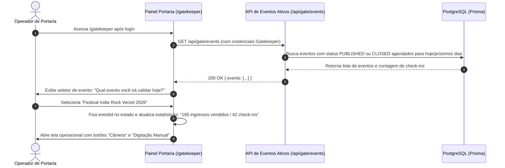
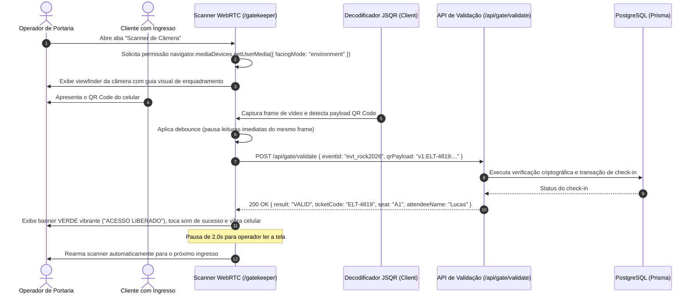
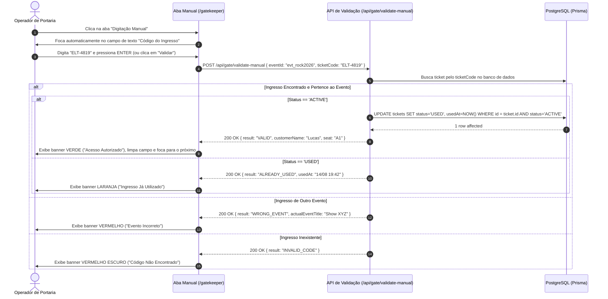
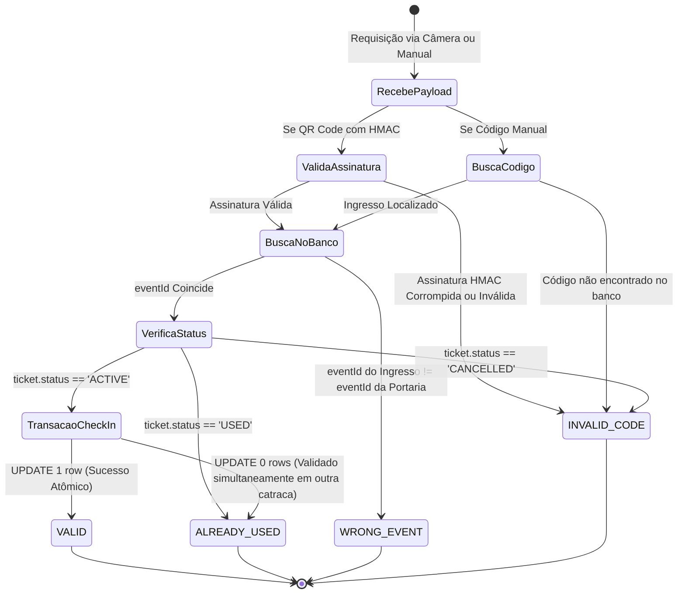

# Módulo 4: Portaria, Scanner WebRTC e Validação Criptográfica (UC21 a UC24)

Este documento consolida os casos de uso detalhados do módulo.

> [!IMPORTANT]
> **Status do Módulo**: 🔴 OBRIGATÓRIO (Requisito Mínimo do Desafio)


---
# Caso de Uso: UC21 - Seleção de Evento e Painel Operacional da Portaria
## Plataforma de Eventos e Ingressos (Fase 2 - Core)

---

## 1. Identificação e Descrição
- **Identificador**: `UC21`
- **Classificação**: 🔴 OBRIGATÓRIO (Requisito Mínimo do Desafio)
- **Nome**: Seleção de Evento e Painel Operacional de Portaria (`/gatekeeper`)
- **Objetivo**: Permitir que o operador de portaria (`GATEKEEPER`) acesse o painel operacional restrito, selecione o evento físico que está ocorrendo no momento e visualize os contadores de entrada em tempo real (total de ingressos vendidos vs. check-ins já realizados).

---

## 2. Atores
- **Portaria (`GATEKEEPER`)**: Operador encarregado do controle de acesso nas catracas ou portas do evento.
- **Sistema de Portaria**: Carrega os eventos ativos e gerencia a sessão operacional do validador.

---

## 3. Pré-condições e Pós-condições
- **Pré-condição**:
  - O usuário autenticado possui o papel `GATEKEEPER`.
- **Pós-condição**:
  - O evento selecionado é fixado no contexto operacional da portaria.
  - A interface habilita o scanner de câmera e o campo de digitação manual vinculados àquele evento específico.

---

## 4. Diagrama de Sequência



---

## 5. Fluxo Principal de Execução

1. O operador de portaria faz login com sua conta dedicada e é redirecionado para `/gatekeeper`.
2. A tela inicial da portaria exibe um seletor em destaque:
   - Lista suspensa com os eventos disponíveis para validação (título, data, local).
3. O operador seleciona o evento onde está trabalhando no momento.
4. O painel carrega a **Visão Operacional do Evento**:
   - **Cartão de Status do Evento**: Nome, local e data.
   - **Métricas Rápidas de Portaria**:
     - Total de Ingressos Emitidos (`185`).
     - Entradas Validadas (`42`).
     - Entradas Pendentes (`143`).
     - Barra de progresso de ocupação em tempo real.
   - **Seletor de Modo de Leitura**:
     - 📷 **Aba Câmera**: Abre o scanner WebRTC de leitura contínua.
     - ⌨️ **Aba Teclado / Manual**: Abre o campo de busca alfanumérico.
5. O operador clica no modo desejado para iniciar a conferência das pessoas na fila.

---

## 6. Fluxos Alternativos e Exceções

### Fluxo Alternativo 1: Alternar de Evento Durante o Turno
- **Cenário**: O operador foi remanejado para outra sala ou festival.
- **Comportamento**: A interface possui botão fixo "Trocar Evento" no topo, permitindo alternar de evento sem deslogar.

---

## 7. Regras de Negócio (RN)

- **RN01 - Acesso Restrito a Gatekeeper**: Apenas usuários com a role `GATEKEEPER` podem acessar as rotas operacionais de portaria.
- **RN02 - Validação Vinculada ao Evento Ativo**: O motor de validação deve sempre comparar o `eventId` do ingresso lido com o evento selecionado no painel da portaria.

---

## 8. Contratos de API

### Requisição: `GET /api/gate/events`

### Resposta de Sucesso: `HTTP 200 OK`
```json
{
  "success": true,
  "events": [
    {
      "id": "evt_rock2026",
      "title": "Festival Indie Rock Verzel 2026",
      "eventDate": "2026-11-20T20:00:00.000Z",
      "locationName": "Espaço Hall Cultural",
      "totalSold": 185,
      "totalCheckedIn": 42
    }
  ]
}
```

---

## 9. Critérios de Aceite (BDD / Gherkin)

```gherkin
Funcionalidade: Painel Operacional da Portaria
  Como um Operador de Portaria
  Eu quero selecionar o evento que estou fiscalizando
  Para configurar o leitor de ingressos e acompanhar o total de presentes

  Cenário: Seleção do evento na tela de portaria
    Dado que estou autenticado como "GATEKEEPER" na rota "/gatekeeper"
    Quando eu seleciono o evento "Festival Indie Rock Verzel 2026"
    Então o sistema deve exibir os contadores de ingressos emitidos e validados
    E deve disponibilizar as abas de leitura por câmera e digitação manual
```


---

# Caso de Uso: UC22 - Validação de Ingressos via Scanner Contínuo de Câmera (WebRTC)
## Plataforma de Eventos e Ingressos (Fase 2 - Core)

---

## 1. Identificação e Descrição
- **Identificador**: `UC22`
- **Classificação**: 🔴 OBRIGATÓRIO (Requisito Mínimo do Desafio)
- **Nome**: Validação Contínua de QR Code por Câmera WebRTC na Portaria
- **Objetivo**: Prover um leitor contínuo de QR Code baseado em câmera mobile/desktop via WebRTC (`getUserMedia`), com mira visual, decodificação em tempo real (60fps), debounce anti-releitura e resposta imediata na tela do operador (com sinais sonoros e táteis).

---

## 2. Atores
- **Operador de Portaria (`GATEKEEPER`)**: Aponta a câmera do celular/tablet para os ingressos apresentados pelos clientes.
- **Cliente na Fila**: Mostra o QR Code no smartphone ou impresso.
- **Motor de Câmera WebRTC / JSQR**: Captura os frames da câmera e decodifica o payload do QR Code.

---

## 3. Pré-condições e Pós-condições
- **Pré-condição**:
  - O operador concedeu permissão de acesso à câmera no navegador.
  - Um evento válido está selecionado no painel da portaria.
- **Pós-condição**:
  - O payload do QR Code é decodificado e enviado instantaneamente para a API de validação (`/api/gate/validate`).
  - O feedback do resultado (Válido, Usado, Errado ou Inválido) é exibido em tela cheia com retorno sonoro.
  - Após 2 segundos, o leitor é rearmado automaticamente para o próximo cliente da fila.

---

## 4. Diagrama de Sequência



---

## 5. Fluxo Principal de Execução

1. O operador de portaria clica na aba **"Scanner de Câmera"**.
2. O navegador solicita permissão de câmera (priorizando a câmera traseira do dispositivo: `{ facingMode: { exact: "environment" } }`).
3. O vídeo em tempo real é renderizado na tela com:
   - Mira de enquadramento com guias nos quatro cantos (*reticle animation*).
   - Botão para alternar entre câmera frontal e traseira.
   - Botão de lanterna (*flashlight / torch*) para ambientes escuros (se suportado pelo aparelho).
4. O cliente posiciona seu celular em frente à câmera.
5. O decodificador client-side intercepta o padrão gráfico e extrai o texto do payload (`v1:ELT-4819:...`).
6. O scanner toca um bipe sonoro de leitura e envia o payload para a API de validação com o `eventId` atual.
7. A resposta do servidor é recebida em menos de 200ms e renderiza o card de resultado correspondente:
   - 🟢 **Verde - Válido**: *"Acesso Liberado! Poltrona A1 - Lucas Silva"*.
   - 🟠 **Laranja - Já Utilizado**: *"Ingresso Já Utilizado em 14/08/2026 às 19:42"*.
   - 🔴 **Vermelho - Evento Errado**: *"Ingresso pertence ao evento 'Show XYZ' e não a este"*.
   - ⛔ **Vermelho Escuro - Inválido**: *"Código Falso ou Adulterado"*.
8. O sistema emite feedback acústico via Web Audio API (som harmônico de aprovação ou som grave de erro) e vibração haptic (`navigator.vibrate`).
9. Após 2 segundos, o resultado é recolhido e a câmera volta a escanear automaticamente o próximo cliente da fila.

---

## 6. Fluxos Alternativos e Exceções

### Fluxo de Exceção 1: Permissão de Câmera Negada
- **Condição**: O usuário bloqueou a permissão de câmera no navegador.
- **Comportamento**: A interface exibe aviso amigável: *"Não foi possível acessar a câmera. Por favor, habilite as permissões ou utilize a validação por digitação manual."*, com botão direto para a aba de digitação manual.

### Fluxo de Exceção 2: Câmera sem Suporte à Câmera Traseira (Desktop/Laptop)
- **Condição**: Operador executando em notebook com webcam frontal.
- **Comportamento**: O sistema faz fallback automático para `facingMode: "user"`.

---

## 7. Regras de Negócio (RN)

- **RN01 - Debounce Anti-Releitura**: O scanner deve ignorar leituras duplicadas consecutivas do mesmo código dentro de um intervalo de 3 segundos para evitar disparos acidentais múltiplos.
- **RN02 - Feedback Multissensorial**: Toda leitura deve produzir resposta visual clara (cores semânticas), resposta sonora (Web Audio API) e vibração tátil em dispositivos compatíveis.
- **RN03 - Contexto Seguro (HTTPS / Localhost)**: A API WebRTC `navigator.mediaDevices.getUserMedia` exige conexão segura (`https://` em produção/Vercel ou `http://localhost`). Em conexões HTTP inseguras por IP de rede local, a interface deve exibir aviso explicativo e direcionar para a aba de digitação manual imediata ([`UC23`](#uc23)).

---

## 8. Contratos de API

### Requisição: `POST /api/gate/validate`
```json
{
  "eventId": "evt_rock2026",
  "qrPayload": "v1:ELT-4819:evt_rock2026:1786579200:e9f1a238b76c8d4e9901ac88f4e2b10a"
}
```

### Resposta: `HTTP 200 OK`
```json
{
  "success": true,
  "result": "VALID",
  "ticket": {
    "ticketCode": "ELT-4819",
    "sectorName": "Plateia VIP Numerada",
    "seatLabel": "A1",
    "customerName": "Lucas Silva",
    "checkedInAt": "2026-08-14T20:15:30.000Z"
  },
  "eventMetrics": {
    "totalSold": 185,
    "totalCheckedIn": 43
  }
}
```

---

## 9. Critérios de Aceite (BDD / Gherkin)

```gherkin
Funcionalidade: Leitura Contínua de QR Code via WebRTC
  Como um Operador de Portaria
  Eu quero apontar a câmera do celular para o ingresso do cliente
  Para validar o acesso instantaneamente de forma contínua

  Cenário: Leitura de QR Code válido na câmera
    Dado que a câmera da portaria está ativa no evento "Festival Indie Rock Verzel 2026"
    Quando o cliente apresenta um QR Code legítimo com ingresso ativo
    Então o sistema deve ler o código automaticamente sem cliques
    E deve exibir o card verde de "ACESSO LIBERADO" com o nome do cliente e poltrona "A1"
    E deve emitir o som de confirmação
    E após 2 segundos deve rearmar o leitor para o próximo cliente
```


---

# Caso de Uso: UC23 - Validação de Ingressos via Digitação Manual de Código
## Plataforma de Eventos e Ingressos (Fase 2 - Core)

---

## 1. Identificação e Descrição
- **Identificador**: `UC23`
- **Classificação**: 🔴 OBRIGATÓRIO (Requisito Mínimo do Desafio)
- **Nome**: Validação de Ingressos por Digitação Manual de Código na Portaria
- **Objetivo**: Fornecer ao operador de portaria uma alternativa rápida e acessível à câmera para validar ingressos através da digitação manual do código alfanumérico impresso ou exibido no voucher (ex: `ELT-4819`), indispensável em cenários de tela de smartphone trincada, reflexo intenso do sol, câmera sem permissão ou falha de leitura óptica.

---

## 2. Atores
- **Operador de Portaria (`GATEKEEPER`)**: Digita o código alfanumérico informado pelo participante.
- **Cliente na Fila**: Apresenta ou dita o código impresso em seu voucher.
- **Backend / Motor de Validação**: Localiza o ingresso pelo código legível e processa o check-in.

---

## 3. Pré-condições e Pós-condições
- **Pré-condição**:
  - O operador está autenticado como `GATEKEEPER` e selecionou o evento ativo.
- **Pós-condição**:
  - O código digitado é validado e o status de entrada correspondente é exibido na tela.
  - Se válido, o ingresso é transicionado para `USED` no banco de dados.

---

## 4. Diagrama de Sequência



---

## 5. Fluxo Principal de Execução

1. O operador clica na aba **"Digitação Manual"** na tela `/gatekeeper`.
2. O sistema exibe um formulário de alta visibilidade com teclado virtual/numérico otimizado:
   - Campo de entrada grande com formatação automática em maiúsculas (uppercase).
   - Auto-foco imediato no campo.
   - Botão **"Validar Ingresso"** com tecla de atalho `Enter`.
   - Atalhos rápidos com botões de códigos de teste semeados para agilizar a avaliação do desafio.
3. O operador digita o código (ex: `ELT-4819`) e pressiona `Enter`.
4. O front-end dispara `POST /api/gate/validate-manual`.
5. O backend processa a consulta:
   - Se o ingresso existe, pertence ao evento atual e tem status `ACTIVE`, atualiza para `USED` em transação atômica e retorna `VALID`.
   - Se o ingresso já estiver como `USED`, retorna `ALREADY_USED` com a data do primeiro check-in.
   - Se o ingresso for de outro evento, retorna `WRONG_EVENT` com o nome do evento correto.
   - Se o código não existir, retorna `INVALID_CODE`.
6. A tela exibe o resultado em destaque com o mesmo padrão visual do leitor de câmera.
7. O campo de texto é automaticamente limpo e refocado, pronto para a próxima digitação.

---

## 6. Fluxos Alternativos e Exceções

### Fluxo de Exceção 1: Entrada Vazia ou Código Muito Curto
- **Condição**: O operador pressiona `Enter` com o campo vazio ou com menos de 4 caracteres.
- **Comportamento**: A validação no front-end exibe aviso inline: *"Insira um código de ingresso válido (ex: ELT-1234)."*.

---

## 7. Regras de Negócio (RN)

- **RN01 - Normalização de Caracteres**: O backend e o front-end devem normalizar o código digitado para caixa alta (`toUpperCase()`) e remover espaços ou traços acidentais antes da consulta no banco.
- **RN02 - Atomicidade do Check-in**: A alteração para `USED` na digitação manual segue a mesma transação atômica anti-corrida da leitura por câmera.

---

## 8. Contratos de API

### Requisição: `POST /api/gate/validate-manual`
```json
{
  "eventId": "evt_rock2026",
  "ticketCode": "ELT-4819"
}
```

### Resposta: `HTTP 200 OK`
```json
{
  "success": true,
  "result": "VALID",
  "ticket": {
    "ticketCode": "ELT-4819",
    "seatLabel": "A1",
    "sectorName": "Plateia VIP Numerada",
    "customerName": "Lucas Silva",
    "usedAt": "2026-08-14T20:20:00.000Z"
  }
}
```

---

## 9. Critérios de Aceite (BDD / Gherkin)

```gherkin
Funcionalidade: Validação Manual de Ingressos na Portaria
  Como um Operador de Portaria
  Eu quero digitar o código alfanumérico do voucher
  Para liberar o acesso caso o QR Code não possa ser lido pela câmera

  Cenário: Digitação manual de código válido
    Dado que estou na aba de digitação manual do evento "Festival Indie Rock Verzel 2026"
    Quando eu digito "ELT-4819" e pressiono "Enter"
    Então o sistema deve validar o ingresso
    E deve exibir o card verde de "Acesso Liberado" com poltrona "A1"
    E o campo de digitação deve ser limpo e focado automaticamente para o próximo código
```


---

# Caso de Uso: UC24 - Motor de Validação da Portaria e os 4 Estados Claros
## Plataforma de Eventos e Ingressos (Fase 2 - Core)

---

## 1. Identificação e Descrição
- **Identificador**: `UC24`
- **Classificação**: 🔴 OBRIGATÓRIO (Requisito Mínimo do Desafio)
- **Nome**: Motor de Validação de Acesso, Verificação Criptográfica e os 4 Estados Claros de Retorno
- **Objetivo**: Processar as requisições de validação de ingressos na portaria com verificação em múltiplas camadas (assinatura HMAC, correspondência de evento, status de uso anterior e integridade transacional anti-duplicação concorrente), retornando com precisão absoluta um dos **4 estados de retorno mandatórios do desafio**: **`VALID`** (Válido), **`ALREADY_USED`** (Já Utilizado), **`WRONG_EVENT`** (Evento Errado) ou **`INVALID_CODE`** (Inválido/Fraude).

---

## 2. Atores
- **Motor de Validação (Gatekeeper Engine)**: Algoritmo backend que avalia a assinatura e o banco de dados.
- **Operador de Portaria**: Recebe o feedback visual e sonoro imediato.
- **Banco de Dados (PostgreSQL)**: Garante atomicidade de alteração com `UPDATE ... WHERE status = 'ACTIVE'`.

---

## 3. Pré-condições e Pós-condições
- **Pré-condição**:
  - Uma requisição contendo `qrPayload` ou `ticketCode` e o `eventId` selecionado na portaria é recebida.
- **Pós-condição**:
  - Um dos 4 estados é retornado com HTTP 200 e payload padronizado.
  - Se `VALID`, o registro é marcado irreversivelmente como `USED` com timestamp do check-in.

---

## 4. Diagrama de Estados do Motor de Validação



---

## 5. Tabela Detalhada dos 4 Retornos Oficiais

| Estado Retornado | Código | Cor Semântica | Mensagem na Interface | Ação no Sistema |
| :--- | :---: | :---: | :--- | :--- |
| **1. Válido** | `VALID` | 🟢 **Verde Vibrante** (`#10B981`) | **"ACESSO LIBERADO"** | Transaciona para `USED`, grava `usedAt = NOW()` e emite tom agudo harmônico. |
| **2. Já Utilizado** | `ALREADY_USED` | 🟠 **Laranja Alerta** (`#F59E0B`) | **"INGRESSO JÁ UTILIZADO"** | Informa a data e horário exato em que a entrada anterior ocorreu. Emite bipe duplo de alerta. |
| **3. Evento Errado** | `WRONG_EVENT` | 🔴 **Vermelho Aviso** (`#EF4444`) | **"EVENTO INCORRETO"** | Informa o nome do evento ao qual o ingresso realmente pertence. Emite som grave de recusa. |
| **4. Inválido / Falso** | `INVALID_CODE` | ⛔ **Vermelho Escuro** (`#991B1B`) | **"CÓDIGO INVÁLIDO OU FORJADO"** | Alerta que o QR Code possui assinatura inválida ou código não existe. Emite alarme de segurança. |

---

## 6. Prevenção de Validação Dupla Concorrente (Race Condition em Múltiplas Catracas)

- **Cenário**: O portador imprime duas cópias do mesmo ingresso e duas pessoas tentam passar em catracas diferentes no exato mesmo milissegundo.
- **Implementação Técnica**:
  ```typescript
  // Execução em transação atômica
  const updateResult = await prisma.ticket.updateMany({
    where: {
      id: ticket.id,
      status: 'ACTIVE', // Garante lock condicional
    },
    data: {
      status: 'USED',
      usedAt: new Date(),
    },
  });

  if (updateResult.count === 0) {
    // Outra catraca acabou de validar milissegundos antes
    return { result: 'ALREADY_USED', checkedInAt: ticket.usedAt };
  }
  return { result: 'VALID', ticket };
  ```
- **Resultado**: Apenas a primeira catraca a receber a resposta do banco recebe `VALID`; a segunda catraca recebe imediatamente `ALREADY_USED`.

---

## 7. Regras de Negócio (RN)

- **RN01 - 4 Estados Rígidos**: A resposta da API deve conter estritamente um dos 4 enums: `VALID`, `ALREADY_USED`, `WRONG_EVENT` ou `INVALID_CODE`.
- **RN02 - Irreversibilidade do Check-in**: Uma vez que o status do ingresso foi marcado como `USED`, ele não pode retornar para `ACTIVE`.
- **RN03 - Log de Auditoria**: Toda tentativa de validação (sucesso ou falha) deve ser registrada em log para histórico operacional.

---

## 8. Contratos de API

### Requisição: `POST /api/gate/validate`
```json
{
  "eventId": "evt_rock2026",
  "qrPayload": "v1:ELT-4819:evt_rock2026:1786579200:e9f1a238b76c8d4e9901ac88f4e2b10a"
}
```

### Resposta: Exemplo 1 - Válido (`VALID`)
```json
{
  "success": true,
  "result": "VALID",
  "message": "Acesso Liberado!",
  "ticket": {
    "ticketCode": "ELT-4819",
    "customerName": "Lucas Silva",
    "seatLabel": "A1",
    "sectorName": "Plateia VIP Numerada",
    "usedAt": "2026-08-14T20:30:15.000Z"
  }
}
```

### Resposta: Exemplo 2 - Já Utilizado (`ALREADY_USED`)
```json
{
  "success": false,
  "result": "ALREADY_USED",
  "message": "Ingresso já utilizado anteriormente.",
  "originalCheckIn": "2026-08-14T19:45:00.000Z"
}
```

### Resposta: Exemplo 3 - Evento Errado (`WRONG_EVENT`)
```json
{
  "success": false,
  "result": "WRONG_EVENT",
  "message": "Este ingresso pertence a outro evento.",
  "actualEventTitle": "Show Alternativo São Paulo"
}
```

### Resposta: Exemplo 4 - Inválido / Forjado (`INVALID_CODE`)
```json
{
  "success": false,
  "result": "INVALID_CODE",
  "message": "Código de ingresso inválido ou assinatura criptográfica corrompida."
}
```

---

## 9. Critérios de Aceite (BDD / Gherkin)

```gherkin
Funcionalidade: Motor de Validação da Portaria e 4 Estados
  Como o motor de controle de acesso da portaria
  Eu quero processar o ingresso e retornar um dos 4 estados
  Para garantir segurança absoluta na entrada do evento

  Cenário: Ingresso válido e ativo
    Dado que o ingresso "ELT-4819" está com status "ACTIVE" no evento "evt_rock2026"
    Quando a portaria envia a requisição de validação para o evento "evt_rock2026"
    Então o sistema deve retornar o status "VALID"
    E o ingresso deve ser atualizado para "USED" no banco de dados

  Cenário: Ingresso apresentado pela segunda vez
    Dado que o ingresso "ELT-4819" já está com status "USED"
    Quando a portaria tenta validar o mesmo ingresso novamente
    Então o sistema deve retornar o status "ALREADY_USED"
    E deve informar o horário do primeiro check-in

  Cenário: Ingresso apresentado no evento errado
    Dado que o ingresso foi emitido para o evento "Show B"
    Quando o operador da portaria do evento "Festival A" tenta validá-lo
    Então o sistema deve retornar o status "WRONG_EVENT"
    E o ingresso não deve ser marcado como utilizado

  Cenário: Ingresso com assinatura criptográfica forjada
    Dado que um QR Code adulterado com assinatura HMAC inválida é lido
    Quando o sistema valida a assinatura
    Então o sistema deve retornar o status "INVALID_CODE"
    E a entrada deve ser sumariamente bloqueada
```


---

