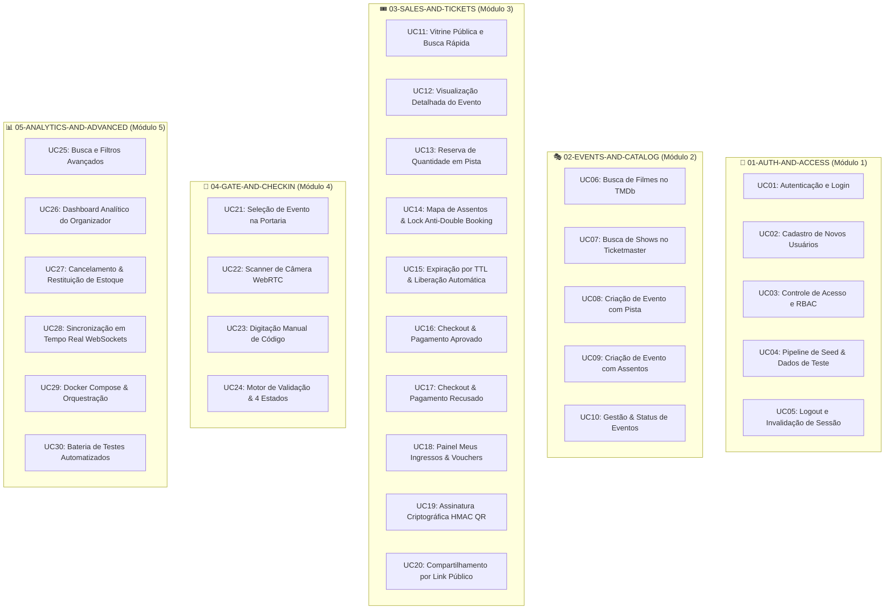

# Catálogo Completo de Casos de Uso por Módulo Funcional

Este diretório centraliza a especificação formal e aprofundada de todos os **30 Casos de Uso (UC01 ao UC30)** da **Plataforma de Eventos e Ingressos**, organizados por **módulos e domínios de negócio orientados a DDD**.

Cada caso de uso detalha uma funcionalidade atômica específica com **Diagrama de Sequência Mermaid**, **Regras de Negócio (RN)**, **Contratos de API JSON** e **Critérios de Aceite em BDD (Gherkin)**.

---

## 1. Mapa Geral de Domínios e Casos de Uso

---

## 2. Índice dos 5 Módulos Consolidados

### 🔐 1. [Módulo de Autenticação e Acesso](./01-AUTH-AND-ACCESS.md) — 🔴 **OBRIGATÓRIO (Requisito Mínimo do Desafio)**
*Consolida os casos de uso UC01 a UC05:*
- **UC01**: Autenticação com credenciais e sessão JWT HttpOnly `[Obrigatório]`
- **UC02**: Cadastro de novas contas (Cliente / Organizador) com hashing bcrypt `[Obrigatório]`
- **UC03**: Controle de Acesso Baseado em Papéis (RBAC) e proteção no Middleware `[Obrigatório]`
- **UC04**: Pipeline de Seed Automatizado com 4 usuários e evento de teste `[Obrigatório]`
- **UC05**: Logout seguro e encerramento de sessão com expiração de cookies `[Obrigatório]`

---

### 🎭 2. [Módulo de Eventos e Catálogo](./02-EVENTS-AND-CATALOG.md) — 🔴 **OBRIGATÓRIO (Requisito Mínimo do Desafio)**
*Consolida os casos de uso UC06 a UC10:*
- **UC06**: Busca e importação de filmes populares via API do TMDb `[Obrigatório]`
- **UC07**: Consulta de shows e concertos ao vivo via Ticketmaster Discovery API `[Obrigatório]`
- **UC08**: Publicação de eventos com setor de Pista (capacidade livre) `[Obrigatório]`
- **UC09**: Criação de eventos com mapa de assentos numerados (grid por fileiras) `[Obrigatório]`
- **UC10**: Gestão, edição e transição de status de eventos pelo organizador `[Obrigatório]`

---

### 🎟️ 3. [Módulo de Venda, Reserva e Ingressos](./03-SALES-AND-TICKETS.md) — 🔴 **OBRIGATÓRIO (Requisito Mínimo do Desafio)**
*Consolida os casos de uso UC11 a UC20:*
- **UC11**: Vitrine pública de eventos com hero dinâmico e busca rápida `[Obrigatório]`
- **UC12**: Detalhes do evento com local, data, sinopse e setores disponíveis `[Obrigatório]`
- **UC13**: Seleção de ingressos de pista e reserva atômica `[Obrigatório]`
- **UC14**: Mapa interativo de assentos com lock atômico anti-double booking `[Obrigatório]`
- **UC15**: Expiração de reserva por TTL (10 minutos) e liberação automática de assentos `[Obrigatório]`
- **UC16**: Checkout com simulação de pagamento aprovado e emissão de ingressos `[Obrigatório]`
- **UC17**: Checkout com simulação de pagamento recusado e devolução instantânea de estoque `[Obrigatório]`
- **UC18**: Painel "Meus Ingressos" com listagem de vouchers ativos `[Obrigatório]`
- **UC19**: Assinatura criptográfica HMAC-SHA256 para geração segura de QR Code anti-fraude `[Obrigatório]`
- **UC20**: Compartilhamento seguro de ingressos por link público tokenizado `[Obrigatório]`

---

### 📱 4. [Módulo de Portaria e Check-in](./04-GATE-AND-CHECKIN.md) — 🔴 **OBRIGATÓRIO (Requisito Mínimo do Desafio)**
*Consolida os casos de uso UC21 a UC24:*
- **UC21**: Painel da Portaria com seleção de evento e contadores em tempo real `[Obrigatório]`
- **UC22**: Scanner de QR Code contínuo via câmera WebRTC `[Obrigatório]`
- **UC23**: Digitação manual de código de ingresso para contingência `[Obrigatório]`
- **UC24**: Motor de validação com 4 retornos determinísticos (Válido, Já Utilizado, Evento Errado, Inválido) `[Obrigatório]`

---

### 📊 5. [Módulo de Analytics, Infraestrutura e Qualidade](./05-ANALYTICS-AND-ADVANCED.md) — 🟢 **OPCIONAL (Diferencial de Excelência / Bônus)**
*Consolida os casos de uso UC25 a UC30:*
- **UC25**: Busca e filtros multicritério avançados `[Opcional]`
- **UC26**: Dashboard analítico do organizador com KPIs de faturamento e comparecimento `[Opcional]`
- **UC27**: Cancelamento voluntário de ingressos com restituição de assentos `[Opcional]`
- **UC28**: Sincronização em tempo real do mapa de assentos (WebSockets / SSE) `[Opcional]`
- **UC29**: Containerização completa com Docker Compose `[Opcional]`
- **UC30**: Execução da suíte de testes automatizados unitários e de concorrência `[Opcional]`

