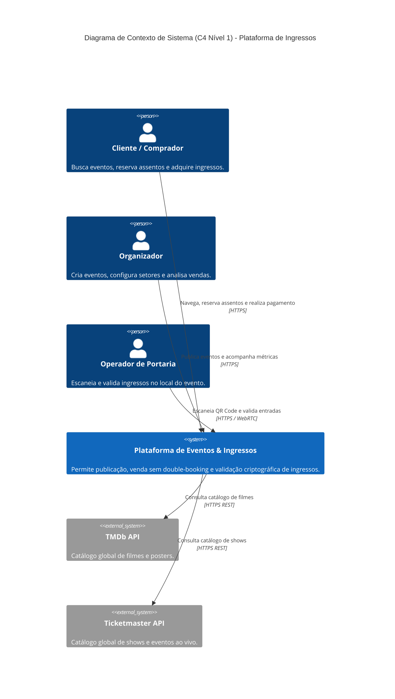
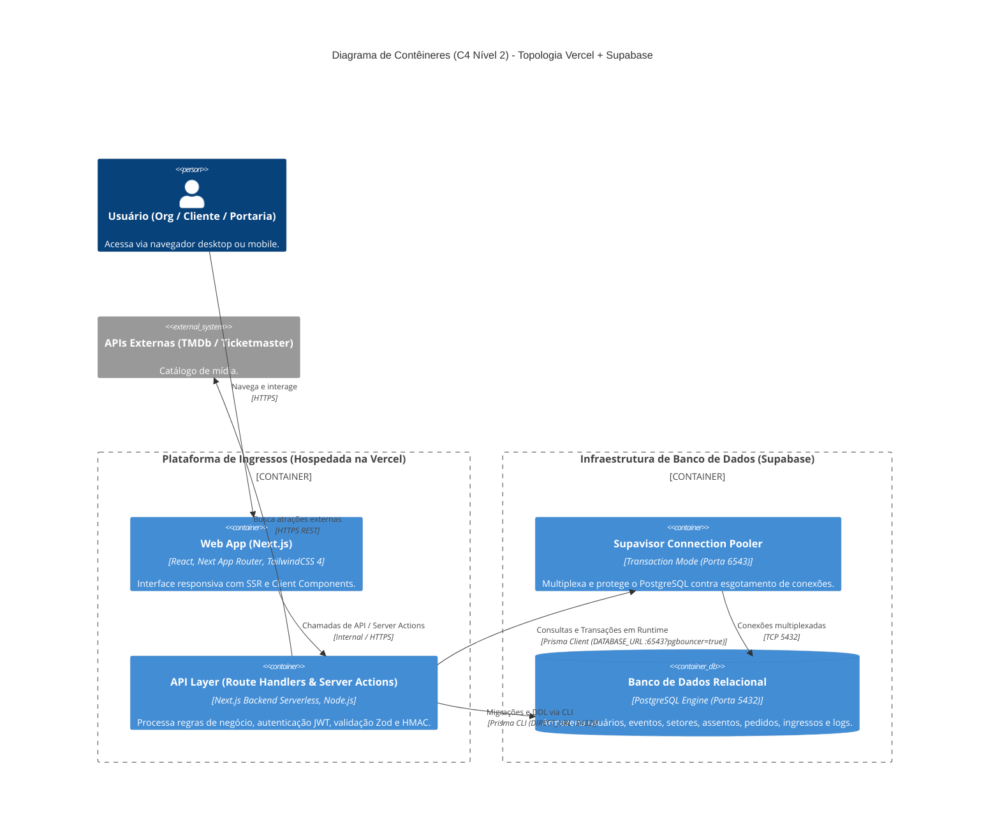
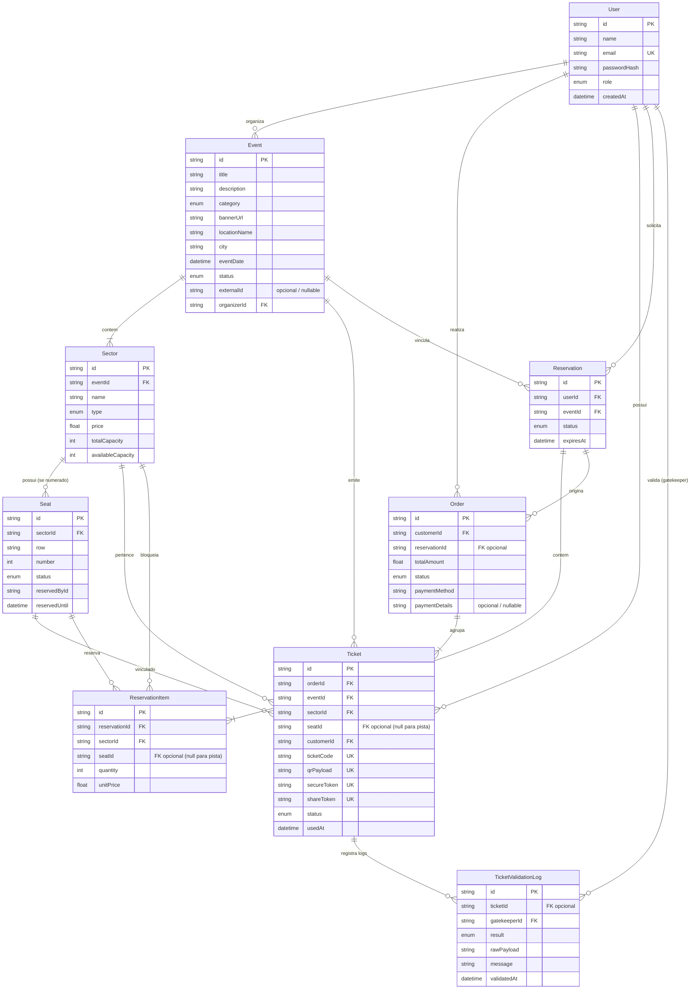

# Visão Geral da Arquitetura de Software

Este documento define a arquitetura técnica da **Plataforma de Eventos e Ingressos**, estruturada segundo os padrões de engenharia de software de alta performance, desacoplamento e o modelo **C4 Model**.

---

## 1. Stack Tecnológica e Camadas

| Camada | Tecnologia | Papel e Justificativa |
| :--- | :--- | :--- |
| **Framework Fullstack** | **Next.js 16 (App Router)** | Unifica Front-End e Back-End (Server Components, Server Actions e Route Handlers) em TypeScript unificado, otimizado para deploy na **Vercel**. |
| **Linguagem** | **TypeScript 5.x (`strict: true`)** | Tipagem estrita de contratos de API, schemas e entidades de banco. |
| **Banco de Dados & ORM** | **PostgreSQL (Supabase) + Prisma ORM** | Persistência relacional robusta com suporte total a enums nativos, constraints de unicidade e transações ACID. Protegido por **Supavisor Connection Pooler** para escala serverless. |
| **Hospedagem & Nuvem** | **Vercel (App/API) + Supabase (DB/Pooler)** | Infraestrutura serverless com alta disponibilidade, conexão multiplexada na porta 6543 (`DATABASE_URL`) e conexão direta na porta 5432 (`DIRECT_URL`) para migrações. |
| **Segurança & Sessão** | **Stateless JWT + Cookies HttpOnly** | Tokens assinados digitalmente com `AUTH_SECRET`, imunes a extração client-side via scripts (XSS). |
| **Criptografia Anti-Fraude** | **HMAC-SHA256 (Node `crypto`)** | Assinatura digital criptográfica dos QR Codes para prevenção de falsificação. |
| **Validação de Dados** | **Zod** | Validação isomórfica (tanto no client-side quanto no server-side). |
| **Estilização & UI** | **TailwindCSS 4 + Tokens Semânticos HSL** | Design System moderno com `@theme`, alta performance e anti-AI slop. |

---

## 2. Modelo C4 (Contexto e Contêineres)

### 2.1 C4 Nível 1: Diagrama de Contexto de Sistema

### 2.2 C4 Nível 2: Diagrama de Contêineres

---

## 3. Modelo de Entidade e Relacionamento (Schema Prisma)

O schema do banco modela as seguintes entidades fundamentais:

> **Notas de Integridade e Regras do Banco**:
> - **Índice Único Composto de Assento**: A tabela `Seat` possui restrição única composta `@@unique([sectorId, row, number])` garantindo que não existam poltronas duplicadas no mesmo setor.
> - **Opcionalidade de Assento (`seatId`)**: Em setores de Pista (`GENERAL_ADMISSION`), os campos `seatId` em `Ticket` e `ReservationItem` são gravados como `null`, operando exclusivamente por cota de capacidade (`availableCapacity`).

---

## 4. Próximos Documentos da Camada de Arquitetura

- 📊 **Diagramas Detalhados**: [`docs/02-architecture/diagrams/`](./diagrams/)
- 📝 **Architecture Decision Records (ADRs)**: [`docs/02-architecture/ADRS.md`](./ADRS.md)
