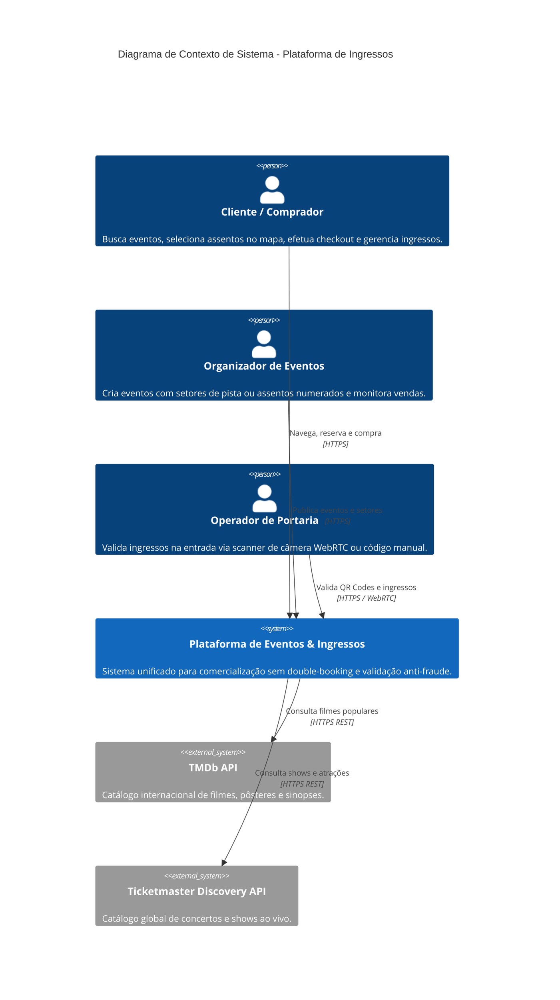
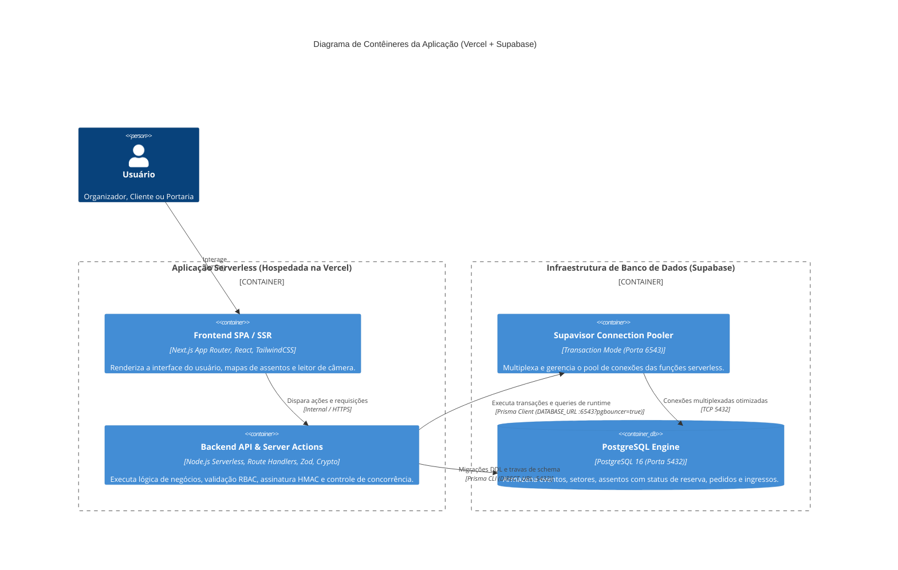

# Diagramas de Arquitetura C4 Model

Este documento contém os diagramas detalhados do C4 Model em sintaxe **Mermaid** versionada.

---

## 1. C4 Nível 1: Contexto de Sistema

---

## 2. C4 Nível 2: Contêineres da Solução (Vercel + Supabase)

