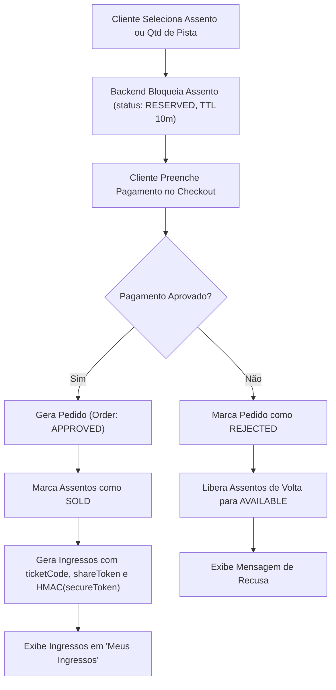
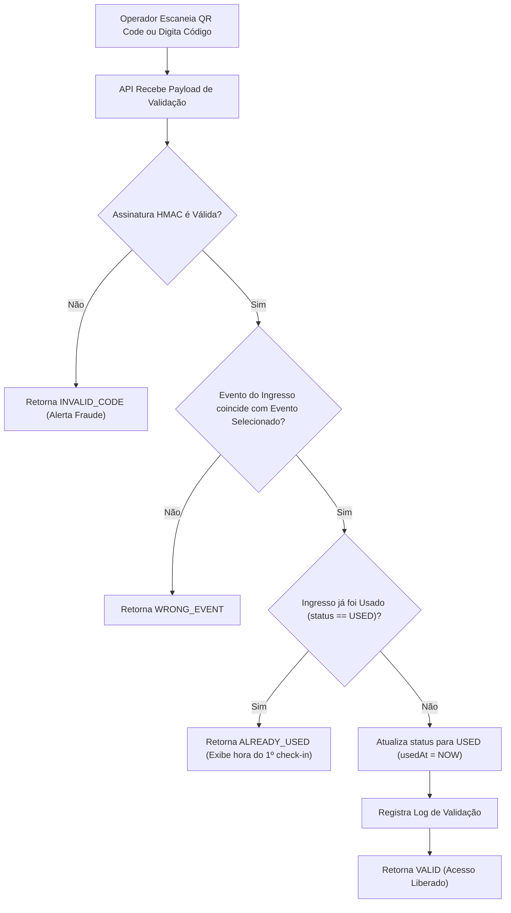

# Diagramas de Fluxo de Dados

Este documento mapeia os três fluxos de dados mais críticos da aplicação.

---

## 1. Fluxo de Compra e Emissão de Ingressos

---

## 2. Fluxo de Validação de Portaria

