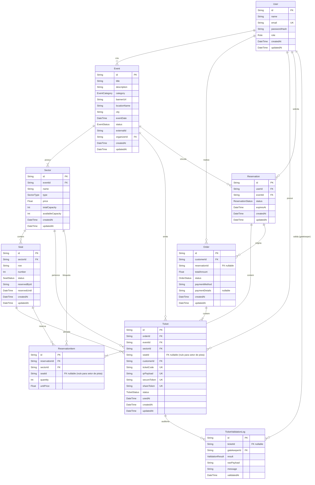

# Diagrama Entidade-Relacionamento (ERD)

Este documento documenta todas as entidades, campos e relações do banco de dados relacional (PostgreSQL).

---

## 1. Diagrama ERD

---

## 2. Índices Compostos e Regras de Integridade

- **Restrição de Cadeira Única (`Seat`)**:
  - `@@unique([sectorId, row, number])`: Impede fisicamente no banco que a mesma poltrona (mesma fileira e número) seja criada duas vezes no mesmo setor.
- **Opcionalidade de Assento para Pista (`GENERAL_ADMISSION`)**:
  - As tabelas `tickets` e `reservation_items` utilizam `seatId` como anulável (`nullable`), pois setores de pista operam pelo controle de cota numérica decrementando `availableCapacity` em `sectors`.
- **Prevenção de Falsificação e Rastreabilidade (`Ticket`)**:
  - `ticketCode`, `qrPayload`, `secureToken` e `shareToken` possuem índices únicos (`UK`), garantindo unicidade criptográfica em cada voucher emitido.

