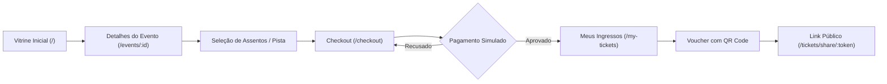
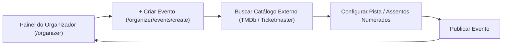
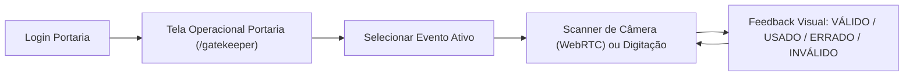

# Design System, Tokens e UX da Plataforma

Este documento unifica o Design System, tokens HSL semânticos, componentes atômicos, regras de layout e fluxos de navegação.

---

# Diretrizes de UI/UX & Design System

Este documento estabelece as diretrizes de experiência de usuário (UX), princípios visuais (*anti-AI slop*) e o sistema de design da plataforma.

---

## 1. Princípios de Experiência e Anti-AI Slop

- **Propósito em cada pixel**: Evitar elementos meramente decorativos, gradientes de texto excessivos ou cards aninhados desnecessariamente.
- **Ergonomia Operacional para Portaria**: A interface da portaria deve ter alto contraste para visualização sob sol ou baixa luminosidade e alvos de toque generosos (mínimo 48x48px).
- **Checkout Sem Fricção**: Clareza absoluta nos valores, taxas e tempo restante da reserva com visualização do mapa de assentos selecionados.
- **Acessibilidade (WCAG 2.1 AA)**: Contraste mínimo de texto de 4.5:1 e suporte completo a navegação por teclado (`Tab`, `Escape`, `Enter`).

---

## 2. Paleta de Cores, Tokens Semânticos & TailwindCSS 4

O design baseia-se na identidade "Kinetic Pulse" (Light Mode / Alto Contraste). No **TailwindCSS 4**, a configuração é declarada diretamente no `src/app/globals.css` utilizando `@import "tailwindcss";` e o bloco `@theme`:

```css
@import "tailwindcss";

@theme {
  --color-bg-main: #faf8ff;                  /* Background principal */
  --color-bg-surface: #ffffff;               /* Card e container (pure white) */
  --color-bg-surface-hover: #f2f3ff;
  --color-border-subtle: #e2e8f0;            /* Bordas sutis */

  --color-primary: #0057ff;                  /* Action Blue */
  --color-primary-hover: #0043c8;
  --color-primary-foreground: #ffffff;

  --color-secondary: #731be5;                /* Vibrant Purple */
  --color-secondary-foreground: #ffffff;

  --color-text-primary: #131b2e;             /* Deep Slate (alto contraste) */
  --color-text-muted: #434656;               /* Cinza para legendas */

  --color-success: #005d3f;                  /* Válido / Aprovado */
  --color-warning: #f59e0b;                  /* Já Usado / Atenção */
  --color-danger: #ba1a1a;                   /* Inválido / Erro / Recusado */
  --color-danger-dark: #93000a;              /* Fraude / Forjado */
}
```

---

## 3. Tipografia

- **Família Tipográfica**: `Plus Jakarta Sans`, `Inter` ou sistema sans-serif nativo de alto desempenho.
- **Hierarquia**:
  - `Display / H1`: `text-3xl font-bold tracking-tight`
  - `H2`: `text-xl font-semibold tracking-tight`
  - `Body`: `text-sm leading-relaxed text-slate-300`
  - `Monospace (Vouchers/Códigos)`: `font-mono tracking-wider`

---

## 4. Responsividade e Grids por Módulo

- **Vitrine e Catálogo (`/`, `/events`)**: `grid-cols-1 md:grid-cols-2 lg:grid-cols-3`
- **Painel "Meus Ingressos" (`/my-tickets`)**:
  - **Até 1023px (`< lg` / Mobile & Tablet)**: 1 card por linha (`grid-cols-1`), evitando aperto horizontal nos vouchers que contêm banner lateral e metadados detalhados.
  - **A partir de 1024px (`lg:` / Desktop)**: 2 cards por linha (`lg:grid-cols-2 gap-6`), mantendo proporções harmônicas e espaçamento generoso.
- **Painel da Portaria (`/gatekeeper`)**: Layout centralizado com alvos de toque generosos (mínimo 48x48px) e visualização de alto contraste.

---

# Catálogo de Componentes Base (Design System)

Este documento especifica a biblioteca de componentes atômicos fundamentais (`src/components/ui/`), construídos com acessibilidade e sem clichês visuais (*anti-AI slop*).

---

## 1. `Button` (`src/components/ui/button.tsx`)
- **Variantes**:
  - `primary`: Action Blue vibrante (`bg-primary hover:bg-primary-hover text-white font-semibold shadow-sm`).
  - `secondary`: Superfície branca com borda sutil (`bg-surface hover:bg-surface-hover text-primary border border-subtle`).
  - `danger`: Ações destrutivas / recusa (`bg-danger hover:bg-danger/90 text-white`).
  - `outline`: Borda sutil com fundo transparente (`border border-subtle hover:bg-surface-hover text-primary`).
  - `ghost`: Transparente com foco acessível (`hover:bg-surface-hover text-primary`).
- **Propriedades Especiais**:
  - `loading`: Exibe spinner SVG integrado e desabilita novos cliques.
  - `disabled`: Desativa interação física e aplica `opacity-50 cursor-not-allowed`.

---

## 2. `Input` / `Select` / `Textarea` (`src/components/ui/input.tsx`)
- Fundo branco limpo com borda sutil (`bg-surface border-subtle text-primary`).
- Anel de foco acessível: `focus-visible:ring-2 focus-visible:ring-primary/20 focus-visible:border-primary`.
- Suporte a ícones à esquerda (lupa, e-mail) e à direita (alternar senha).
- Rótulo acessível (`Label`) e mensagem de erro contextual com ícone de alerta em tom semântico de perigo (`text-danger`).

---

## 3. `Badge`, Selos de Classificação & Pílulas de Filtro (`src/components/ui/badge.tsx`, `CategoryPills`)
- Indicador visual compacto para status de ingressos, eventos e botões de filtro interativo:
  - `success`: Fundo verde suave com texto escuro (`bg-success text-success`).
  - `warning`: Fundo âmbar suave com texto escuro (`bg-warning text-warning`).
  - `danger`: Fundo vermelho suave com texto escuro (`bg-danger text-danger`).
  - `neutral`: Fundo branco/superfície com texto suave (`bg-surface text-text-muted border border-border-subtle`).
- **Categorias de Evento & Breadcrumb/Badges (`EVENT_CATEGORY_LABELS` / `getEventCategoryLabel`)**:
  - Exibição obrigatória em português em todas as interfaces públicas e administrativas:
    - `SHOW` -> **Show** (ou **Shows** em filtros/listagens)
    - `MOVIE` -> **Cinema**
    - `THEATER` -> **Teatro**
    - `FESTIVAL` -> **Festival** (ou **Festivais** em filtros/listagens)
- **Classificação Indicativa +18**:
  - **Na Tela do Evento (`/events/:id`)**: Badge destacado em tom de perigo/alerta ao lado da categoria principal (`bg-danger/80 text-white backdrop-blur-md border-danger font-bold text-xs`).
  - **No Card de Evento (`EventCard`)**: Indicador translúcido discreto no canto superior do banner sobreposto (`bg-black/60 text-rose-300 text-[11px] font-semibold backdrop-blur-md border border-rose-500/30`).
- **Pílulas de Filtro de Categoria (`CategoryPills`)**:
  - Estado Inativo: `bg-surface text-text-muted border border-border-subtle hover:bg-surface-hover hover:text-text-primary hover:border-primary/40 transition-all duration-150`.
  - Estado Ativo: `bg-primary text-primary-foreground border border-primary hover:bg-primary-hover shadow-sm font-semibold`.

---

## 4. `Modal` / `Dialog` (`src/components/ui/modal.tsx`)
- Overlay escurecido com desfoque de fundo (`backdrop-blur-sm bg-black/40`).
- Fechamento seguro via tecla `Escape`, clique no backdrop ou botão `X`.
- Bloqueio automático do scroll do `body`.

---

## 5. `DangerModal` (`src/components/ui/danger-modal.tsx`)
- Diálogo especializado de UX defensiva para ações destrutivas (recusa de pagamento, cancelamentos, encerramento de vendas).
- Exibe ícone de alerta destacado, texto explicativo das consequências e botões "Cancelar" e "Confirmar Ação Destrutiva" com variante `danger`.

---

## 6. `Tooltip` (`src/components/ui/tooltip.tsx`)
- Dica de interface flutuante acessível para ícones de ação e textos truncados.
- Renderizado com atraso configurável, fundo de alto contraste e transição suave de opacidade.

---

## 7. `Toast` (`src/components/ui/toast.tsx`)
- Notificações flutuantes globais disparadas via hook `useToast()`.
- **Posicionamento**: Topo direito (`fixed top-4 right-4 z-[100]`), com animação fluida de entrada a partir do topo (`slide-in-from-top-4`).
- **Dimensões e Destaque**: Padding ampliado (`p-4 sm:p-5`), cantos arredondados (`rounded-xl`), sombra de alta definição (`shadow-xl`) e largura máxima otimizada (`md:max-w-[440px]`).
- **Esquema de Cores Sólidas & Alto Contraste**:
  - `success`: Fundo verde sólido (`bg-emerald-600`), ícone branco e texto branco (`text-white font-semibold`).
  - `error`: Fundo vermelho sólido (`bg-rose-600`), ícone branco e texto branco (`text-white font-semibold`).
  - `warning`: Fundo amarelo/âmbar sólido (`bg-amber-500`), ícone branco e texto branco (`text-white font-semibold`).
  - `info`: Fundo azul sólido (`bg-blue-600`), ícone branco e texto branco (`text-white font-semibold`).
- **Acessibilidade**: Botão de fechar `X` com alto contraste (`text-white/80 hover:text-white`) e temporizador automático de 4000ms.

---

## 8. `Skeleton` (`src/components/ui/skeleton.tsx`)
- Indicadores de carregamento pulsantes (`animate-pulse bg-slate-200 rounded-md`) para evitar deslocamento de layout (*CLS*).

---

## 9. Utilitários de Máscaras e Formatação (`src/lib/masks.ts`)
- `maskCPF(value)`: `000.000.000-00`
- `maskCreditCard(value)`: `0000 0000 0000 0000`
- `maskCardExpiry(value)`: `MM/AA`
- `maskBRL(value)`: Formatação monetária em Real Brasileiro (`R$ 1.250,00`)
- `formatDateLong(date)`: Data legível por extenso (ex: *"20 de Novembro de 2026 às 20:00"*).

---

## 10. `TypewriterText` (`src/components/ui/typewriter-text.tsx`)
- Animação de máquina de escrever (*typewriter effect*) fluida com suporte a termos dinâmicos destacados em cores específicas para cada frase, cursor piscante (*blink*) e posicionamento inline natural para quebras em múltiplas linhas.
- Ciclo de animação: digitação caractere a caractere (~60-80ms), retenção do texto completo por 3 segundos (3000ms), apagamento suave (~30-40ms) e transição para a próxima frase da lista cíclica.
- Destaque colorido dinâmico: suporte a segmentos estruturados (`prefix`, `highlight`, `highlightColor`, `suffix`) permitindo que a palavra-chave central (ex: *"show"*, *"filme"*, *"festa"*, *"peça de teatro"*, etc.) seja renderizada em cor distinta enquanto o restante mantém o tom principal.
- Cursor piscante: animação CSS `@keyframes cursor-blink` com ciclo de alternância limpa (0.8s), renderizado em fluxo `inline` diretamente após o último caractere, sem desalinhamento quando o texto ocupa 2 ou mais linhas.
- Estabilidade de Layout (Zero CLS): container com altura fixa calibrada responsivamente (`h-[96px] sm:h-[120px] lg:h-[140px] flex items-center justify-center`) impedindo qualquer variação de altura ou pulo de layout quando o texto varia entre 1 e 2 linhas.
- Acessibilidade: suporte a `prefers-reduced-motion` e atributos ARIA para leitores de tela sem causar deslocamentos bruscos de layout (CLS).


---

# Regras Globais de Layout e Componentes

Este documento padroniza o comportamento de layouts, formulários, modais e estados interativos na aplicação.

---

## 1. Regras de Formulários e Validação

1. **Validação Instantânea e Não-Intrusiva**:
   - Campos de formulário validam o formato após a primeira interação (`onBlur`) ou no momento da submissão.
   - Mensagens de erro aparecem com animação suave e ícone de alerta vermelho sob o campo.
2. **Estados de Botão**:
   - `Loading`: Exibe spinner animado e bloqueia múltiplos cliques.
   - `Disabled`: Opacidade reduzida (50%) e cursor não permitido (`not-allowed`).
   - `Hover`: Elevação ou clareamento sutil de tom.

---

## 2. Responsividade e Breakpoints

| Breakpoint | Faixa de Largura | Comportamento Principal |
| :--- | :--- | :--- |
| **Mobile (`sm`)** | `< 640px` | Coluna única, menu gaveta/sanduíche, scanner em tela cheia na portaria. |
| **Tablet (`md`)** | `640px - 1024px` | Grade de 2 colunas para eventos, mapa de assentos com scroll horizontal suave. |
| **Desktop (`lg/xl`)** | `> 1024px` | Grade de 3 a 4 colunas, checkout com visualização lateral em tempo real. |


---

# Fluxos de Navegação e Arquitetura de Telas

Este documento ilustra a jornada de navegação por perfil de usuário.

---

## 1. Fluxo de Navegação do Cliente (Compra de Ingressos)



---

## 2. Fluxo de Navegação do Organizador



---

## 3. Fluxo de Navegação da Portaria (Gatekeeper)




---

# Checklist de Qualidade e Profissionalismo (UX/UI)

Para garantir que a aplicação transmita confiança e um aspecto *premium*, os seguintes detalhes devem ser aplicados em todas as entregas:

## 1. Feedback e Estados de Carregamento (Loading States)
- **Skeleton Screens (Shimmer):** Ao carregar dados, exibir esqueletos pulsantes em vez de telas brancas ou spinners grandes para evitar saltos de layout (CLS).
- **Botões com Loading:** Ações de submissão (ex: "Salvar", "Comprar") devem desabilitar o botão e exibir um *spinner* interno, evitando duplos cliques.
- **Toast Notifications:** Utilizar toasts não obstrusivos (sucesso, erro, aviso) para feedback rápido de ações concluídas.

## 2. Tratamento de Erros e Estados Vazios (Empty States)
- **Páginas 404 e 500 Personalizadas:** Telas amigáveis com Call to Actions claros ("Voltar ao Início") em vez das páginas de erro padrão do servidor.
- **Empty States Elegantes:** Listas vazias (ex: "Meus Ingressos") devem exibir uma ilustração/ícone condizente com a marca e um botão para a principal ação relacionada.
- **Validação Inline:** Erros de formulário devem aparecer sob o campo durante a digitação ou no `onBlur`, em vermelho, antes da submissão final.

## 3. Microinterações e Refinamento Visual
- **Estados de Interação:** Todo elemento interativo deve possuir estados claros de `hover`, `active` e `focus` (essencial para navegação por teclado).
- **Transições Suaves:** Mudanças de estado (cores, abertura de menus) devem possuir transições CSS (`150ms` a `300ms`).
- **Modais Seguros:** Devem possuir *backdrop blur*, bloquear o scroll do *body* e fechar com a tecla `Escape` ou clique fora da área útil.
- **Tooltips:** Utilizados em ícones sem label explícita ou em textos truncados.

## 4. Prevenção de Erros (UX Defensiva)
- **Danger Modals:** Ações destrutivas (excluir, cancelar pedido) exigem confirmação explícita em um modal secundário.
- **Bloqueio de Duplo Clique:** Desabilitar botões imediatamente após a primeira interação para prevenir envios duplicados, especialmente em checkout.
- **Máscaras de Input:** Formatação automática (CPF, telefone, CEP, moeda) durante a digitação.

## 5. Acessibilidade e Identidade
- **Favicon e Apple Touch Icon:** Ícones da plataforma configurados corretamente.
- **Meta Tags (Open Graph):** Título, descrição e imagem de preview configurados para compartilhamento em redes sociais e mensageiros.
- **Contraste de Cores:** Garantir contraste adequado (WCAG) entre textos e fundos escuros/claros.
- **Alvos de Toque (Touch Targets):** Mínimo de 48x48px para botões e elementos interativos no mobile.
