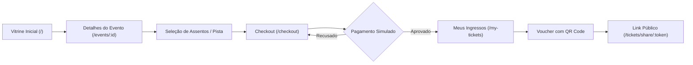
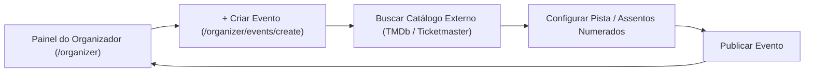
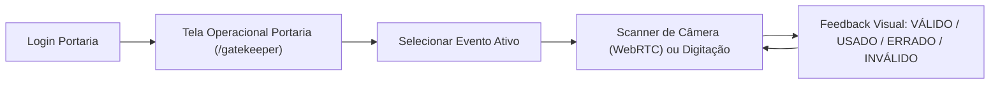

# Design System, Tokens e UX da Plataforma

Este documento unifica o Design System, tokens HSL semânticos, componentes atômicos, regras de layout e fluxos de navegação.

---

# Diretrizes de UI/UX & Design System

Este documento estabelece as diretrizes de experiência de usuário (UX), princípios visuais (*anti-AI slop*) e o sistema de design da plataforma.

---

## 1. Princípios de Experiência e Anti-AI Slop

- **Propósito em cada pixel**: Evitar elementos meramente decorativos, gradientes de texto excessivos ou cards aninhados desnecessariamente.
- **Ergonomia Operacional para Portaria**: A interface da portaria deve ter alto contraste para visualização sob sol ou baixa luminosidade e alvos de toque generosos (mínimo 48x48px).
- **Checkout Sem Fricção**: Clareza absoluta nos valores, taxas e tempo restante da reserva com visualização do mapa de assentos selecionados.
- **Acessibilidade (WCAG 2.1 AA)**: Contraste mínimo de texto de 4.5:1 e suporte completo a navegação por teclado (`Tab`, `Escape`, `Enter`).

---

## 2. Paleta de Cores, Tokens Semânticos HSL & TailwindCSS 4

No **TailwindCSS 4**, a configuração é declarada diretamente no `src/app/globals.css` utilizando `@import "tailwindcss";` e o bloco `@theme`:

```css
@import "tailwindcss";

@theme {
  --color-bg-main: hsl(222, 47%, 11%);       /* #0B1329 - Azul meia-noite profundo */
  --color-bg-surface: hsl(217, 33%, 17%);    /* #1E293B - Card e container */
  --color-bg-surface-hover: hsl(215, 28%, 23%);
  --color-border-subtle: hsl(217, 20%, 27%);

  --color-primary: hsl(158, 85%, 45%);       /* #10B981 - Esmeralda vivo */
  --color-primary-hover: hsl(158, 85%, 40%);
  --color-primary-foreground: hsl(222, 47%, 11%);

  --color-text-primary: hsl(210, 40%, 98%);  /* Branco gelo de alto contraste */
  --color-text-muted: hsl(215, 20%, 65%);    /* Cinza azulado para legendas */

  --color-success: hsl(142, 71%, 45%);       /* Válido / Aprovado */
  --color-warning: hsl(38, 92%, 50%);        /* Já Usado / Atenção */
  --color-danger: hsl(0, 84%, 60%);          /* Inválido / Erro / Recusado */
  --color-danger-dark: hsl(0, 84%, 40%);     /* Fraude / Forjado */
}
```

---

## 3. Tipografia

- **Família Tipográfica**: `Plus Jakarta Sans`, `Inter` ou sistema sans-serif nativo de alto desempenho.
- **Hierarquia**:
  - `Display / H1`: `text-3xl font-bold tracking-tight`
  - `H2`: `text-xl font-semibold tracking-tight`
  - `Body`: `text-sm leading-relaxed text-slate-300`
  - `Monospace (Vouchers/Códigos)`: `font-mono tracking-wider`


---

# Catálogo de Componentes Base (Design System)

Este documento especifica a biblioteca de componentes atômicos fundamentais (`src/components/ui/`), construídos com acessibilidade e sem clichês visuais (*anti-AI slop*).

---

## 1. `Button` (`src/components/ui/button.tsx`)
- **Variantes**:
  - `primary`: Fundo Esmeralda vivo (`bg-emerald-500 hover:bg-emerald-600 text-slate-950 font-semibold`).
  - `secondary`: Superfície Slate (`bg-slate-800 hover:bg-slate-700 text-slate-100 border border-slate-700`).
  - `danger`: Ações destrutivas / recusa (`bg-rose-600 hover:bg-rose-700 text-white`).
  - `outline` / `ghost`: Transparente com foco acessível.
- **Propriedades Especiais**:
  - `loading`: Exibe spinner SVG integrado e desabilita novos cliques.
  - `disabled`: Desativa interação física e aplica `opacity-50 cursor-not-allowed`.

---

## 2. `Input` / `Select` / `Textarea` (`src/components/ui/input.tsx`)
- Fundo escuro com borda suave (`bg-slate-900 border-slate-700 text-slate-100`).
- Anel de foco: `focus-visible:ring-2 focus-visible:ring-emerald-500/50`.
- Suporte a ícones à esquerda (lupa, e-mail) e à direita (alternar senha).
- Rótulo (`Label`) e mensagem de erro contextual em vermelho com ícone de exclamação.

---

## 3. `Badge` (`src/components/ui/badge.tsx`)
- Indicador visual compacto para status de ingressos, eventos e pedidos:
  - `success`: Verde esmeralda (Ativo, Válido, Aprovado).
  - `warning`: Laranja âmbar (Já Utilizado, Em Reserva).
  - `danger`: Vermelho carmesim (Inválido, Recusado, Cancelado).
  - `neutral`: Cinza slate (Rascunho, Finalizado).

---

## 4. `Modal` / `Dialog` (`src/components/ui/modal.tsx`)
- Overlay escurecido com desfoque de fundo (`backdrop-blur-sm`).
- Fechamento seguro via tecla `Escape`, clique no backdrop ou botão `X`.
- Bloqueio automático do scroll do `body`.

---

## 5. `Toast` (`src/components/ui/toast.tsx`)
- Alertas flutuantes globais disparados via hook `useToast()`.
- Suporta 4 tipos semânticos: `success`, `error`, `warning`, `info`.
- Desaparece automaticamente após 4000ms com animação suave de fade/slide.

---

## 6. `Skeleton` (`src/components/ui/skeleton.tsx`)
- Indicadores de carregamento pulsantes (`animate-pulse bg-slate-800/80 rounded-md`) para evitar deslocamento de layout (*CLS*).


---

# Regras Globais de Layout e Componentes

Este documento padroniza o comportamento de layouts, formulários, modais e estados interativos na aplicação.

---

## 1. Regras de Formulários e Validação

1. **Validação Instantânea e Não-Intrusiva**:
   - Campos de formulário validam o formato após a primeira interação (`onBlur`) ou no momento da submissão.
   - Mensagens de erro aparecem com animação suave e ícone de alerta vermelho sob o campo.
2. **Estados de Botão**:
   - `Loading`: Exibe spinner animado e bloqueia múltiplos cliques.
   - `Disabled`: Opacidade reduzida (50%) e cursor não permitido (`not-allowed`).
   - `Hover`: Elevação ou clareamento sutil de tom.

---

## 2. Responsividade e Breakpoints

| Breakpoint | Faixa de Largura | Comportamento Principal |
| :--- | :--- | :--- |
| **Mobile (`sm`)** | `< 640px` | Coluna única, menu gaveta/sanduíche, scanner em tela cheia na portaria. |
| **Tablet (`md`)** | `640px - 1024px` | Grade de 2 colunas para eventos, mapa de assentos com scroll horizontal suave. |
| **Desktop (`lg/xl`)** | `> 1024px` | Grade de 3 a 4 colunas, checkout com visualização lateral em tempo real. |


---

# Fluxos de Navegação e Arquitetura de Telas

Este documento ilustra a jornada de navegação por perfil de usuário.

---

## 1. Fluxo de Navegação do Cliente (Compra de Ingressos)



---

## 2. Fluxo de Navegação do Organizador



---

## 3. Fluxo de Navegação da Portaria (Gatekeeper)




---

# Checklist de Qualidade e Profissionalismo (UX/UI)

Para garantir que a aplicação transmita confiança e um aspecto *premium*, os seguintes detalhes devem ser aplicados em todas as entregas:

## 1. Feedback e Estados de Carregamento (Loading States)
- **Skeleton Screens (Shimmer):** Ao carregar dados, exibir esqueletos pulsantes em vez de telas brancas ou spinners grandes para evitar saltos de layout (CLS).
- **Botões com Loading:** Ações de submissão (ex: "Salvar", "Comprar") devem desabilitar o botão e exibir um *spinner* interno, evitando duplos cliques.
- **Toast Notifications:** Utilizar toasts não obstrusivos (sucesso, erro, aviso) para feedback rápido de ações concluídas.
- **Barra de Progresso Global:** Utilizar um indicador no topo da tela durante a navegação entre rotas pesadas.

## 2. Tratamento de Erros e Estados Vazios (Empty States)
- **Páginas 404 e 500 Personalizadas:** Telas amigáveis com Call to Actions claros ("Voltar ao Início") em vez das páginas de erro padrão do servidor.
- **Empty States Elegantes:** Listas vazias (ex: "Meus Ingressos") devem exibir uma ilustração/ícone condizente com a marca e um botão para a principal ação relacionada.
- **Validação Inline:** Erros de formulário devem aparecer sob o campo durante a digitação ou no `onBlur`, em vermelho, antes da submissão final.

## 3. Microinterações e Refinamento Visual
- **Estados de Interação:** Todo elemento interativo deve possuir estados claros de `hover`, `active` e `focus` (essencial para navegação por teclado).
- **Transições Suaves:** Mudanças de estado (cores, abertura de menus) devem possuir transições CSS (`150ms` a `300ms`).
- **Modais Seguros:** Devem possuir *backdrop blur*, bloquear o scroll do *body* e fechar com a tecla `Escape` ou clique fora da área útil.
- **Tooltips:** Utilizados em ícones sem label explícita ou em textos truncados.

## 4. Prevenção de Erros (UX Defensiva)
- **Danger Modals:** Ações destrutivas (excluir, cancelar pedido) exigem confirmação explícita em um modal secundário.
- **Bloqueio de Duplo Clique:** Desabilitar botões imediatamente após a primeira interação para prevenir envios duplicados, especialmente em checkout.
- **Máscaras de Input:** Formatação automática (CPF, telefone, CEP, moeda) durante a digitação.

## 5. Acessibilidade e Identidade
- **Favicon e Apple Touch Icon:** Ícones da plataforma configurados corretamente.
- **Meta Tags (Open Graph):** Título, descrição e imagem de preview configurados para compartilhamento em redes sociais e mensageiros.
- **Contraste de Cores:** Garantir contraste adequado (WCAG) entre textos e fundos escuros/claros.
- **Alvos de Toque (Touch Targets):** Mínimo de 48x48px para botões e elementos interativos no mobile.
