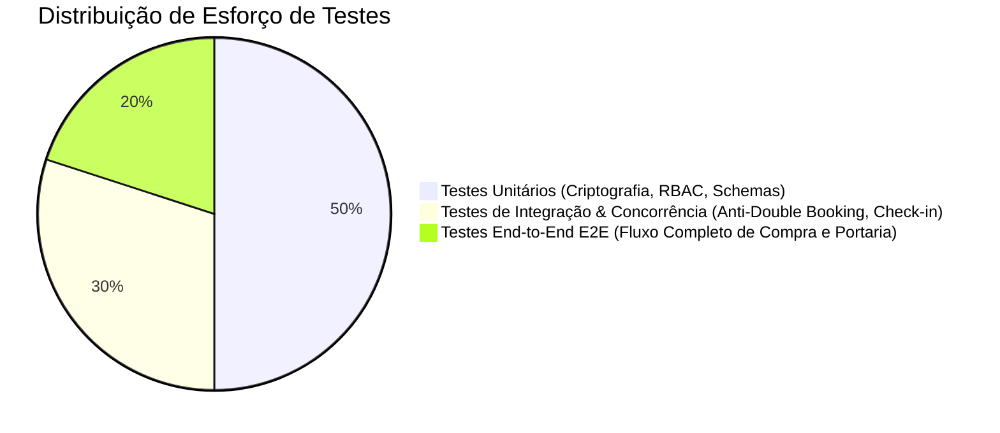

# Plano de Testes, Critérios de Aceite e Qualidade

Este documento reúne a pirâmide de testes automatizados, cenários de concorrência ACID, critérios globais de aceitação, DoR (Definition of Ready) e DoD (Definition of Done).

---

# Plano de Qualidade e Estratégia de Testes

Este documento define a pirâmide de testes e os cenários automatizados obrigatórios do projeto.

---

## 1. Pirâmide de Testes

---

## 2. Bateria de Testes por Camada

### 2.1 Testes Unitários
- **Criptografia HMAC**:
  - Geração correta da assinatura do QR Code.
  - Rejeição de tokens com payload adulterado ou assinatura inválida.
- **Autorização RBAC**:
  - Validação do middleware garantindo isolamento entre `ORGANIZER`, `CUSTOMER` e `GATEKEEPER`.
- **Validação de Schemas (Zod)**:
  - Validação estrita de formatos de e-mail, senhas, capacidade de setores e preços.

### 2.2 Testes de Integração & Concorrência
- **Teste de Corrida (Anti-Double Booking)**:
  - Disparo de duas requisições concorrentes no mesmo milissegundo para o mesmo assento (`Seat A1`).
  - Verificação de que exatamente 1 requisição retorna status `200` e a outra retorna `409 Conflict`.
- **Teste de Portaria (Dupla Validação)**:
  - Envio consecutivo da mesma validação de ingresso.
  - Primeira leitura retorna `VALID`; segunda leitura retorna `ALREADY_USED`.

### 2.3 Testes End-to-End (Playwright)
- **Cenário Completo**:
  1. Login como Organizador -> Criação de evento modelo.
  2. Login como Cliente 1 -> Seleção de assento -> Pagamento Aprovado -> Obtenção de Ingresso.
  3. Login como Portaria -> Validação por código do ingresso emitido -> Confirmação de entrada liberada.

---

# Critérios de Aceite Padrão, Definição de Ready (DoR) e Done (DoD)

Este documento define os padrões de qualidade e critérios de conclusão de tarefas no projeto.

---

## 1. Definição de Ready (DoR - Definition of Ready)

Um Caso de Uso ou funcionalidade só inicia desenvolvimento quando:
- [x] O documento de especificação técnica e regras de negócio está aprovado em `docs/01-use-cases/`.
- [x] Os schemas de entrada/saída Zod e contratos de API estão especificados em `docs/04-api-and-integrations/`.
- [x] O comportamento visual e estados de erro/loading estão alinhados com `docs/03-design/`.

---

## 2. Definição de Done (DoD - Definition of Done)

Uma funcionalidade só é considerada concluída e pronta para entrega quando:
- [x] **Código Tipado e Limpo**: TypeScript em modo estrito (`strict: true`) sem `any` implícito ou supressões indevidas.
- [x] **Tratamento de Erros**: Mensagens amigáveis exibidas ao usuário via Toasts ou Error Boundaries.
- [x] **Anti-AI Slop**: Interface limpa, responsiva (mobile, tablet, desktop) e acessível (contraste e foco).
- [x] **Testes Automatizados**: Cobertura de testes unitários ou de integração para a regra de negócio implementada.
- [x] **Documentação Atualizada**: O caso de uso e os diagramas refletem fielmente o comportamento implementado.

---

