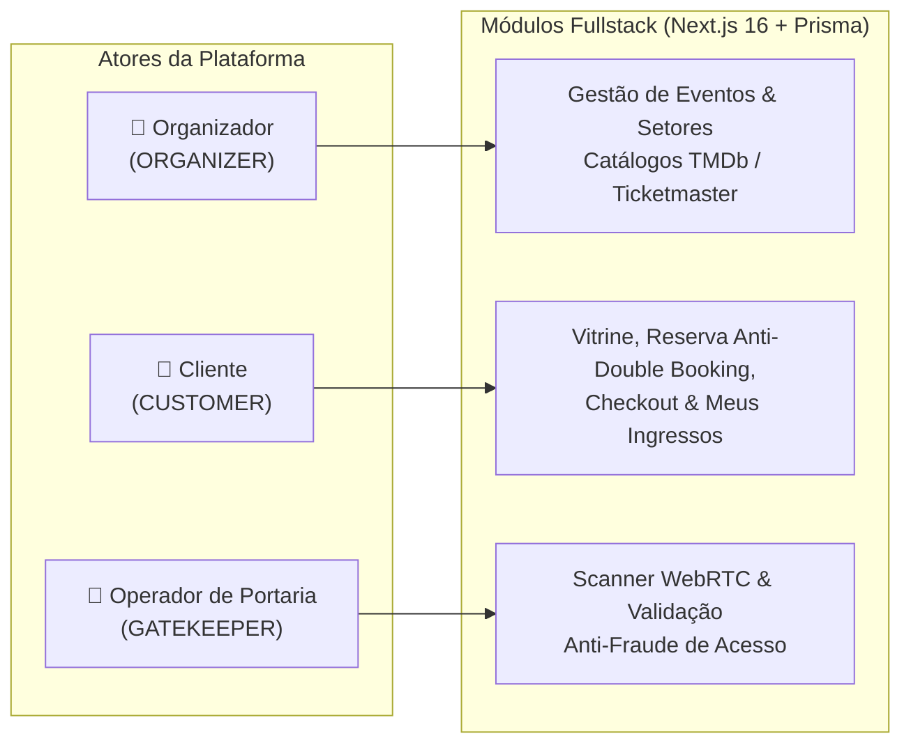

# Relato Técnico do Projeto: Visão Inicial, Evolução e Decisões de Engenharia

> **Autor**: Desenvolvedor / Candidato Elite Dev  
> **Data**: Agosto de 2026  
> **Status**: Concluído (Fases 1, 2 e 3)  
> **Demonstração Online**: [https://ticket-platform-verzel.vercel.app/](https://ticket-platform-verzel.vercel.app/)

---

## 1. Visão Geral: O Que É o Projeto

Construí a **Plataforma de Eventos e Ingressos** para atender de ponta a ponta ao [Desafio Elite Dev da Verzel](./CHALLENGE.md). A plataforma resolve todo o ciclo de vida de eventos culturais e de entretenimento: desde a curadoria e importação de atrações a partir de catálogos globais até a venda concorrente sem *double-booking*, emissão de ingressos com QR Code criptografado e validação contínua na portaria via câmera WebRTC.

A aplicação é orientada a três perfis de usuários estritamente delimitados por **Controle de Acesso Baseado em Papéis (RBAC)**:

1. **Organizador (`ORGANIZER`)**:
   - Importa dados de filmes ([TMDb API](https://developer.themoviedb.org/docs)) ou shows/turnês ([Ticketmaster Discovery API](https://developer.ticketmaster.com/products-and-docs/apis/discovery-api/v2)) com fallback mock integrado, ou cadastra eventos manuais.
   - Configura setores de **Pista (lotação geral)** e/ou **Mapas de Assentos Numerados (poltronas por fileira)** com precificação dinâmica.
   - Acompanha faturamento, taxa de ocupação e gráficos de presença em um dashboard analítico.
   - Gerencia a equipe de portaria do evento, gerando credenciais temporárias de acesso rápido.

2. **Cliente (`CUSTOMER`)**:
   - Explora a vitrine pública de eventos com busca textual, pílulas de categoria e filtros multicritério.
   - Reserva assentos interativamente com garantia de bloqueio temporário (10 minutos) contra outros compradores.
   - Realiza checkout com simulação explícita de pagamento aprovado ou recusado.
   - Acessa o painel "Meus Ingressos" para visualizar vouchers com QR Code assinado digitalmente, efetua cancelamento voluntário com estorno de estoque ou gera links públicos seguros para terceiros.

3. **Operador de Portaria (`GATEKEEPER`)**:
   - Opera uma interface mobile-first de alto contraste no dia do evento.
   - Valida ingressos por leitura contínua de câmera ([WebRTC](https://webrtc.org/)) com mira gráfica e feedback multissensorial (áudio e vibração), ou via digitação manual de código.
   - Recebe feedback determinístico em 4 estados: `VÁLIDO`, `JÁ UTILIZADO`, `EVENTO ERRADO` e `INVÁLIDO / FORJADO`.



---

## 2. O Que Foi Planejado Inicialmente

Na etapa de concepção técnica e planejamento de arquitetura ([`docs/02-architecture/`](./02-architecture/ARCHITECTURE-OVERVIEW.md)) e roadmap ([`ROADMAP.md`](./00-overview/ROADMAP.md)), estruturei o projeto sobre as seguintes premissas:

1. **Backend Integrado no Próprio Next.js (Simplicidade & Produtividade)**:
   - O edital permitia escolher stacks separadas (como NestJS, Express, FastAPI ou Spring Boot no backend e React no frontend). No entanto, **por conta da simplicidade e escopo da aplicação, decidi utilizar o próprio backend nativo do Next.js 16 (Route Handlers e Server Actions)** ([ADR 0001](./02-architecture/ADRS.md#adr-0001-escolha-da-stack-fullstack-com-nextjs-e-typescript)).
   - Essa decisão evitou a complexidade de manter dois servidores, configurar políticas de CORS, duplicar schemas TypeScript e gerenciar pipelines de deploy separados, permitindo que os tipos das entidades do Prisma e schemas Zod fossem consumidos diretamente de ponta a ponta.
2. **Persistência Relacional com Prisma e PostgreSQL**:
   - Escolha do **PostgreSQL** gerenciado via **Prisma ORM** com modelagem inicial cobrindo `User`, `Event`, `Sector`, `Seat`, `Reservation`, `Order`, `Ticket` e `TicketValidationLog` ([ADR 0002](./02-architecture/ADRS.md#adr-0002-escolha-do-postgresql-com-prisma-orm)).
3. **Autenticação Stateless Segura e Assinatura Criptográfica**:
   - Sessões baseadas em **JWT Stateless** armazenados em cookies `httpOnly`, `SameSite: "lax"` e `secure`, prevenindo vulnerabilidades de XSS e roubo de tokens no client-side ([ADR 0003](./02-architecture/ADRS.md#adr-0003-estrategia-de-autenticacao-jwt-stateless-com-cookies-httponly)).
   - Assinatura criptográfica dos QR Codes via **HMAC-SHA256** utilizando `node:crypto` para impedir falsificação de vouchers ([ADR 0004](./02-architecture/ADRS.md#adr-0004-assinatura-criptografica-de-qr-code-com-hmac-sha256)).
4. **Prevenção de Double-Booking via Locks Condicionais**:
   - Mecanismo de reserva atômica no banco de dados com lock condicional de 10 minutos (`reservedUntil`) e rotina de *lazy expiration* para liberar assentos abandonados ([ADR 0005](./02-architecture/ADRS.md#adr-0005-estrategia-de-prevencao-de-double-booking-e-controle-de-concorrencia)).
5. **Design System com Propósito (Anti-AI Slop)**:
   - Uso do **TailwindCSS 4** com tokens semânticos declarados no `@theme` em `src/app/globals.css`, compondo a paleta *Kinetic Pulse* e componentes atômicos reutilizáveis em `src/components/ui/` ([ADR 0009](./02-architecture/ADRS.md#adr-0009-design-system-semantico-kinetic-pulse-com-tailwindcss-4)).
6. **Governança por Especificações (Docs-First)**:
   - Todo comportamento foi desenhado para ser formalmente documentado em `/docs` antes da codificação, com rastreabilidade por tarefas no [`tasks.md`](../tasks.md).

---

## 3. O Que Mudou, Desafios Enfrentados e Evoluções Técnicas

Durante o desenvolvimento prático, enfrentei desafios de integrações externas, particularidades de infraestrutura serverless, gestão de contexto e restrições de tempo que exigiram decisões pragmáticas:

### 3.1 Integração com Ticketmaster e Falta de API Key
- **Desafio Encontrado**: Criei contas com **3 e-mails diferentes** no portal de desenvolvedores da Ticketmaster para obter a chave oficial da API (`TICKETMASTER_API_KEY`). No entanto, o e-mail de confirmação de cadastro nunca chegou (nem na caixa de entrada, nem no lixo eletrônico/spam). Tentei redefinir a senha e também não recebi os e-mails do sistema deles, além de não conseguir retorno do suporte da plataforma.
- **Decisão e Solução**:
  - A integração com a API da Ticketmaster foi **100% implementada no backend** conforme o contrato oficial (`GET /api/external-catalog/ticketmaster`).
  - Para não travar a aplicação nem a avaliação do projeto, construí um **catálogo mock de fallback integrado** com atrações reais de shows e turnês populares. Se a variável `TICKETMASTER_API_KEY` não for informada ou a API externa falhar, a rota automaticamente utiliza o catálogo mock sem quebrar o fluxo de criação de eventos pelo organizador.

### 3.2 Design Visual Direto no Código (Sem Prototipagem no Figma)
- **Desafio Encontrado**: Por conta do pouco tempo hábil disponível para conciliar todas as frentes do projeto (arquitetura, concorrência ACID, portaria WebRTC, testes, containerização e documentação), não foi possível realizar um mapeamento prévio exaustivo de telas nem desenhar protótipos de alta fidelidade em ferramentas como o Figma.
- **Decisão e Solução**:
  - Optei por desenhar e iterar o design **diretamente no código**, estabelecendo primeiro uma base sólida de Design System atômico no TailwindCSS 4 (`@theme` com tokens de alto contraste) e componentes atômicos em `src/components/ui/` (`Button`, `Input`, `Badge`, `Modal`, `Toast`, `Skeleton`).
  - A partir dos casos de uso especificados em `docs/01-use-cases/`, construí as interfaces de forma modular, focando na ergonomia e usabilidade (por exemplo, botões de 48px para a portaria e checkout com visualização lateral em tempo real).

### 3.3 Infraestrutura e Resiliência de Conexões (Vercel + Supabase)
- **Desafio Encontrado**: O modelo serverless da Vercel instancia funções efêmeras que abrem conexões simultâneas ao banco, causando o erro `Too many connections` (*Connection Pool Starvation*). Além disso, localmente a porta padrão `5432` conflitava com outras instâncias de PostgreSQL instaladas na minha máquina.
- **Decisão e Mudança**:
  - Ajustei o PostgreSQL local no `docker-compose.yml` para a porta `5433`.
  - Adotei a **estratégia de Dupla Conexão (Dual-URL)** no Prisma ([ADR 0002](./02-architecture/ADRS.md#adr-0002-escolha-do-postgresql-com-prisma-orm)):
    - `DATABASE_URL`: Aponta para o pooler **Supavisor (porta 6543 / Modo Transação)** com `?pgbouncer=true&connection_limit=1`, multiplexando as conexões das lambdas serverless em runtime.
    - `DIRECT_URL`: Aponta para a conexão direta (porta 5432), utilizada exclusivamente para migrações DDL da CLI do Prisma (`prisma migrate deploy`), garantindo compatibilidade com *advisory locks*.

### 3.4 Interceptação Edge e Refinamento de RBAC (`src/proxy.ts`)
- **Desafio Encontrado**: Validações de permissão dispersas em componentes ou páginas permitiam desvios de experiência, como organizadores comprando ingressos de seus próprios eventos ou operadores de portaria acessando a vitrine pública.
- **Decisão e Mudança**:
  - Implementei o interceptor centralizado `src/proxy.ts` ([ADR 0008](./02-architecture/ADRS.md#adr-0008-interceptacao-e-protecao-edge-rbac-com-srcproxyts-no-nextjs-16)), que valida JWTs no Edge em milissegundos e injeta cabeçalhos downstream (`x-user-id`, `x-user-role`, `x-user-email`).
  - **Bloqueio de Auth para Usuários Logados**: Usuários autenticados que acessam `/login` ou `/register` são redirecionados automaticamente para seus dashboards.
  - **Restrição Estrita de Compra para Organizadores**: Bloqueio de reservas e checkout para o papel `ORGANIZER` com retorno `403` na API e modal informativo na interface orientando a troca de perfil.
  - **Confinamento da Portaria**: Operadores `GATEKEEPER` são redirecionados diretamente para `/gatekeeper`, com links de eventos ocultados da barra de navegação.

### 3.5 Gestão de Portaria com Credenciais Temporárias e Controle Temporal
- **Desafio Encontrado**: O edital previa apenas um usuário genérico de portaria. Na prática, eventos reais exigem que múltiplos operadores tenham acesso restrito apenas aos eventos para os quais foram escalados e somente durante a realização do evento.
- **Decisão e Mudança**:
  - Modelei a entidade `EventGatekeeper` (`event_gatekeepers`) associando operadores aos eventos específicos.
  - Criei no painel do organizador uma interface para **geração instantânea de credenciais temporárias de 1 clique**, com botão para copiar login e senha descartáveis.
  - **Horário de Abertura dos Portões (`entryStartTime`)**: Implementei o campo `entryStartTime` (validado entre 30 min e 6h antes do evento). A portaria bloqueia validações fora desse intervalo e após o encerramento do evento.
  - **Desbloqueio Reativo Automático**: A tela da portaria calcula o offset do relógio do servidor (`serverTime`) e usa temporizadores internos para liberar o botão de validação exatamente no segundo da abertura dos portões, sem exigir recarga de página.

### 3.6 Concorrência ACID, Retenção e Regras de Negócio Avançadas
- **Retenção de Compra Deslogada**: Se um cliente seleciona assentos sem estar logado, a intenção de reserva é preservada no `sessionStorage` e o usuário é guiado para o login/registro. Após autenticar, a reserva atômica é realizada e o cliente cai direto no checkout.
- **Encerramento Automático por Esgotamento**: Durante a transação de aprovação de checkout (`POST /api/checkout/process`), o backend verifica atomicamente se a capacidade total foi atingida e altera o status do evento de `PUBLISHED` para `CLOSED`.
- **Cancelamento Voluntário com Reposição**: Implementei no painel "Meus Ingressos" o cancelamento atômico pelo cliente, liberando instantaneamente a poltrona ou cota de pista, reabrindo o evento caso estivesse fechado e invalidando o QR Code na portaria.

### 3.7 Sincronização de Assentos em Tempo Real (SSE)
- **Desafio Encontrado**: Em eventos com alta procura, poltronas selecionadas por outros clientes ficavam visualmente disponíveis até o clique, gerando frustração.
- **Decisão e Mudança**:
  - Implementei um canal de **Server-Sent Events (SSE)** em `/api/events/[id]/seats/stream` com hub Pub/Sub em memória.
  - O componente `SeatMap` sincroniza mudanças de status de assentos e cotas em tempo real entre todos os navegadores abertos, com badge visual "Ao Vivo" e tratamento proativo de conflitos.

### 3.8 Refinamentos de UX e Dados de Domínio
- **Animação Typewriter Estabilizada**: Desenvolvi o componente `TypewriterText` no Hero da vitrine alternando entre 9 frases, com destaque colorido na palavra-chave e container com altura calibrada para **zero Cumulative Layout Shift (CLS)**.
- **Toasts Sólidos e de Alto Contraste**: Posicionados no topo direito (`fixed top-4 right-4 z-[100]`), com fundos sólidos (verde, vermelho, amarelo, azul) e ícones acessíveis.
- **Classificação +18 e Descrições Qualificadas**: Adicionei o campo `isAdult` com selos visuais em toda a aplicação e exigi descrições de eventos com no mínimo 300 caracteres, acompanhadas de contador em tempo real (`X / 300`) no formulário.
- **Endereço Completo e Google Maps Gratuito**: Modelei campos de logradouro (`street`, `number`, `neighborhood`, `city/UF`) e adotei integração com Google Maps Embed sem chave paga, acompanhada de deep links para Waze, Google Maps e Apple Maps ([ADR 0006](./02-architecture/ADRS.md#adr-0006-visualizacao-de-localizacao-via-google-maps-embed-gratuito)).
- **Dashboard Analítico com Gráficos**: Implementei métricas financeiras e de presença com gráficos interativos (`recharts`) e exportação real de relatórios em CSV (BOM UTF-8) e JSON.

### 3.9 Testes Automatizados e Oportunidades de Cobertura
- **O Que Foi Implementado**:
  - Bateria com **Vitest** cobrindo os pilares mais críticos da aplicação:
    - Assinatura e verificação de integridade do QR Code (**HMAC-SHA256**).
    - Validação de regras e autorização de papéis (**RBAC**).
    - Validação estrita de contratos e schemas (**Zod**).
    - **Testes de Concorrência ACID**: Simulação de disparos simultâneos de requisições concorrentes no mesmo milissegundo para o mesmo assento, validando que exatamente 1 requisição obtém sucesso e as demais recebem `409 Conflict`.
- **O Que Faltou / Próximos Passos**:
  - Por restrições de tempo, **faltou uma cobertura mais ampla de testes automatizados**, especialmente uma suíte completa de testes End-to-End (E2E) com Playwright cobrindo todas as variações de fluxos de ponta a ponta na interface e testes unitários de componentes visuais secundários.

### 3.10 Granularidade dos Documentos de Casos de Uso e Gestão de Tokens
- **Desafio Encontrado**: Por conta da urgência e do pouco tempo hábil para estruturar todo o projeto, acabei agrupando múltiplos casos de uso dentro de arquivos únicos e densos para cada grande módulo (por exemplo, `01-AUTH-AND-ACCESS.md` agrupando UC01 a UC05, `03-SALES-AND-TICKETS.md` agrupando UC11 a UC20). Esses documentos extensos acabaram gerando uma sobrecarga desnecessária na janela de contexto e um consumo maior de tokens durante as consultas e iterações com os agentes de IA.
- **Lição Aprendida e Abordagem Ideal**:
  - Como evolução arquitetural e boa prática de *Context Engineering*, a abordagem mais eficiente seria particionar os casos de uso de forma granular: **um arquivo Markdown exclusivo para cada caso de uso individual** (ex: `UC01-LOGIN.md`, `UC14-SEAT-RESERVATION.md`, `UC24-GATE-VALIDATION.md`), organizados dentro de **subpastas temáticas para cada módulo da aplicação** (ex: `docs/01-use-cases/auth/`, `docs/01-use-cases/events/`, `docs/01-use-cases/sales/`, `docs/01-use-cases/gate/`).
  - Essa segregação reduz drasticamente o consumo de tokens, elimina ruído de contexto irrelevante para tarefas pontuais e facilita a leitura focada tanto por humanos quanto por LLMs.

### 3.11 Mapeamento e Navegação do Codebase com Graphify
- **Como Foi Utilizado**:
  - Para gerenciar a complexidade do repositório (com mais de 150 arquivos, 600 nós e mais de 1.000 arestas conectando código TypeScript, rotas de API, schemas Zod, entidades Prisma e documentos Markdown), adicionei e mantive um grafo de conhecimento via **Graphify** (`graphify-out/`).
- **Como Ajudou no Projeto**:
  1. **Navegação Cirúrgica sem Desperdício de Tokens**: Em vez de ler dezenas de arquivos ou efetuar buscas cegas via grep, o Graphify permitiu consultar subgrafos escopados via comandos (`graphify query`, `graphify path`, `graphify explain`), retornando apenas o contexto exato e as conexões necessárias para cada tarefa.
  2. **Rastreabilidade de Impacto de Mudanças**: Permitiu entender em segundos quais arquivos seriam afetados por uma alteração (por exemplo, do modelo `Seat` no Prisma até o componente `SeatMap` no frontend e a rota de validação na portaria).
  3. **Manutenção Contínua a Custo Zero de API**: A cada alteração de código, a execução de `graphify update .` é feita automaticamente pelo agente e reprocessa a AST do projeto de forma puramente estática e local (sem custo de tokens), mantendo o mapa arquitetural do projeto sempre sincronizado com o histórico do Git.

---

## 4. Matriz Comparativa: Planejado Inicialmente vs. Entregue

| Dimensão | Planejado Inicialmente (Edital & V1) | Entregue / Evolução Final |
| :--- | :--- | :--- |
| **Backend & Stack** | Opção por backend separado ou integrado | Backend unificado no Next.js 16 (Route Handlers & Server Actions) por simplicidade |
| **Integração Ticketmaster** | Chamada direta via API Key | Implementação completa da integração + catálogo mock de fallback por falta de envio de API Key pelo provedor |
| **Design & Mapeamento** | Planejamento formal prévio em UI tools | Desenho direto no código via TailwindCSS 4 (@theme) e componentes atômicos por restrição de tempo |
| **Documentação de Casos de Uso** | Documentos densos agrupados por módulo | Identificada a necessidade de quebra em arquivos individuais por caso de uso em subpastas modulares para otimização de tokens |
| **Navegação do Codebase (Graphify)** | Navegação manual e grep | Grafo de conhecimento indexado com mais de 600 nós (`graphify-out/`) para consultas escopadas e análise de impacto |
| **Topologia de Banco** | PostgreSQL local padrão (porta 5432) | Topologia Dual-URL (Supavisor 6543 pooler + 5432 direta) e porta 5433 local |
| **Proteção de Rotas** | Validações básicas de login | Edge Proxy unificado (`src/proxy.ts`), bloqueio de auth para logados e isolamento estrito de papéis |
| **Operação de Portaria** | 1 usuário fixo, validação livre a qualquer hora | Relação `EventGatekeeper`, credenciais temporárias em 1 clique, validação temporal (`entryStartTime`) e desbloqueio reativo com `serverTime` |
| **Concorrência & Estoque** | Lock condicional básico de 10 min | Lock ACID + Encerramento automático por esgotamento (`CLOSED`) + Cancelamento voluntário com reposição imediata |
| **Sincronização de Mapa** | Consulta sob demanda (pull/refresh) | Sincronização em tempo real via Server-Sent Events (SSE) com badge "Ao Vivo" |
| **Design System & UI** | Telas padrão funcionais | Identidade *Kinetic Pulse* (TailwindCSS 4 `@theme`), Typewriter Hero com zero CLS, Toasts sólidos top-right e Loading Screen global |
| **Dados do Evento** | Título, data e local simples | Classificação +18, descrição com min. 300 chars e contador, endereço completo com Google Maps Embed e deep links |
| **Analytics & Gestão** | Apenas listagem de eventos | Dashboard analítico com KPIs, gráficos `recharts` (faturamento, ocupação, presença) e exportação CSV/JSON |
| **Testes Automatizados** | Testes básicos planejados | Testes de concorrência ACID, HMAC, Zod e RBAC via Vitest; E2E extensivo identificado como evolução futura |
| **Empacotamento & Deploy** | Dockerfile simples | Dockerfile multi-stage com `standalone`, Docker Compose orquestrado e deploy em produção na Vercel + Supabase |

---

## 5. Filosofia de Condução e Uso de IA

O edital encoraja o uso consciente de inteligência artificial com foco no processo de tomada de decisão e na eliminação de clichês visuais (*AI slop*). A condução do projeto seguiu diretrizes claras:

- **Desenvolvimento Orientado a Especificações**: Nenhuma linha de código foi implementada sem que a regra de negócio, schema Zod ou contrato de API estivesse previamente documentado em `/docs`.
- **Subagentes Especializados sob Regras Estritas**: A implementação foi conduzida através de subagentes com papéis bem definidos (`frontend-expert`, `backend-acid-expert`, `qa-code-auditor`), limitados por princípios de simplicidade de código ([`code-simplicity.md`](../.agents/rules/code-simplicity.md) - KISS & YAGNI) e sem abstrações especulativas.
- **Engenharia de Conhecimento com Graphify**: O uso do grafo de conhecimento permitiu recuperar subgrafos de arquitetura precisos em vez de carregar arquivos inteiros, reduzindo drasticamente o consumo de tokens e evitando alucinações de contexto.
- **Rastreabilidade Transparente**: Todo o ciclo de vida do projeto foi registrado commit a commit e verificado contra os critérios de aceitação no [`tasks.md`](../tasks.md).

---

## 6. Estado Atual da Aplicação

A plataforma encontra-se **100% concluída, documentada e testada**:

1. **Deploy em Produção**: Acessível publicamente em [https://ticket-platform-verzel.vercel.app/](https://ticket-platform-verzel.vercel.app/).
2. **Execução Local via Docker Compose**:
   ```bash
   docker compose up -d --build
   ```
3. **Ambiente Pré-Semeado para Testes**:
   - **Organizador**: `organizador@verzel.com.br` / `Senha@123`
   - **Cliente 1**: `cliente1@verzel.com.br` / `Senha@123`
   - **Cliente 2**: `cliente2@verzel.com.br` / `Senha@123`
   - **Portaria**: `portaria@verzel.com.br` / `Senha@123`
